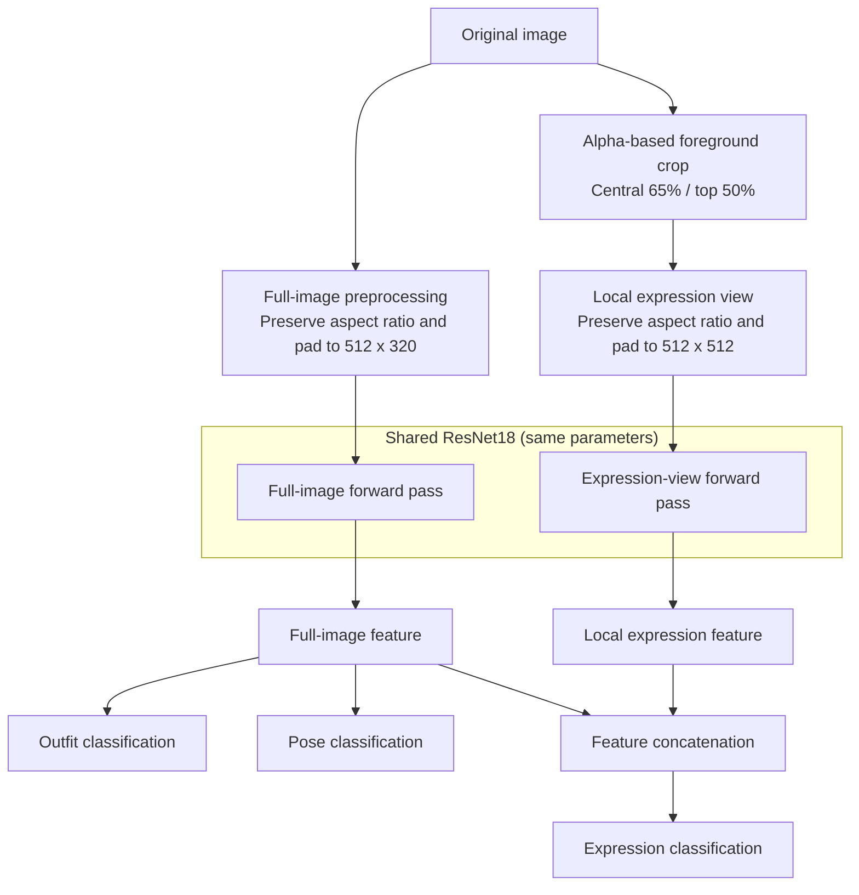

# ATRI Multi-Attribute Recognition

English | [中文](README_CN.md) | [日本語](README_JP.md)

A PyTorch-based project for jointly recognizing three attributes of a single character, ATRI: outfit, pose, and expression.

The project began as a deep learning course assignment and was later refactored to address duplicate training images, aspect-ratio distortion, low effective resolution in the expression region, and limitations in training and evaluation.

<p align="center">
  
</p>

## Features

- Built with PyTorch and a pretrained ResNet18
- Joint recognition of outfit, pose, and expression
- A single ResNet18 is shared between the full-image and local expression views
- Preserves the original aspect ratio instead of stretching images into a square
- Automatically extracts the upper-center region of the character foreground from the alpha channel to improve effective expression resolution
- Uses the same random augmentation parameters for both views to keep them consistent
- Automatically splits training and validation data and tracks per-task and joint accuracy
- Supports CUDA, AMP, frozen BatchNorm, early stopping, resumable training, and overwrite protection
- Automatically saves JSON/CSV training history and performs temperature calibration for newly trained checkpoints
- Supports low-confidence abstention, batch JSON/CSV inference, and independent test-set evaluation
- Provides expression-crop previews, Grad-CAM, dataset auditing, and ONNX export

## Model Structure

The model uses two input views that share the same ResNet18 parameters:



The full image is resized and padded while preserving its aspect ratio, then used for outfit and pose classification as well as global-context feature extraction. The expression view uses the alpha channel to locate the character foreground, then crops the central `65%` of its width and the top `50%` of its height. The expression head combines the full-image and local features.

## Dataset

The training data consists of illustrations of a single character. The script reads only supported image files directly from the training directory and strictly validates their filenames.

Filename format:

```text
<character_name>_<compatibility_field>_<scale>_<outfit>_<pose>_<expression>.png
```

Example:

```text
アトリ_tatr01_w_d1_p1_f1.png
```

Field usage:

| Position | Example | Purpose |
|----------|---------|---------|
| Character name | アトリ | Preserved as metadata; not used as a classification target |
| Compatibility field | tatr01 / tatr02 | Parsed for compatibility with existing filenames; not used as a classification target |
| Resolution level | s / w / m / l / ll | Selects the source-image resolution; only `w` is used by default |
| Outfit | d1 | Outfit class label |
| Pose | p1 | Pose class label |
| Expression | f1 | Expression class label |

Each image is available in five proportionally scaled versions: `s`, `w`, `m`, `l`, and `ll`. By default, the program uses only `w` so that different-size versions of the same content are not counted as separate samples in training or validation. Do not add extra underscores to the character name, because filenames must contain exactly six fields.

Supported recognition labels:

| Attribute | Code | Output name |
|-----------|------|-------------|
| Outfit | d1 | school uniform |
| Outfit | d2 | swimsuit |
| Outfit | d3 | pajamas |
| Outfit | d4 | pajamas + pumpkin pants |
| Pose | p1 | normal |
| Pose | p2 | hands up |
| Pose | p3 | arms horizontal + jump |
| Expression | f1 | staring |
| Expression | f2 | smile |
| Expression | f3 | happy |
| Expression | f4 | angry |
| Expression | f5 | serious |
| Expression | f6 | sad |
| Expression | f7 | distressed |
| Expression | f8 | surprised |
| Expression | f9 | confused |
| Expression | fa | troubled / embarrassed |
| Expression | fb | confident (eyes open) |
| Expression | fc | sleepy |
| Expression | fd | crying |
| Expression | fe | calm |
| Expression | ff | shy |
| Expression | fg | sulky |
| Expression | fh | shy (blush) |
| Expression | fi | blank |
| Expression | fj | disgusted |
| Expression | fk | shocked |
| Expression | fl | confident (eyes closed) |

The public repository does not include the training images because they contain copyrighted material. Only the source code, model architecture, and inference program are published in the repository. The best trained checkpoint has been available through GitHub Releases since version 1.0.0.

Before training, you can audit filename validity, corrupted images, alpha channels, completeness across all five resolution levels, aspect ratios, and similar images between the training and test sets with:

```powershell
python check_dataset.py --train_dir atridataset/train --test_dir atridataset/test --report dataset_report.json
```

The report computes difference hashes for both the full image and the expression crop. Similar image pairs are reported for manual review and are never deleted automatically.

## Environment

Supported range:

- Python 3.10+
- PyTorch `2.3` or later within the `2.x` series, with a matching torchvision release
- A CUDA-compatible PyTorch environment (optional, for GPU acceleration)

Install dependencies:

```powershell
pip install -r requirements.txt
```

The training script uses the current `torch.amp` API. If CUDA is not detected, it automatically falls back to CPU; use `--cpu` to force CPU execution. `requirements.txt` also includes the dependencies required for ONNX export. For a CUDA environment, it is still recommended to install the appropriate PyTorch build first and then install the remaining dependencies.

## Training

Recommended command:

```powershell
python train.py --train_dir atridataset/train --out_dir outputs --run_name w512_seed42 --epochs 90 --batch 16
```

Main parameters:

| Parameter | Default | Description |
|-----------|---------|-------------|
| `--train_dir` | `atridataset/train` | Training image directory |
| `--out_dir` | `outputs` | Output directory for checkpoints, curves, and reports |
| `--run_name` | none | Create a subdirectory for this training run |
| `--overwrite` | disabled | Allow existing training outputs to be overwritten without deleting unrelated files |
| `--epochs` | `90` | Maximum number of epochs |
| `--batch` | `16` | Batch size |
| `--height` | `512` | Full-image input height |
| `--width` | `320` | Full-image input width |
| `--expression_size` | `512` | Side length of the square expression view |
| `--expression_width_fraction` | `0.65` | Expression crop width as a fraction of foreground width |
| `--expression_height_fraction` | `0.50` | Expression crop height as a fraction of foreground height |
| `--scale` | `w` | Source-image resolution level |
| `--val_ratio` | `0.25` | Validation split ratio |
| `--lr_backbone` | `1e-4` | ResNet18 learning rate |
| `--lr_heads` | `3e-4` | Classification-head learning rate |
| `--warmup_epochs` | `5` | Number of epochs used to train only the classification heads |
| `--patience` | `15` | Early-stopping patience for expression validation loss |
| `--threshold_quantile` | `0.05` | Quantile used for suggested confidence thresholds |
| `--workers` | `2` | Number of DataLoader worker processes |
| `--resume` | none | Resume from `atri_net_last.pth` |
| `--train_bn` | disabled | Update ResNet18 BatchNorm statistics; they are frozen by default |
| `--cpu` | disabled | Force CPU execution |
| `--no_pretrained` | disabled | Do not use ImageNet pretrained weights |
| `--no_amp` | disabled | Disable CUDA automatic mixed precision |

The program creates a train/validation split stratified by pose and expression. The backbone is frozen for the first `5` epochs while only the classification heads are trained. It is then unfrozen and optimized with AdamW and cosine learning-rate decay. Training uses label smoothing, while validation and model selection use standard cross-entropy. Both best-checkpoint selection and early stopping are based on expression validation loss.

The running statistics of the ImageNet-pretrained BatchNorm layers are frozen by default to reduce drift caused by the small dataset and the mixture of two input-view distributions. Use `--train_bn` to re-enable BatchNorm updates, and keep that setting only if it performs better on an independent test set.

If the target directory already contains a checkpoint or `metrics.json`, the new run stops to prevent accidental overwrites. Use a new `--run_name` to write to a separate directory, or pass `--overwrite` to explicitly replace the existing training outputs.

Training outputs:

```text
outputs/w512_seed42/
├── atri_net_best.pth
├── atri_net_last.pth
├── split.json
├── run_config.json
├── environment.json
├── metrics.json
├── metrics.csv
├── calibration.json
├── loss_curve.png
├── accuracy_curve.png
├── expression_report.json
└── expression_confusion_matrix.png
```

- `atri_net_best.pth`: intended for inference and distribution; contains the model and required configuration
- `atri_net_last.pth`: contains optimizer, learning-rate scheduler, and AMP state for resuming training
- `split.json`: records the actual split and dataset signature; resuming training checks whether the data has changed
- `metrics.json` / `metrics.csv`: records per-epoch losses, accuracies, and learning rates
- `calibration.json`: records per-task temperatures, calibration errors, and suggested confidence thresholds
- `expression_report.json`: records per-expression accuracy, sample counts, and the confusion matrix

When resuming training, the input dimensions, crop fractions, labels, and resolution level must match those stored in the checkpoint:

```powershell
python train.py --train_dir atridataset/train --out_dir outputs --run_name w512_seed42 --resume outputs/w512_seed42/atri_net_last.pth
```

## Reference Results

The current `w + 512` reference experiment used random seed `42` and split 252 images with distinct content into 189 training images and 63 validation images. The validation set contained 3 images for each expression class. Training was configured for a maximum of 90 epochs; the best checkpoint was saved at epoch 70, and early stopping was triggered at epoch 85 after 15 consecutive epochs without improvement in expression validation loss.

| Metric | Result |
|--------|--------|
| Outfit accuracy | 100% |
| Pose accuracy | 100% |
| Expression accuracy | 100% |
| All three tasks correct | 100% |
| Best expression validation loss | 0.0664 |

All 21 expression classes had 3 validation images each and achieved 100% per-class accuracy, with no off-diagonal entries in the confusion matrix. At the final epoch, the total training loss was approximately `0.7268`, while the total validation loss was approximately `0.1376`. The higher training loss is expected because training uses random augmentation and label smoothing, whereas validation uses standard cross-entropy without label smoothing.

The best checkpoint uses per-task temperature scaling fitted on the validation set:

| Task | Temperature | ECE before | ECE after | Suggested threshold |
|------|-------------|------------|-----------|---------------------|
| Outfit | 0.2596 | 3.11% | approximately 0% | 95% |
| Pose | 0.2500 | 2.89% | approximately 0% | 95% |
| Expression | 0.2500 | 6.39% | approximately 0% | 95% |

Manual Grad-CAM inspection showed that expression classification focused primarily on the face, pose classification on the arms and hands, and outfit classification on the torso and clothing. These regions are semantically appropriate for the respective tasks.

The reference environment used Python `3.11.9`, PyTorch `2.5.1+cu121`, torchvision `0.20.1+cu121`, CUDA `12.1`, and an NVIDIA GeForce RTX 3060 Laptop GPU.

These results reflect performance only on the current single-character, same-source, closed-set validation data. The near-zero ECE after calibration is also affected by the small validation set and the fact that every validation image was classified correctly; it does not imply comparable generalization to external images, unknown characters, or different art styles. The Grad-CAM observations are qualitative checks on a small number of samples and do not replace evaluation on an independent test set.

## Independent Test-Set Evaluation

For images such as `test1.png` whose filenames do not contain labels, provide a UTF-8 CSV manifest:

```csv
filename,outfit,pose,expression
image.png,d1,p1,f1
```

`test_labels.example.csv` provides an example header. After filling in the labels, run:

```powershell
python evaluate.py --weight outputs/w512_seed42/atri_net_best.pth --test_dir atridataset/test --labels test_labels.csv --output_dir evaluation
```

The report includes per-task accuracy, Macro-F1, NLL, ECE, coverage after abstention, joint accuracy, a per-image CSV file, and a confusion matrix for each task. If `--labels` is omitted, the evaluator attempts to parse labels from standard six-field filenames. The independent test set must not be used for training, early stopping, or threshold tuning.

## Inference

GUI:

```powershell
python infer.py --weight outputs/w512_seed42/atri_net_best.pth
```

The GUI displays the full-image input used by the model, the expression crop, and calibrated predictions with confidence scores for all three tasks. Select a task to generate its Grad-CAM: outfit and pose use the full-image view, while expression uses the local expression view.

### Grad-CAM Examples

<p align="center">
  
  <br />
  <strong>Pose recognition:</strong> the model primarily attends to the raised arms and hands.
</p>

<p align="center">
  
  <br />
  <strong>Outfit recognition:</strong> the model primarily attends to the torso and clothing.
</p>

Batch inference on a directory:

```powershell
python infer.py --weight outputs/w512_seed42/atri_net_best.pth --input atridataset/test --output predictions.csv --top_k 3
```

`--input` accepts either a single image or a directory. If the output path ends in `.csv`, results are written in CSV format; otherwise they are written as JSON. `--recursive` scans subdirectories recursively, `--min_confidence 0.8` overrides the checkpoint's per-task suggested thresholds, and `--accept_all` disables abstention.

New checkpoints store temperatures fitted on the validation set along with suggested confidence thresholds. Predictions below the threshold are marked `uncertain`. This is only a low-confidence gate, not an unknown-character or out-of-distribution detector. Older v3 checkpoints do not contain calibration metadata and therefore retain the previous behavior of accepting all predictions.

The inference script automatically reads the input dimensions, crop settings, normalization parameters, and label order from the checkpoint. Both GUI and batch modes support PNG, JPEG, BMP, and WebP images.

The current model uses checkpoint format version 3. Older four-task checkpoints that include shoe/sock recognition, as well as earlier single-view three-task checkpoints, cannot be loaded directly and must be retrained with the current code.

## ONNX Export

```powershell
python export_onnx.py --weight outputs/w512_seed42/atri_net_best.pth --output outputs/atri_net.onnx
```

The exporter also writes `atri_net.json`, which stores the input dimensions, preprocessing parameters, label order, and calibration metadata. The ONNX model has two inputs, `full_image` and `expression_image`, and three logit outputs: `outfit`, `pose`, and `expression`. The batch dimension is dynamic by default; use `--fixed_batch` to make it fixed.

## Basic Tests

```powershell
python -m unittest discover -s tests
```

Tests cover filename parsing, stratified splitting, synchronized augmentation across the two views, CSV label manifests, and confidence calibration.

## Project Structure

```text
.
├── calibration.py       # Temperature calibration and suggested thresholds
├── check_dataset.py     # Dataset integrity and near-duplicate audit
├── dataset.py           # Filename parsing, splitting, and dual-view preprocessing
├── evaluate.py          # Independent test-set evaluation
├── export_onnx.py       # ONNX model and metadata export
├── infer.py             # GUI, batch inference, and low-confidence abstention
├── model.py             # Dual-view model with a shared ResNet18
├── train.py             # Training, calibration, early stopping, and reports
├── visualization.py     # Grad-CAM generation and overlay
├── labels.py            # Outfit, pose, and expression labels
├── tests/               # Basic tests using the standard-library unittest module
├── test_labels.example.csv
├── requirements.txt
├── LICENSE
├── README.md             # English (default)
├── README_CN.md          # Simplified Chinese
└── README_JP.md          # 日本語
```

`atridataset/` and `outputs/` are directories for local data and runtime outputs; they are not part of the program itself.

## Known Limitations

- The dataset only contains ATRI, and the model does not perform character recognition
- The shoe/sock field is deterministically tied to pose, so since version 2.0.0 it has been retained only as compatibility metadata and is no longer used as a recognition target
- The expression crop assumes that the face is located in the upper-center region of the character foreground
- The validation set is small, with only 3 validation images per expression
- The data source and composition are highly consistent, so the model may still overfit to the closed-set distribution
- Confidence thresholds cannot reliably identify arbitrary unknown characters or out-of-distribution images
- JPEG and other images without transparency use the upper-center region of the entire image for the expression crop

## Future Plans

- Label and publish results from a more complete independent test set
- Add supported-input detection once enough negative examples are available, rather than relying only on softmax thresholds
- Web UI
- Video inference

## License

This project uses the MIT License. See [LICENSE](LICENSE) for details.

This project contains only the source code, model architecture, and inference program. It does not include any training images.
