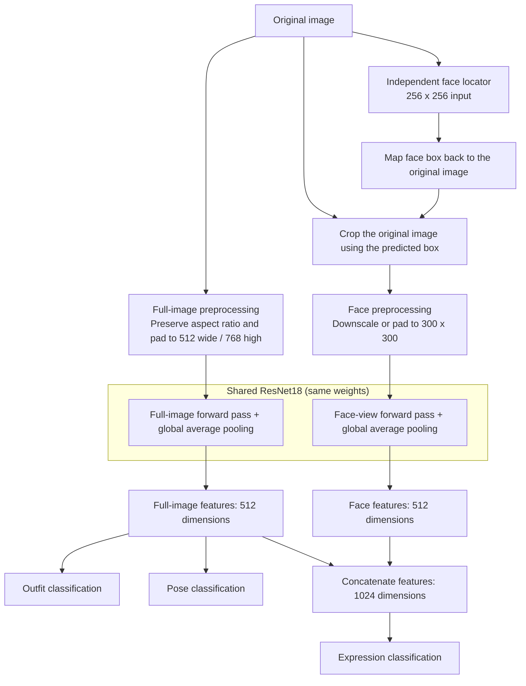

# ATRI Multi-Attribute Recognition

English | [中文](README_CN.md) | [日本語](README_JP.md)

A PyTorch-based tool for recognizing ATRI's outfit, pose, and expression in a single image. The project began as a deep learning course assignment and is now maintained as an independent open-source project.

v4.0.0 lays the groundwork for using a model trained on character sprites with a wider range of images. It first locates the face, then combines full-image and face features to handle CG artwork with backgrounds, different resolutions, and rotated inputs. The showcase below focuses on artwork from other sources and includes examples where the model still makes mistakes.

- Recognizes 4 outfits, 3 poses, and 21 expressions.
- Includes a GUI, batch inference, confidence indicators, and Grad-CAM.
- Provides tools for face annotation, crop inspection, training, evaluation, and ONNX export.
- Supports balanced training across five resolution levels, six rotation angles, and face-box jitter.

**Training v4.0.0 requires substantially more compute and time than v3.0.0.** If your hardware or time budget is limited, select **v3.0.0** from GitHub's **branches/tags** menu and follow that version's instructions. To use the model for inference, simply download the released weights; there is no need to retrain it.

<p align="center">
  
  <br />
  <em>Predictions and expression Grad-CAM for CG artwork from another source</em>
</p>

## Contents

- [Quick Start](#quick-start): installation, model downloads, and inference
- [Results and Limitations](#results-and-limitations): sprite validation and examples from other sources
- [How the Model Works](#how-the-model-works): face localization and dual-view classification
- [Preparing Training Data](#preparing-training-data): filenames, labels, and face annotations
- [Training and Resuming](#training-and-resuming): complete commands, output files, and checkpoints
- [Training Parameter Reference](#training-parameter-reference): options for each training stage
- [Evaluation and Export](#evaluation-and-export): independent test sets, ONNX, and release weights
- [Development and Project Structure](#development-and-project-structure): tests and file overview

## Quick Start

Run the following commands from the project root.

### 1. Install Dependencies

Requires Python 3.10+, PyTorch `2.3` or later within the `2.x` series, and a matching torchvision release. CPU inference is supported; the program automatically uses the GPU when a CUDA-enabled PyTorch installation is available.

```powershell
python -m pip install -r requirements.txt
```

For GPU acceleration, install the appropriate CUDA build of PyTorch using its official installation instructions before installing the remaining dependencies. The GUI requires Tcl/Tk: include it when installing Python on Windows, or install `python3-tk` when using Ubuntu's system Python.

Training uses `torch.amp` and downloads ImageNet-pretrained ResNet18 weights on first use. Inference with the released models does not require that download. Reusing the supplied rotation annotations also requires a specific Pillow version; see [Face Annotation](#face-annotation).

### 2. Download the Models

**Model files are distributed separately through [GitHub Releases](https://github.com/hoshino924/atri-multitask-cnn/releases) and are not included in the source repository.**

The complete source package with models available from Releases already includes the `models/` directory. If you only download or clone the source repository, create `models/classifier/` and `models/locator/` in the project root, then download the classifier, locator, and companion files for your program version and arrange them as follows:

```text
models/
├── classifier/
│   ├── atri_net_best.pth
│   └── split.json
├── locator/
│   ├── face_locator_best.pth
│   └── split.json
└── manifest.json
```

Each `split.json` records the training and validation content groups for reproducibility and diagnostics. `manifest.json` records information about the model files. The classifier must be paired with the locator used during its training; the program checks that they match.

### 3. Open the GUI

```powershell
python infer.py
```

Click **Select Image** to choose an image. The window shows the full-image input, the actual face crop, and predictions for all three tasks. Select a task and click **Show Grad-CAM** to view its heatmap: outfit and pose use the full image, while expression uses the face view.

The inference GUI uses English. The annotation and crop-inspection tools support both English and Simplified Chinese.

### 4. Single-Image and Batch Inference

```powershell
python infer.py --input path/to/image.png
python infer.py --input atridataset/test --output predictions.csv --top_k 3
```

`--input` accepts an image or a directory and supports PNG, JPEG, BMP, and WebP. Results are saved as CSV when the output filename ends in `.csv`, or as JSON otherwise. Common options include:

| Option | Purpose |
|--------|---------|
| `--recursive` | Scan subdirectories. |
| `--cpu` | Force CPU execution. |
| `--top_k 3` | Return the top three candidates for each task. |
| `--min_confidence 0.8` | Override the classification confidence threshold with 80%. |
| `--accept_all` | Return classification results without low-confidence abstention. |
| `--weight` / `--locator_weight` | Select your own classifier and its matching locator. |

### Understanding uncertain

The released models use a suggested confidence threshold of `95%` for all three classification tasks. Below that threshold, the GUI displays `uncertain (best: ...)`. The label in parentheses is still the top prediction, but its confidence is too low to accept.

That prediction may be right or wrong, so top-1 accuracy and accuracy among accepted predictions measure different things. `uncertain` does not mean there is something wrong with the image; it describes the model's confidence in that particular prediction. Lowering the threshold reduces abstention but does not change the ranking or correct a misclassification.

A failure to locate a face is reported separately. Changing classification thresholds or using `--accept_all` does not bypass it.

### Inspecting Face Crops

```powershell
python inspect_faces.py --input atridataset/test
```

The inspector displays the original image with its predicted box, the raw crop before resizing, and the face input before normalization. You can filter by resolution or filename, step through images, and switch to a 100% view to check details. The tool does not modify images or annotations.

<p align="center">
  
  <br />
  <em>Compare the predicted box, raw face crop, and actual model input in the crop inspector</em>
</p>

## Results and Limitations

### CG Artwork from Other Sources

These examples use CG artwork with backgrounds to see how the model handles images beyond the standard sprite composition. In this small manual trial, the top predictions matched the human assessment for most images, although some correct predictions were still marked `uncertain`. The examples show progress in v4.0.0, but they are not a measured accuracy result on an independent test set.

<p align="center">
  
  <br />
  <em>A CG example with a background; all three top predictions match the human assessment</em>
</p>

#### Inconsistent Predictions across CG Variants

Figures 1 and 2 below are variants of the same CG scene. Their outfit, pose, and expression labels are unchanged on manual review, but the model's top predictions differ:

| Image | Top outfit prediction | Top pose prediction | Top expression prediction |
|-------|-----------------------|---------------------|---------------------------|
| Figure 1 | `d4` pajamas + pumpkin pants, 51.4%, incorrect | `p1` normal, 81.0%, correct | `fa` troubled / embarrassed, 100.0%, correct |
| Figure 2 | `d1` school uniform, 72.9%, correct | `p1` normal, 66.4%, correct | `f4` angry, 94.8%, incorrect |

All results in the table except Figure 1's expression were marked `uncertain`. The current threshold rejected both incorrect predictions, but the inconsistency shows that the model is still sensitive to changes between variants. Hair, water droplets, background details, and the actual crop can all affect the input; the screenshots alone cannot establish how much each factor contributes.

<p align="center">
  
  <br />
  <em>Figure 1: outfit prediction and Grad-CAM</em>
</p>

<p align="center">
  
  <br />
  <em>Figure 2: expression prediction and Grad-CAM</em>
</p>

### Released Models and Sprite Validation

The results below are for the final models distributed through [Releases](https://github.com/hoshino924/atri-multitask-cnn/releases): the classifier with a fusion expression head and its matching face locator.

| Model | Training epochs | Best epoch | Input size |
|-------|-----------------|------------|------------|
| Multi-attribute classifier | 500 | 401 | Full image: 512 wide × 768 high; face: 300×300 |
| Face locator | 240 | 231 | 256×256 |

The following results cover 63 content groups in the development validation set, each at five resolutions. They report **top-1 accuracy before confidence-based abstention**:

| Input angles | Views | Outfit accuracy | Pose accuracy | Expression accuracy |
|--------------|-------|-----------------|---------------|---------------------|
| 0° | 315 | 100% | 100% | 100% |
| All six training angles | 1,890 | 100% | 100% | 100% |
| Unseen 15° / 30° / 330° / 345° | 1,260 | 100% | 100% | 100% |
| Unseen 135° / 225° | 630 | 100% | 100% | 80% |

Five correct expression predictions were rejected for low confidence across the six training angles, as was one at the four unseen angles near upright. Neither group had an accepted incorrect prediction. At 135° / 225°, however, 95 incorrect expression predictions still exceeded the confidence threshold, so recognition at arbitrary angles remains a limitation.

The six-angle results already include 0°. Resizing and rotating the same content does not add independent samples, and these validation data were also used for model selection and confidence calibration. The table helps assess sprite recognition and rotation handling, but does not replace evaluation on images from other sources.

Reference training environment: Python `3.11.9`, PyTorch `2.5.1+cu121`, torchvision `0.20.1+cu121`, CUDA `12.1`, and an NVIDIA GeForce RTX 3060 Laptop GPU.

#### Examples from the Validation Set

These two examples were selected from the validation content above. They show the full-image input, face crop, and predictions at 0° and 45°. They illustrate the validation results and do not count as additional independent test samples.

<p align="center">
  
  <br />
  <em>Validation example: upright input at 0°</em>
</p>

<p align="center">
  
  <br />
  <em>Validation example: rotated input at 45°</em>
</p>

### Intended Use and Limitations

The current model is intended for images of ATRI alone, particularly upright or nearly upright inputs. Keep the following limitations in mind:

- It does not identify characters or reliably locate and classify multiple characters in one image.
- Training is based mainly on sprites from a single source. Complex backgrounds, occlusion, lighting, and changes in art style can affect predictions.
- Some expressions, such as `f1` and `fe`, differ only subtly. Low resolution and resizing can remove the distinguishing details; they remain separate labels.
- Confidence thresholds cannot reliably detect unknown characters or images outside the training distribution. Confident predictions can still be wrong.
- Grad-CAM can help show which areas influence the model, but cannot establish the cause of a misclassification on its own.

## How the Model Works

The pipeline has two parts: a locator finds the face, and a classifier predicts the attributes. The locator is trained from this project's manual annotations and does not depend on an external face-detector project. The classifier uses an ImageNet-pretrained ResNet18 backbone, with the full-image and face views sharing the same weights.



The locator takes a `256×256` input and predicts both the probability that a face is present and its box coordinates. The box is mapped back to the original image for a square crop. The default face-presence threshold is `0.5`.

Both classifier inputs preserve the original aspect ratio:

- **Full image:** when a transparent background is available, the image is cropped around the alpha foreground with a margin, then resized and padded to a canvas 512 pixels wide and 768 pixels high. If the foreground cannot be separated by transparency, the whole image is used.
- **Face view:** the predicted region is cropped from the original image. Crops larger than `300×300` are downscaled; smaller crops keep their original pixel size and are centered with padding. Transparent areas and padding are filled with black.

Outfit and pose use the full-image features. The expression head combines the full-image and face features. The model does not predict the rotation angle or automatically rotate the image upright.

The **626×626** size in the annotations is the side length of the manual face boxes at resolution level `l`. It describes the region selected from the source image, separate from the locator's `256×256` input and the classifier's `300×300` face canvas.

## Preparing Training Data

If you only want to use the released models, you can skip this section and the training instructions that follow.

The source repository includes manual annotations and the necessary configuration, but **does not include the original training images**. You will need to prepare your own data to retrain the models. The locator's sample-generation pipeline requires PNG images with transparent backgrounds. Automatic box caches, training logs, and other experimental results are also excluded from the repository.

### Filenames and Content Groups

The training scripts read labels from filenames in this format:

```text
<character_name>_<compatibility_field>_<scale>_<outfit>_<pose>_<expression>.png
```

For example, `アトリ_tatr01_w_d1_p1_f1.png`:

| Field | Example | Meaning |
|-------|---------|---------|
| Character name | アトリ | Kept as metadata; not a recognition target. |
| Compatibility field | tatr01 / tatr02 | Preserves information in existing filenames; not a recognition target. |
| Resolution level | s / w / m / l / ll | Five proportionally scaled versions of the same content. |
| Outfit | d1 | Outfit label. |
| Pose | p1 | Pose label. |
| Expression | f1 | Expression label. |

The current dataset has 252 distinct content groups, with 1,260 source images in total. Seed `42` splits them into 189 training groups and 63 validation groups. All resized and rotated versions of the same content stay in one split, preventing versions of the same image from appearing in both training and validation.

Do not add extra underscores to the character name, as filenames must contain exactly six fields. Before training, run the dataset audit:

```powershell
python check_dataset.py --train_dir atridataset/train --test_dir atridataset/test --report dataset_report.json
```

The report checks filenames, corrupted images, alpha channels, completeness across all five resolution levels, aspect ratios, and similar images between the training and test sets. Similar images are flagged for manual review and are never deleted automatically.

### Label Definitions

The model uses the following codes and output names:

| Attribute | Code | Output name |
|-----------|------|-------------|
| Outfit | d1 | school uniform |
| Outfit | d2 | swimsuit |
| Outfit | d3 | pajamas |
| Outfit | d4 | pajamas + pumpkin pants |
| Pose | p1 | normal |
| Pose | p2 | hands up |
| Pose | p3 | arms horizontal + jump |
| Expression | f1 | staring |
| Expression | f2 | smile |
| Expression | f3 | happy |
| Expression | f4 | angry |
| Expression | f5 | serious |
| Expression | f6 | sad |
| Expression | f7 | distressed |
| Expression | f8 | surprised |
| Expression | f9 | confused |
| Expression | fa | troubled / embarrassed |
| Expression | fb | confident (eyes open) |
| Expression | fc | sleepy |
| Expression | fd | crying |
| Expression | fe | calm |
| Expression | ff | shy |
| Expression | fg | sulky |
| Expression | fh | shy (blush) |
| Expression | fi | blank |
| Expression | fj | disgusted |
| Expression | fk | shocked |
| Expression | fl | confident (eyes closed) |

### Face Annotation

The supplied annotations were created with Pillow `12.0.0`. Install the same version before reusing them for rotation training:

```powershell
python -m pip install "pillow==12.0.0"
```

The annotation tool displays the rotated canvas so you can draw and confirm a square face box. Include hair if desired. It saves only the CSV and its companion `.meta.json` file; the original images are never cropped or overwritten.

```powershell
python annotate_faces.py --train_dir atridataset/train --scale l --angles 0 45 90 180 270 315 --output annotations/face_boxes_l_rotated.csv
```

The GUI starts in English. Use **Language / 语言** to switch languages, or pass `--language zh` to start in Simplified Chinese. The tool only needs Pillow, Tkinter, and the project's helper modules; it does not load PyTorch weights.

<p align="center">
  
  <br />
  <em>Adjust the square box on the rotated canvas and check the crop in the live preview</em>
</p>

- `--scale` defaults to `l` and also accepts the other four resolution levels. Use a separate annotation table for each level.
- Annotate one angle at a time: finish all images at `0°`, then move to `45°`, and continue through to `315°`. Positive angles rotate counterclockwise.
- Drag with the left mouse button to draw a square, drag inside it to move it, or use the bottom-right handle to resize it. Hold `Shift` while dragging to draw a new box.
- Arrow keys move the box by one image pixel; `+` / `-` or the mouse wheel resize it. Hold `Shift` for steps of 10 pixels. You can also enter coordinates directly.
- **Confirm & next**, or `Enter` / Space on the canvas, saves and advances to the next image. `Ctrl+S` saves without advancing.
- Images with the same angle, character, resolution, and pose can inherit the last confirmed box. Check every inherited box, including candidates generated from annotations at other angles.

The current six-angle table contains 1,512 annotations, all with a square side length of `626` at resolution level `l`. The main fields are:

| Field | Meaning |
|-------|---------|
| `filename` | Source-image filename. |
| `angle` | Counterclockwise rotation angle. |
| `image_width` / `image_height` | Original image dimensions before rotation. |
| `canvas_width` / `canvas_height` | Canvas dimensions after rotation. |
| `x_left` / `y_bottom` | Position of the box's left and bottom edges, measured from the rotated canvas's bottom-left corner in pixels. |
| `side` | Square side length in canvas pixels. |

Coordinates use the **bottom-left corner of the rotated canvas** as the origin. They are actual canvas pixels and do not depend on the GUI's display zoom. To convert to Pillow's top-left coordinates, use `top = canvas_height - y_bottom - side`.

Keep the CSV and its matching `.meta.json` together. The metadata records source-image hashes, dimensions, rotation rules, and the Pillow version, which the program checks before use. If you replace or resize the source images, create new annotations and save them separately.

## Training and Resuming

The following three steps use the settings of the final released models. The locator trains on manual boxes at resolution level `l`; the classifier trains on all five resolutions using automatic boxes, matching how crops are obtained during inference. See the [Training Parameter Reference](#training-parameter-reference) for all options.

The example uses `models/classifier/split.json` from Releases to verify the published model's content split. If you are training from scratch on your own data, omit `--reference_split`; you do not need to download the released weights first.

### 1. Train the Locator

```powershell
python train_locator.py --train_dir atridataset/train --annotations annotations/face_boxes_l_rotated.csv --rotated_annotations --scale l --angles 0 45 90 180 270 315 --angle_weights 1 1 1 1 1 1 --reference_split models/classifier/split.json --epochs 240 --batch 16 --workers 6 --seed 42 --out_dir outputs/face_locator
```

The locator samples all six angles equally and uses a `256×256` input. The script creates samples with and without faces from the transparent sprites.

### 2. Build the Automatic Box Cache

```powershell
python face_box_cache.py --train_dir atridataset/train --locator_weight outputs/face_locator/face_locator_best.pth --scale all --angles 0 45 90 180 270 315 --seed 42 --val_ratio 0.25 --output_dir annotations/face_cache
```

The script rotates each source image before running the locator, then saves the box coordinates, data signatures, and model hash. The current dataset produces 7,560 view records. Training reads crops from the original images using those coordinates, so there is no need to save a second set of cropped images.

To use the released locator, skip step 1 and set `--locator_weight` to `models/locator/face_locator_best.pth`. The cache output directory must not already exist.

### 3. Train the Classifier

```powershell
python train.py --train_dir atridataset/train --face_cache annotations/face_cache --scale all --angles 0 45 90 180 270 315 --angle_weights 45 20 5 5 5 20 --expression_head fusion --face_jitter mixed --face_shrink_probability 0 --height 768 --width 512 --expression_size 300 --epochs 500 --warmup_epochs 5 --patience 500 --batch 16 --workers 6 --seed 42 --out_dir outputs/classifier
```

### Settings Used for the Released Classifier

This table summarizes the settings used by the commands above. Some differ from the program defaults listed later.

| Setting | Value |
|---------|-------|
| Source resolutions | `s / w / m / l / ll`, balanced at 20% each |
| Classifier angle proportions | `0°: 45%`, `45°: 20%`, `90°: 5%`, `180°: 5%`, `270°: 5%`, `315°: 20%` |
| Full-image / face canvas | 512 wide × 768 high / 300×300 |
| Expression head | Fusion of full-image and face features |
| Face-position jitter | Keep position: 25%; small shift: 50%; larger shift: 25% |
| Shift range | Small: ±10 px per axis; larger: ±25 px per axis, measured in equivalent face-input pixels and mapped back to the source image |
| Box-size jitter | ±8%; no additional random downscaling of the face crop |
| Epochs / batch size | 500 / 16 |
| DataLoader workers | 6; adjust to suit your CPU and available memory |
| Initial backbone / head learning rates | `1e-4` / `3e-4` |
| Optimizer / weight decay | AdamW / `1e-4` |
| Label smoothing / dropout | `0.05` / `0.2` |
| Training / validation split | 75% / 25% by content, seed 42 |

Each epoch selects one resolution-and-angle combination per content group. The requested proportions are reached over a complete sampling cycle. Both views come from the same rotated source image, so rotation training applies to outfit, pose, and expression. The views share horizontal flips, small affine transforms, and color augmentation; jitter around the automatic box affects only the face crop.

Only the classification heads train during the first five epochs. The backbone is then unfrozen, with AdamW and cosine learning-rate decay. BatchNorm running statistics remain frozen, and AMP is enabled by default on CUDA. Training uses label smoothing; validation uses ordinary cross-entropy.

The best classifier is selected by the mean validation cross-entropy across all three tasks, weighting resolutions equally and angles according to the chosen proportions. After training, the best model is calibrated on the validation set with a separate temperature for each task.

The released model was trained with `batch 16` and `workers 6`. Spare GPU memory does not eliminate preprocessing costs: loading, rotating, and cropping images also take CPU time. Adjust the settings if you run out of GPU or system memory.

### Training Outputs and Resume Checkpoints

#### Output Directory Layout

The commands above produce the following main files:

```text
outputs/
├── face_locator/
│   ├── face_locator_best.pth
│   ├── face_locator_last.pth
│   └── split.json
└── classifier/
    ├── atri_net_best.pth
    ├── atri_net_last.pth
    ├── split.json
    ├── run_config.json
    ├── environment.json
    ├── metrics.json
    ├── metrics.csv
    ├── calibration.json
    ├── loss_curve.png
    ├── accuracy_curve.png
    ├── expression_report.json
    └── expression_confusion_matrix.png
```

| File | Purpose |
|------|---------|
| `*_best.pth` | Best model selected by validation metrics. Local training checkpoints still include training configuration and records. |
| `*_last.pth` | Full state needed to resume training. |
| `split.json` | Content split and data signatures. |
| `run_config.json` / `environment.json` | Classifier configuration and runtime environment. |
| `metrics.json` / `metrics.csv` | Loss, accuracy, and other metrics for each epoch. |
| `calibration.json` | Fitted temperatures and suggested abstention thresholds. |
| Curves, reports, and confusion matrix | Training progress and results for individual expressions. |

#### Resuming Training

Append the appropriate option to the original full training command:

- Classifier: `--resume outputs/classifier/atri_net_last.pth`
- Locator: `--resume outputs/face_locator/face_locator_last.pth`

Keep the original data, split, cache, architecture, input sizes, angles, and augmentation settings. The classifier also checks the total epoch count, batch size, learning rates, and early-stopping settings. Keep the original `--epochs` value; increasing it is not supported as a way to extend a classifier run. The locator does allow a higher cumulative target epoch count, while its other checked settings must still match.

Use a new output directory for a new run. The compact weights distributed through Releases are intended for inference and evaluation; they cannot replace a `*_last.pth` checkpoint for resuming training.

## Training Parameter Reference

Use these tables when adjusting a training run. **The values below are program defaults; use the complete commands above to reproduce the released models.** Boolean switches take no value: write the option name without `true`. Separate angles and weights with spaces. Use the same `--seed`, `--val_ratio`, and content split for locator training, cache generation, and classifier training.

You can also list the available options with:

```powershell
python train_locator.py --help
python face_box_cache.py --help
python train.py --help
```

### Locator (train_locator.py)

| Option | Default | Description |
|--------|---------|-------------|
| `--train_dir` | `atridataset/train` | Directory containing the source training images. |
| `--annotations` | Depends on mode | `annotations/face_boxes_l.csv` in upright mode, or `annotations/face_boxes_l_rotated.csv` in rotation mode. The rotated table requires its matching `.meta.json`. |
| `--scale` | `l` | Source resolution: `s / w / m / l / ll`. The locator uses one resolution level per run. |
| `--out_dir` | Depends on mode | `outputs/face_locator_l` in upright mode, or `outputs/face_locator_rotated_l` in rotation mode. The name does not change automatically with `--scale`. |
| `--rotated_annotations` | Off | Read manually confirmed rotation annotations and enable sampling by content and angle. |
| `--angles` | Six angles in rotation mode | Counterclockwise angles; defaults to `0 45 90 180 270 315`. Requires `--rotated_annotations` and manual annotations for every selected angle. |
| `--angle_weights` | `45 20 5 5 5 20` for the six angles | Positive weights in the same order as the angles, normalized automatically. The released locator uses `1 1 1 1 1 1`, which must be passed explicitly. |
| `--reference_split` | None | Compare the generated training and validation content groups against an existing `split.json`. This verifies an exact match rather than importing an arbitrary split. |
| `--input_size` | `256` | Side length of the square locator input, at least 32 pixels. |
| `--epochs` | `60` | Total training epochs; the released locator uses 240. When resuming, this is the cumulative target. |
| `--batch` | `16` | Samples per batch. |
| `--samples_per_image` | `8` | Training samples per content group per epoch, including original, negative, and synthetic samples; at least 4. Rotation mode first selects one angle for the group. |
| `--val_ratio` | `0.25` | Fraction of content groups reserved for validation. |
| `--seed` | `42` | Seed for splitting, sampling, and randomness during training. |
| `--threshold` | `0.5` | Face-presence probability threshold in `(0, 1]`. Used for locator metrics and saved in the checkpoint. |
| `--lr` | `0.001` | AdamW learning rate for the locator; must be greater than 0. |
| `--workers` | `0` | DataLoader worker processes; 0 loads data in the main process. The example uses 6. |
| `--resume` | None | Resume from a `face_locator_last.pth` checkpoint containing the full training state. |
| `--preview_only` | Off | Validate the data and export locator inputs with target boxes, without creating or training a model. Requires a new directory and cannot be combined with `--resume`. |
| `--cpu` | Off | Force CPU execution. Otherwise, use CUDA with AMP when available. |

### Automatic Box Cache (face_box_cache.py)

| Option | Default | Description |
|--------|---------|-------------|
| `--train_dir` | `atridataset/train` | Source images to run through the locator. |
| `--locator_weight` | `models/locator/face_locator_best.pth` | Locator weights. The default path is resolved relative to the script directory; download the model first. |
| `--locator_split` | `split.json` beside the weights | Locator content split, used to check that classifier validation content was not used to train the locator. |
| `--scale` | `w` | One resolution level or `all`. `all` requires all five versions of every content group and is used for the released classifier. |
| `--angles` | No rotation | Rotate each source image before localization and include rotation metadata in the cache. The final workflow explicitly supplies all six angles. |
| `--seed` | `42` | Seed for the classifier's content split. |
| `--val_ratio` | `0.25` | Fraction of classifier content reserved for validation; must match the subsequent training run. |
| `--output_dir` | Generated automatically | `annotations/locator_<scale>_seed<seed>` without rotation, or `annotations/locator_<scale>_rotated_seed<seed>` when angles are supplied. The directory must not already exist. |
| `--cpu` | Off | Run the locator on CPU. |

### Classifier (train.py)

#### Data, Inputs, and Outputs

The released model uses automatic box caches, six-angle sampling, and the `fusion` expression head. Other supported options are also listed here so you can adapt the workflow to your own data.

| Option | Default | Description |
|--------|---------|-------------|
| `--train_dir` | `atridataset/train` | Directory containing the source training images. |
| `--out_dir` | `outputs` | Output directory, or the parent directory when `--run_name` is supplied. |
| `--run_name` | None | Output subdirectory name, for example `--out_dir outputs --run_name classifier`. Must be a single directory name. |
| `--overwrite` | Off | Allow training results with the same filenames to be overwritten in an existing output directory. Does not empty the directory; use another directory to preserve an earlier run. |
| `--face_cache` | None | Automatic box cache directory, used by the final workflow. |
| `--face_annotations` | None | Use an upright manual-box CSV directly. Mutually exclusive with `--face_cache`; six-angle classifier training requires a rotation cache. |
| `--scale` | `l` with manual boxes; otherwise `w` | One of the five resolution levels, or `all`. `all` selects resolutions evenly by content and requires all five versions of each group. |
| `--angles` | Rotation sampling disabled | Counterclockwise angles. Requires `--face_cache`, and the cache must cover every selected angle. |
| `--angle_weights` | `45 20 5 5 5 20` for the six angles | Positive weights paired with `--angles`. They affect angle sampling, model selection on rotated validation views, and calibration. |
| `--height` | `768` | Full-image canvas height in pixels. |
| `--width` | `512` | Full-image canvas width in pixels. |
| `--expression_size` | Depends on crop source | Side length of the square face canvas: 300 with automatic caches, 626 with manual boxes, or 512 without face boxes. The final workflow uses 300. |
| `--expression_head` | `fusion` | `fusion` concatenates full-image and face features; `face_only` uses face features alone for expression classification. Both use the shared backbone. |
| `--margin` | `0.04` | Margin around the full-image foreground crop, in `[0, 0.5)`. Does not add a margin to automatic face boxes. |
| `--expression_width_fraction` | `0.65` | Central fraction of the foreground width to crop when no face boxes are provided, in `(0, 1]`. Unused in the automatic-box workflow. |
| `--expression_height_fraction` | `0.50` | Fraction of the foreground height to crop from the top when no face boxes are provided, in `(0, 1]`. Unused in the automatic-box workflow. |

Both training scripts pair angle weights with the angles in the supplied order, then normalize them. Weights may be omitted for a single angle; a multi-angle set other than the default six requires explicit weights. Angles must be unique after normalization modulo 360°: `0` and `360` represent the same direction. Use simple weight ratios. The angle sampling cycle is limited to 1,000 epochs, and the classifier's full resolution-and-angle cycle is that length multiplied by the number of selected resolutions.

#### Optimization, Runtime, and Calibration

| Option | Default | Description |
|--------|---------|-------------|
| `--epochs` | `90` | Total training epochs; the released model uses 500. For a resumed run, this is the cumulative target, not additional epochs. |
| `--batch` | `16` | Samples per batch. Each sample contains a full-image view and a face view. |
| `--val_ratio` | `0.25` | Fraction of content groups reserved for validation. |
| `--seed` | `42` | Seed for data splitting and random operations. |
| `--lr_backbone` | `1e-4` | Initial backbone learning rate after unfreezing. |
| `--lr_heads` | `3e-4` | Initial learning rate for the classification heads. |
| `--min_lr` | `1e-6` | Minimum learning rate for cosine decay. |
| `--weight_decay` | `1e-4` | AdamW weight decay. |
| `--label_smoothing` | `0.05` | Label-smoothing factor for training cross-entropy, in `[0, 1)`. Validation does not use label smoothing. |
| `--dropout` | `0.2` | Dropout probability in the classification heads, in `[0, 1)`. |
| `--gradient_clip` | `5.0` | Maximum gradient norm; 0 disables clipping. |
| `--warmup_epochs` | `5` | Initial epochs with a frozen backbone, training only the heads. Must be in `[0, epochs)`. |
| `--patience` | `15` | Epochs without an improvement in the model-selection metric before early stopping. Six-angle training monitors weighted validation loss across all three tasks; training without rotation monitors expression validation loss. The released configuration uses 500. |
| `--threshold_quantile` | `0.05` | Quantile of calibrated confidence among correct validation predictions used to suggest thresholds, in `[0, 0.5]`. This does not directly set the inference threshold. |
| `--workers` | `2` | DataLoader worker processes; 0 loads data in the main process. The released configuration uses 6. |
| `--resume` | None | Restore training state from `atri_net_last.pth`. The configuration must match the original run. |
| `--train_bn` | Off | Update backbone BatchNorm running statistics; they are frozen by default. |
| `--cpu` | Off | Force CPU execution; otherwise use CUDA when available. |
| `--no_pretrained` | Off | Start a new run without ImageNet-pretrained weights. Pretrained weights are loaded by default; resumed runs use the checkpoint weights. |
| `--no_amp` | Off | Disable CUDA automatic mixed precision. CPU training does not use CUDA AMP. |

#### Face Boxes and Image Augmentation

The following defaults apply to **new training runs with face boxes**. When resuming, face-augmentation options that are not explicitly supplied retain their checkpoint values. Check `run_config.json` for the effective configuration. Box position and size are adjusted on the source image; affine and color transforms are applied after the input canvases have been created.

| Option | Default | Description |
|--------|---------|-------------|
| `--face_jitter` | `mixed` | `mixed` keeps the position or applies a small or larger shift; `none` disables position jitter; `legacy` uses the earlier box-jitter policy. Without face boxes, the default is `legacy`. |
| `--face_size_jitter` | `0.08` | Relative variation in the square's side length, in `[0, 1)`. For example, 0.08 means ±8%. |
| `--face_keep_probability` | `0.25` | Probability of keeping the crop position in mixed mode. |
| `--face_small_probability` | `0.50` | Probability of a small shift in mixed mode. The larger-shift probability is `1 - keep - small`; keep and small must sum to at most 1. |
| `--face_small_pixels` | `10` | Maximum absolute small shift on each axis, measured in equivalent face-input pixels. |
| `--face_wide_pixels` | `25` | Maximum absolute larger shift in the same units; must be at least `face_small_pixels`. |
| `--face_jitter_attempts` | `16` | Maximum resampling attempts when a shifted box falls outside the image. If no valid shift is found, use the valid box from before the position shift. |
| `--face_shrink_probability` | `0.35` | Probability of additionally downscaling the cropped face image. This does not tighten the face box. Explicitly set to 0 for the released model. |
| `--face_min_scale` | `0.30` | Minimum side-length ratio for that extra downscaling, in `(0, 1]`. The ratio is sampled between this value and 1. This option has no effect when the shrink probability is 0. |
| `--face_translate` | `0` | Maximum affine translation on the face canvas, as a fraction of its width or height. Must be 0 in mixed / none mode to avoid stacking translations; defaults to 0.02 in legacy mode. |
| `--full_translate` | `0.02` | Maximum affine translation on the full-image canvas, as a fraction of its width or height, in `[0, 1]`. |
| `--flip_probability` | `0.50` | Probability of applying the same horizontal flip to both views. |
| `--affine_degrees` | `3` | Maximum absolute angle for the shared small affine rotation. Separate from six-angle rotation of the source image. |
| `--affine_scale_min` | `0.95` | Minimum shared affine scale factor; must be greater than 0. |
| `--affine_scale_max` | `1.02` | Maximum shared affine scale factor; must be at least the minimum. |
| `--color_jitter` | `0.08` | Brightness, contrast, and saturation factors are each sampled within `1 ± this value`, with matching factors for both views. Range: `[0, 1]`. |

`--face_jitter none` only disables crop-position jitter. Box-size jitter, extra downscaling, flips, and color augmentation are controlled by their own options.

#### Preview Modes

| Option | Default | Description |
|--------|---------|-------------|
| `--sampling_preview_only` | Off | Validate the data and cache, save the split and sampling schedule, then exit without creating a model or optimizer. |
| `--augmentation_preview_only` | Off | Export actual training inputs and box-jitter details, then exit without training. Requires face boxes and cannot be combined with `--resume`. |
| `--augmentation_preview_count` | `21` | Maximum training images to preview per resolution-and-angle combination; at least 1. |
| `--augmentation_preview_repeats` | `4` | Random augmentation repeats per preview image; at least 1. |

The two preview switches are mutually exclusive. Use a separate new directory for preview output. Previews help check the data and sampling configuration, but do not measure model accuracy.

## Evaluation and Export

### Evaluating on Your Own Test Set

An independent test set should not be used for training, model selection, or threshold tuning. For images such as `image.png` that do not encode labels in their filenames, prepare a UTF-8 CSV:

```csv
filename,outfit,pose,expression
image.png,d1,p1,f1
```

You can start with `test_labels.example.csv`, then run:

```powershell
python evaluate.py --test_dir atridataset/test --labels test_labels.csv --output_dir evaluation/test
```

By default, evaluation uses the classifier and locator downloaded into `models/`. It reports per-task accuracy, Macro-F1, NLL, ECE, coverage under the abstention policy, and joint accuracy, along with per-image CSV results and confusion matrices. Without `--labels`, it tries to read labels from the standard six-field filenames.

### ONNX Export

```powershell
python export_onnx.py --output outputs/atri_net.onnx
```

The exporter writes the classifier's ONNX model and an `atri_net.json` file containing preprocessing settings, label order, and calibration metadata.

| Name | Type and shape |
|------|----------------|
| `full_image` | Full-image input, `[batch, 3, 768, 512]` |
| `expression_image` | Face input, `[batch, 3, 300, 300]` |
| `outfit` / `pose` / `expression` | Logit outputs for the three tasks |

The batch dimension is dynamic by default; use `--fixed_batch` to make it fixed. The ONNX file contains only the classifier. Your deployment code must handle face localization, cropping from the original image, temperature scaling, softmax, and abstention separately, following the metadata.

### Exporting Release Weights

You can export your own trained models as compact files for distribution through Releases:

```powershell
python export_release_weights.py --classifier outputs/classifier/atri_net_best.pth --locator outputs/face_locator/face_locator_best.pth --output_dir release_models
```

Use the classifier and locator that were paired during training, and keep `split.json` in each model's directory. If the cache was built with a downloaded release locator, point `--locator` to that model.

The exporter removes training history, optimizer state, and other training records while retaining what inference and evaluation need. It also checks the model tensors and verifies that the exported models load. The destination must be a new directory; existing files are not overwritten.

## Development and Project Structure

### Regression Tests

```powershell
python -m unittest discover -s tests -v
```

Tests cover label parsing, content grouping, balanced sampling, rotation annotations, face-box caches, synchronized augmentation, model structure, confidence calibration, and release-weight export. GUI appearance and interaction still need manual checks.

### File Overview

```text
.
├── annotate_faces.py         # Face-box and rotation annotation GUI
├── annotation_i18n.py        # English and Chinese text for the annotation tool
├── app_assets.py             # Default model paths, GUI icons, and taskbar identity
├── calibration.py            # Temperature calibration and suggested thresholds
├── check_dataset.py          # Dataset integrity and similar-image audit
├── dataset.py                # Filenames, content splits, and dual-view preprocessing
├── model.py                  # Shared ResNet18 and fusion classification heads
├── face_locator.py           # Single-face localization network and prediction
├── locator_data.py           # Locator training sample generation
├── face_regions.py           # Square boxes and face cropping
├── face_box_cache.py         # Automatic box cache generation and validation
├── face_augmentation.py      # Face-box jitter policies
├── image_rotation.py         # Shared rotation rules
├── rotation_annotations.py   # Rotation annotations and metadata validation
├── rotation_data.py          # Resolution and angle sampling
├── classifier_rotation.py    # Rotation data validation for classifier training
├── train_locator.py          # Locator training
├── train.py                  # Classifier training, calibration, and reports
├── preview_augmentation.py   # Augmentation previews
├── infer.py                  # GUI and batch inference
├── inspect_faces.py          # Automatic face-crop inspector GUI
├── evaluate.py               # Independent test-set evaluation
├── diagnose_*.py             # Resolution, rotation, and crop-offset diagnostics
├── visualization.py          # Grad-CAM
├── export_onnx.py            # Classifier ONNX export
├── export_release_weights.py # Release-weight export
├── models/                   # Create for release files; included in packages with models
├── annotations/              # Manual annotation CSVs and metadata
├── icons/                    # Original PNGs at each size and a multi-resolution ICO
├── tools/build_icon.ps1      # Package the original PNGs without resizing
├── tests/                    # Regression tests
├── test_labels.example.csv
├── requirements.txt
├── LICENSE
├── README.md                 # English (default)
├── README_CN.md              # Simplified Chinese
└── README_JP.md              # 日本語
```

The `models/` entry shows where downloaded model files belong. Neither that directory nor its companion files are in the source repository; see [Download the Models](#2-download-the-models) for setup and file placement. `atridataset/` holds images you prepare, while `outputs/` and `evaluation/` hold local run results. Those directories are also excluded from the source repository. Documentation screenshots are hosted externally.

## Future Plans

- Collect and manually label more images from other sources for quantitative evaluation
- Add negative examples to improve detection of inputs the model is not suited for
- Web UI
- Video inference

## License

The project code and the project icons created by the author (the PNG and ICO files in `icons/`) are released under the MIT License. See [LICENSE](LICENSE) for details.

Models are distributed through Releases, either separately or in a complete source package that includes them. Original training images are not included. Rights to the character and image assets used for training and demonstrations remain with their respective owners.
