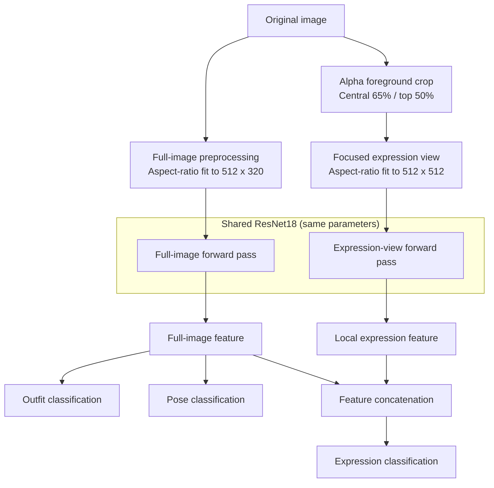

# ATRI Multi-Attribute Recognition

English | [中文](README_CN.md) | [日本語](README_JP.md)

A PyTorch-based single-character multi-attribute recognition project for jointly classifying outfit, pose, and expression from ATRI character illustrations.

The project originated as a deep learning course assignment and was later refactored to address duplicate training images, aspect-ratio distortion, insufficient expression resolution, and limited training evaluation.

<p align="center">
  
</p>

## Features

- Built with PyTorch and a pretrained ResNet18
- Joint outfit, pose, and expression recognition
- Full-image and focused-expression views share the same ResNet18
- Aspect-ratio-preserving resize and padding instead of square distortion
- Automatic upper-center foreground extraction from the Alpha channel for higher effective expression resolution
- Shared random augmentation parameters for consistent full and expression views
- Automatic train/validation split with per-task and joint accuracy tracking
- CUDA, AMP, frozen BatchNorm, early stopping, resume training, and overwrite protection
- JSON/CSV training history and automatic temperature calibration for new checkpoints
- Low-confidence abstention, batch JSON/CSV inference, and independent-set evaluation
- Crop preview, Grad-CAM, dataset auditing, and ONNX export

## Model Structure

The model uses two input views while sharing one set of ResNet18 parameters:



The full image is resized with its aspect ratio preserved and padded before being used for outfit, pose, and global-context features. The expression view locates the foreground through transparency and crops the central `65%` of its width and the top `50%` of its height. The expression head fuses the full-image and local features.

## Dataset

The training data consists of single-character illustrations. The script only reads supported image files in the training directory and strictly validates their filenames.

Filename format:

```text
<character_name>_<compatibility_field>_<scale>_<outfit>_<pose>_<expression>.png
```

Example:

```text
アトリ_tatr01_w_d1_p1_f1.png
```

Field usage:

| Position | Example | Purpose |
|----------|---------|---------|
| Character name | アトリ | Preserved as metadata; not a current target |
| Compatibility field | tatr01 / tatr02 | Parsed for filename compatibility; not a recognition target |
| Resolution level | s / w / m / l / ll | Selects source images; only `w` is used by default |
| Outfit | d1 | Outfit class label |
| Pose | p1 | Pose class label |
| Expression | f1 | Expression class label |

Each source image has five proportional size copies: `s`, `w`, `m`, `l`, and `ll`. The program uses only `w` by default so that size variants of the same content are not counted repeatedly in training or validation. Do not add extra underscores to the character name, because filenames must contain exactly six fields.

Supported recognition labels:

| Attribute | Code | Output name |
|-----------|------|-------------|
| Outfit | d1 | school uniform |
| Outfit | d2 | swimsuit |
| Outfit | d3 | pajamas |
| Outfit | d4 | pajamas + pumpkin pants |
| Pose | p1 | normal |
| Pose | p2 | hands up |
| Pose | p3 | arms horizontal + jump |
| Expression | f1 | staring |
| Expression | f2 | smile |
| Expression | f3 | happy |
| Expression | f4 | angry |
| Expression | f5 | serious |
| Expression | f6 | sad |
| Expression | f7 | distressed |
| Expression | f8 | surprised |
| Expression | f9 | confused |
| Expression | fa | troubled / embarrassed |
| Expression | fb | confident (eyes open) |
| Expression | fc | sleepy |
| Expression | fd | crying |
| Expression | fe | calm |
| Expression | ff | shy |
| Expression | fg | sulky |
| Expression | fh | shy (blush) |
| Expression | fi | blank |
| Expression | fj | disgusted |
| Expression | fk | shocked |
| Expression | fl | confident (eyes closed) |

The public repository does not provide training images. The data involves copyrighted material, so the repository only publishes source code, the model structure, and the inference program. The trained best checkpoint has been available through Releases since version 1.0.0.

Before training, filenames, corrupt images, Alpha channels, five-scale completeness, aspect ratios, and similar train/test images can be audited with:

```powershell
python check_dataset.py --train_dir atridataset/train --test_dir atridataset/test --report dataset_report.json
```

The report calculates difference hashes for both the full image and the expression crop. Similar pairs require manual review and are never deleted automatically.

## Environment

Supported range:

- Python 3.10+
- PyTorch `2.3` through `2.x`, with a matching torchvision release
- A CUDA-compatible PyTorch environment (optional, for GPU acceleration)

Install dependencies:

```powershell
pip install -r requirements.txt
```

The training script uses the current `torch.amp` API. It automatically falls back to CPU when CUDA is unavailable; use `--cpu` to force CPU execution. `requirements.txt` also includes the ONNX export dependency. For CUDA, install the appropriate PyTorch build first, then install the remaining dependencies.

## Training

Recommended command:

```powershell
python train.py --train_dir atridataset/train --out_dir outputs --run_name w512_seed42 --epochs 90 --batch 16
```

Main parameters:

| Parameter | Default | Description |
|-----------|---------|-------------|
| `--train_dir` | `atridataset/train` | Training image directory |
| `--out_dir` | `outputs` | Output directory for checkpoints, curves, and reports |
| `--run_name` | none | Create a named subdirectory for this run |
| `--overwrite` | disabled | Allow existing training artifacts to be replaced without deleting other files |
| `--epochs` | `90` | Maximum number of epochs |
| `--batch` | `16` | Batch size |
| `--height` | `512` | Full-image input height |
| `--width` | `320` | Full-image input width |
| `--expression_size` | `512` | Square expression-view side length |
| `--expression_width_fraction` | `0.65` | Expression crop fraction of foreground width |
| `--expression_height_fraction` | `0.50` | Expression crop fraction of foreground height |
| `--scale` | `w` | Source-image resolution level |
| `--val_ratio` | `0.25` | Validation split ratio |
| `--lr_backbone` | `1e-4` | ResNet18 learning rate |
| `--lr_heads` | `3e-4` | Classification-head learning rate |
| `--warmup_epochs` | `5` | Epochs that train only the heads |
| `--patience` | `15` | Early-stopping patience for expression validation loss |
| `--threshold_quantile` | `0.05` | Quantile used for suggested confidence thresholds |
| `--workers` | `2` | Number of DataLoader workers |
| `--resume` | none | Resume from `atri_net_last.pth` |
| `--train_bn` | disabled | Update ResNet18 BatchNorm statistics; frozen by default |
| `--cpu` | disabled | Force CPU execution |
| `--no_pretrained` | disabled | Do not use ImageNet pretrained weights |
| `--no_amp` | disabled | Disable CUDA automatic mixed precision |

The program creates a pose- and expression-stratified train/validation split. The backbone is frozen for the first `5` epochs while only the heads are trained. It is then unfrozen and optimized with AdamW and cosine learning-rate decay. Training uses label smoothing, while validation and model selection use standard cross-entropy. The best checkpoint and early stopping are both based on expression validation loss.

ImageNet BatchNorm running statistics are frozen by default to reduce drift from the small dataset and mixed dual-view distributions. Use `--train_bn` to restore updates and keep that setting only if it performs better on an independent test set.

When a target directory already contains a checkpoint or `metrics.json`, a new run stops with instructions to use `--run_name` or `--overwrite`.

Training outputs:

```text
outputs/w512_seed42/
├── atri_net_best.pth
├── atri_net_last.pth
├── split.json
├── run_config.json
├── environment.json
├── metrics.json
├── metrics.csv
├── calibration.json
├── loss_curve.png
├── accuracy_curve.png
├── expression_report.json
└── expression_confusion_matrix.png
```

- `atri_net_best.pth`: intended for inference and distribution; contains the model and required configuration
- `atri_net_last.pth`: contains optimizer, scheduler, and AMP state for resume training
- `split.json`: records the split and dataset signature; resume training verifies that the data did not change
- `metrics.json` / `metrics.csv`: per-epoch losses, accuracy values, and learning rates
- `calibration.json`: per-task temperatures, calibration error, and suggested thresholds
- `expression_report.json`: contains per-expression accuracy, support counts, and the confusion matrix

Resume training requires the input dimensions, crop fractions, labels, and resolution level to match the checkpoint:

```powershell
python train.py --train_dir atridataset/train --out_dir outputs --run_name w512_seed42 --resume outputs/w512_seed42/atri_net_last.pth
```

## Reference Result

The current `w + 512` reference run used random seed `42` and split 252 unique-content images into 189 training images and 63 validation images. Each expression had 3 validation samples. Training was configured for at most 90 epochs; the best checkpoint was produced at epoch 70, and training stopped normally at epoch 85 after 15 epochs without an improvement in expression validation loss.

| Metric | Result |
|--------|--------|
| Outfit accuracy | 100% |
| Pose accuracy | 100% |
| Expression accuracy | 100% |
| All three correct | 100% |
| Best expression validation loss | 0.0664 |

All 21 expression classes had 3 validation images and achieved 100% per-class accuracy, with no off-diagonal entries in the confusion matrix. At the final epoch, total training loss was approximately `0.7268` and total validation loss was approximately `0.1376`. The higher training loss is expected because training uses random augmentation and label smoothing, while validation uses standard cross-entropy without label smoothing.

The best checkpoint applies per-task temperature scaling fitted on the validation set:

| Task | Temperature | ECE before | ECE after | Suggested threshold |
|------|-------------|------------|-----------|---------------------|
| Outfit | 0.2596 | 3.11% | approximately 0% | 95% |
| Pose | 0.2500 | 2.89% | approximately 0% | 95% |
| Expression | 0.2500 | 6.39% | approximately 0% | 95% |

Manual Grad-CAM inspection showed that expression classification focused primarily on the face, pose classification attended to the arms and hands, and outfit classification focused on the torso and clothing. These regions are semantically appropriate for their respective tasks.

The reference environment used Python `3.11.9`, PyTorch `2.5.1+cu121`, torchvision `0.20.1+cu121`, CUDA `12.1`, and an NVIDIA GeForce RTX 3060 Laptop GPU.

These results only describe the current single-character, same-source, closed-set validation data. The near-zero calibrated ECE is also influenced by the small validation set and its perfect classification result; it does not imply equivalent generalization to external images, unknown characters, or different art styles. The Grad-CAM observations are qualitative checks on a small number of samples and do not replace independent-set evaluation.

## Independent Test Evaluation

Images such as `test1.png` that do not encode labels in their filenames require a UTF-8 CSV manifest:

```csv
filename,outfit,pose,expression
image.png,d1,p1,f1
```

`test_labels.example.csv` provides the header. After labeling the images, run:

```powershell
python evaluate.py --weight outputs/w512_seed42/atri_net_best.pth --test_dir atridataset/test --labels test_labels.csv --output_dir evaluation
```

The report includes task accuracy, Macro-F1, NLL, ECE, abstention coverage, joint accuracy, per-image CSV output, and a confusion matrix for each task. Without `--labels`, the evaluator attempts to parse labels from conventional six-field filenames. The independent set must not be used for training, early stopping, or threshold tuning.

## Inference

GUI:

```powershell
python infer.py --weight outputs/w512_seed42/atri_net_best.pth
```

The GUI displays the exact full-image model view, expression crop, three calibrated predictions, and confidence values. Select a task to create its Grad-CAM: outfit and pose use the full view, while expression uses the focused view.

### Grad-CAM Examples

<p align="center">
  
  <br />
  <strong>Pose recognition:</strong> the model primarily attends to the raised arms and hands.
</p>

<p align="center">
  
  <br />
  <strong>Outfit recognition:</strong> the model primarily attends to the torso and clothing.
</p>

Directory batch inference:

```powershell
python infer.py --weight outputs/w512_seed42/atri_net_best.pth --input atridataset/test --output predictions.csv --top_k 3
```

`--input` accepts one image or a directory. A `.csv` output extension writes a table; other extensions write JSON. `--recursive` scans subdirectories, `--min_confidence 0.8` overrides checkpoint thresholds, and `--accept_all` disables abstention.

New checkpoints store validation-fitted temperatures and suggested thresholds. Predictions below a threshold are marked `uncertain`. This is only a low-confidence gate, not an unknown-character or out-of-distribution detector. Older v3 checkpoints contain no calibration metadata and continue to accept all predictions.

The inference script reads dimensions, crop settings, normalization, and label order from the checkpoint. Both GUI and batch modes accept PNG, JPEG, BMP, and WebP images.

The current model uses checkpoint format version 3. Old four-task checkpoints with shoe recognition and earlier single-view three-task checkpoints cannot be loaded directly and must be retrained with the current code.

## ONNX Export

```powershell
python export_onnx.py --weight outputs/w512_seed42/atri_net_best.pth --output outputs/atri_net.onnx
```

The exporter also writes `atri_net.json` with input dimensions, preprocessing, label order, and calibration metadata. The model has `full_image` and `expression_image` inputs and `outfit`, `pose`, and `expression` logits outputs. The batch axis is dynamic by default; use `--fixed_batch` to fix it.

## Basic Tests

```powershell
python -m unittest discover -s tests
```

Tests cover filename parsing, stratified splitting, synchronized dual-view augmentation, CSV manifests, and confidence calibration.

## Project Structure

```text
.
├── calibration.py       # Temperature calibration and suggested thresholds
├── check_dataset.py     # Integrity and near-duplicate dataset audit
├── dataset.py           # Filename parsing, splitting, and dual-view preprocessing
├── evaluate.py          # Independent-set evaluation
├── export_onnx.py       # ONNX model and metadata export
├── infer.py             # GUI, batch inference, and low-confidence abstention
├── model.py             # Shared-ResNet18 dual-view model
├── train.py             # Training, calibration, early stopping, and reports
├── visualization.py     # Grad-CAM generation and overlay
├── labels.py            # Outfit, pose, and expression labels
├── tests/               # Standard-library unittest coverage
├── test_labels.example.csv
├── requirements.txt
├── LICENSE
├── README.md             # English (default)
├── README_CN.md          # Simplified Chinese
└── README_JP.md          # 日本語
```

`atridataset/` and `outputs/` are local data and runtime-output directories rather than part of the program itself.

## Known Limitations

- The dataset only contains ATRI, and the model does not perform character recognition
- The shoe field is deterministically tied to pose, so starting with version 2.0.0 it is retained only as compatibility metadata and is not recognized
- The expression crop assumes that the face is in the upper-center region of the character foreground
- The validation set is small, with only 3 validation images per expression
- The data source and composition are highly consistent, so closed-set overfitting remains possible
- Confidence thresholds cannot reliably identify arbitrary unknown characters or out-of-distribution images
- JPEG and other images without transparency are cropped from the upper-center of the entire image

## Future Plans

- Label and publish results from a more complete independent test set
- Add supported-input detection only after enough negative examples are available, rather than relying on softmax thresholds
- Web UI
- Video inference

## License

This project uses the MIT License. See [LICENSE](LICENSE) for details.

The project only contains source code, the model structure, and the inference program. It does not include any training image resources.
