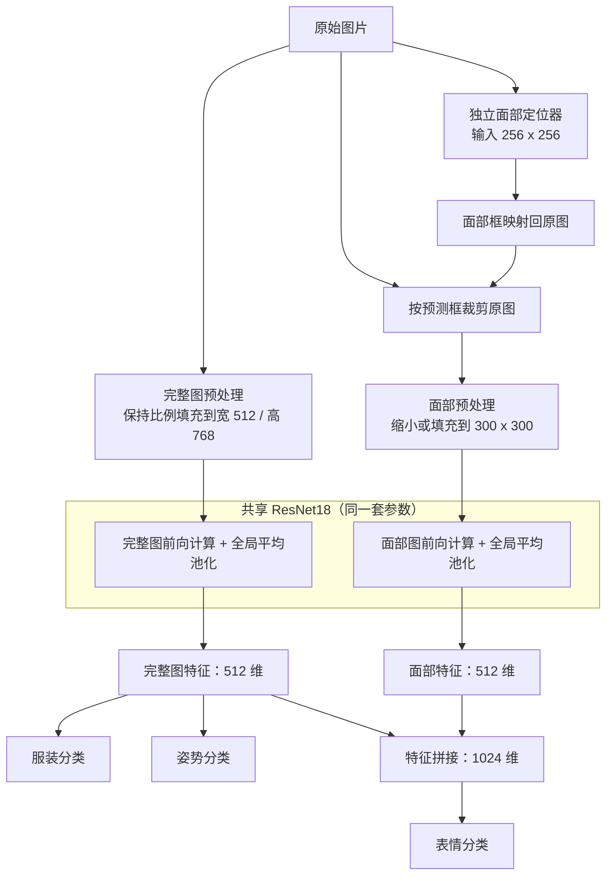

# ATRI Multi-Attribute Recognition

[English](README.md) | 中文 | [日本語](README_JP.md)

一个基于 PyTorch 的 ATRI 角色属性识别工具，可以同时判断图片中的服装、姿势和表情。项目从深度学习课程课题起步，目前作为独立开源项目维护。

v4.0.0 希望让基于立绘训练的模型逐步适应更丰富的图片输入。程序会先定位面部，再结合完整图和面部图进行识别，为处理带背景的 CG、不同分辨率和旋转图片打下基础。下面的展示以独立来源 CG 为主，也保留了当前仍会出错的例子。

- 识别 4 类服装、3 类姿势和 21 类表情。
- 提供图形界面、批量推理、置信度提示和 Grad-CAM。
- 提供面部标注、自动裁剪检查、训练、评估和 ONNX 导出工具。
- 训练支持五档分辨率均衡采样、六角度旋转和面部框扰动。

**v4.0.0 相比 v3.0.0，训练所需的计算资源和训练时间都大幅增加。** 如果硬件性能或时间预算有限，可以在 GitHub 的 **branches/tags** 中切换到 **v3.0.0**，按照该版本的说明使用。只想进行识别时，下载发布的模型即可，不需要重新训练。

<p align="center">
  
  <br />
  <em>独立来源 CG 的识别结果与表情 Grad-CAM</em>
</p>

## 目录

- [快速开始](#快速开始)：安装、下载模型、识别图片
- [效果与适用范围](#效果与适用范围)：立绘验证和独立来源图片试用
- [模型原理](#模型原理)：定位器与双视图分类器
- [准备训练数据](#准备训练数据)：文件命名、标签和面部标注
- [训练与续训](#训练与续训)：完整命令、输出文件和恢复训练
- [训练参数参考](#训练参数参考)：各脚本支持的参数
- [评估与导出](#评估与导出)：独立测试集、ONNX 和发布权重
- [开发与项目结构](#开发与项目结构)：测试命令和文件说明

## 快速开始

下面的命令都在项目根目录执行。

### 1. 安装环境

需要 Python 3.10+、PyTorch 2.3～2.x 及匹配的 torchvision。可以使用 CPU；安装支持 CUDA 的 PyTorch 后，程序会自动优先使用 GPU。

```powershell
python -m pip install -r requirements.txt
```

需要 GPU 加速时，先按 PyTorch 官方安装方式配置 CUDA 版 PyTorch，再安装其余依赖。图形界面依赖 Tcl/Tk：Windows 安装 Python 时需要包含该组件，Ubuntu 系统 Python 可安装 `python3-tk`。

训练使用 `torch.amp`，首次加载 ImageNet 预训练 ResNet18 时会下载权重。直接使用本项目发布的模型推理不需要这一步。复用现有旋转标注还需要固定 Pillow 版本，见[面部标注](#面部标注)。

### 2. 下载模型

**模型通过 [GitHub Releases](https://github.com/hoshino924/atri-multitask-cnn/releases) 单独发布，不包含在源码仓库中。**

下载 Releases 中已包含模型的完整源码包时，`models/` 目录已随包提供。若只下载或克隆了源码仓库，请先在项目根目录下创建 `models/classifier/` 和 `models/locator/`，再从 Releases 下载与程序版本对应的分类器、定位器及配套文件，按以下结构放置：

```text
models/
├── classifier/
│   ├── atri_net_best.pth
│   └── split.json
├── locator/
│   ├── face_locator_best.pth
│   └── split.json
└── manifest.json
```

两份 `split.json` 记录训练与验证内容的划分，训练复现和部分诊断会用到；`manifest.json` 记录模型文件信息。分类器需要与训练时使用的定位器配对，程序会检查模型之间的匹配关系。

### 3. 打开图形界面

```powershell
python infer.py
```

点击 **Select Image** 选择图片。窗口会显示完整图输入、实际面部裁剪和三个任务的结果。选择任务后点击 **Show Grad-CAM**，可以查看该任务的热力图：服装和姿势对应完整图，表情对应面部图。

推理界面使用英文；面部标注器和裁剪检查工具可以在英文与简体中文之间切换。

### 4. 单张与批量推理

```powershell
python infer.py --input path/to/image.png
python infer.py --input atridataset/test --output predictions.csv --top_k 3
```

`--input` 接受图片或目录，支持 PNG、JPEG、BMP 和 WebP。输出文件以 `.csv` 结尾时保存为表格，其他扩展名保存为 JSON。常用选项有：

| 参数 | 用途 |
|------|------|
| `--recursive` | 扫描子目录。 |
| `--cpu` | 强制使用 CPU。 |
| `--top_k 3` | 返回每个任务的前三个候选。 |
| `--min_confidence 0.8` | 将分类置信度阈值改为 80%。 |
| `--accept_all` | 显示分类结果，不因置信度低而拒答。 |
| `--weight` / `--locator_weight` | 指定自己训练的分类器与配套定位器。 |

### 如何理解 uncertain

发布模型的三个任务都使用 `95%` 的建议置信度阈值。低于阈值时，界面显示 `uncertain (best: ...)`：括号里仍是第一候选，但模型没有给出足够高的置信度。

第一候选可能正确，也可能错误。因此，统计第一候选准确率和统计被接受结果的准确率是两回事。`uncertain` 也不代表图片本身有问题；它只反映当前模型对这次预测的置信度。降低阈值可以减少拒答，但不会改变候选排序或修正误判。

面部定位失败会单独报错。调整分类阈值或使用 `--accept_all` 都不能绕过定位失败。

### 检查面部裁剪

```powershell
python inspect_faces.py --input atridataset/test --language zh
```

检查工具会并列显示原图与自动框、缩放前的裁剪区域，以及归一化前的面部模型输入。可以按分辨率或文件名筛选、逐图切换，并按 100% 显示检查细节；工具不会修改图片或标注。

<p align="center">
  
  <br />
  <em>裁剪检查工具：对照原图中的自动框、原始裁剪区域与实际模型输入</em>
</p>

## 效果与适用范围

### 独立来源 CG 示例

这里使用带背景的独立来源 CG 展示实际推理效果，观察模型离开标准立绘构图后能否正常工作。此次手动试用中，多数图片的第一候选符合人工判断，有些正确结果仍显示为 `uncertain`。这些例子反映了 v4.0.0 的实际进展，但样本还少，尚未据此统计独立测试集准确率。

<p align="center">
  
  <br />
  <em>带背景 CG 的识别示例，三项第一候选均符合人工判断</em>
</p>

#### 差分图片中的不稳定预测

下方两张图（图 1、图 2）使用同一组 CG 的不同差分。人工核对的服装、姿势和表情相同，模型的第一候选却有变化：

| 图片 | 服装第一候选 | 姿势第一候选 | 表情第一候选 |
|------|--------------|--------------|--------------|
| 图 1 | `d4` 睡衣与南瓜裤，51.4%，错误 | `p1` normal，81.0%，正确 | `fa` troubled / embarrassed，100.0%，正确 |
| 图 2 | `d1` 水手连衣裙，72.9%，正确 | `p1` normal，66.4%，正确 | `f4` angry，94.8%，错误 |

除图 1 的表情外，表中结果均被标记为 `uncertain`。这两个误判都被当前阈值拦下，但也说明模型对差分中的画面变化还不够稳定。头发、水滴、背景细节以及实际裁剪范围都可能影响输入，仅凭这些截图还不能确定各因素的影响程度。

<p align="center">
  
  <br />
  <em>图 1：服装预测与 Grad-CAM</em>
</p>

<p align="center">
  
  <br />
  <em>图 2：表情预测与 Grad-CAM</em>
</p>

### 发布模型与立绘验证

下表对应 [Releases](https://github.com/hoshino924/atri-multitask-cnn/releases) 中发布的最终模型，使用融合表情分类头和配套面部定位器。

| 模型 | 训练轮数 | 最佳轮次 | 输入尺寸 |
|------|----------|----------|----------|
| 多属性分类器 | 500 | 401 | 完整图宽 512、高 768；面部 300×300 |
| 面部定位器 | 240 | 231 | 256×256 |

以下结果来自 63 组开发验证内容的五档分辨率，统计的是**拒答前的第一候选准确率**：

| 输入角度 | 视图数 | 服装准确率 | 姿势准确率 | 表情准确率 |
|----------|--------|------------|------------|------------|
| 0° | 315 | 100% | 100% | 100% |
| 六个训练角度 | 1,890 | 100% | 100% | 100% |
| 未训练的 15° / 30° / 330° / 345° | 1,260 | 100% | 100% | 100% |
| 未训练的 135° / 225° | 630 | 100% | 100% | 80% |

六角度结果中有 5 个第一候选正确的表情被低置信度拒答，接近直立的四个未训练角度中有 1 个；这两组没有错误结果被接受。135° / 225° 中仍有 95 个错误表情超过了置信度阈值，说明任意角度识别还有明显局限。

0° 已包含在六角度统计中。不同尺寸和旋转图仍来自同一批内容，并没有增加独立样本；这些数据也用于选择模型和校准置信度。因此，表格适合用来检查立绘识别与旋转表现，不能代替外部图片评估。

参考训练环境：Python `3.11.9`、PyTorch `2.5.1+cu121`、torchvision `0.20.1+cu121`、CUDA `12.1`、NVIDIA GeForce RTX 3060 Laptop GPU。

#### 验证集抽选示例

下面两张图从上述验证内容中抽选，分别展示 0° 正立和 45° 旋转输入下的完整图、面部裁剪及识别结果。这些图片用于辅助理解验证表，不计作新增的独立测试样本。

<p align="center">
  
  <br />
  <em>验证集抽选示例：0° 正立输入</em>
</p>

<p align="center">
  
  <br />
  <em>验证集抽选示例：45° 旋转输入</em>
</p>

### 使用范围

当前模型主要面向 ATRI 的单角色图片，尤其是正立或接近正立的输入。使用时还需要留意以下限制：

- 模型不会识别角色身份，也不支持可靠的多人定位与逐人分类。
- 训练数据以同来源立绘为主，复杂背景、遮挡、光照和画风变化都可能影响预测。
- `f1` 与 `fe` 等表情差异很小，低分辨率和缩放可能抹去区分信息，当前仍保留独立标签。
- 置信度阈值不能可靠识别未知角色或不同于训练数据的图片，高置信度结果也可能错误。
- Grad-CAM 可以辅助观察模型关注的区域，但不能单独证明误判原因。

## 模型原理

模型由两个部分组成：定位器寻找面部，分类器判断属性。定位器由本项目的人工标注训练，不依赖外部人脸检测项目；分类器以 ImageNet 预训练 ResNet18 为骨干，完整图和面部图共享同一套参数。



定位器使用 `256×256` 输入，预测面部存在概率和框位置，再将框映射回原图进行正方形裁剪。默认面部存在阈值为 `0.5`。

分类器的两种输入都保留宽高比：

- **完整图：** 有透明背景时，按 Alpha 前景范围裁剪并留出边距，再缩放、填充到宽 512、高 768 的画布；没有透明前景可分离时按整张图片处理。
- **面部图：** 从原图预测框裁剪。大于 `300×300` 时缩小，小于画布时保留原始像素尺寸并居中补边，透明区域与补边使用黑色。

服装和姿势使用完整图特征；表情将完整图与面部特征拼接后分类。模型不预测旋转角度，也不会先将图片自动转正。

标注中使用的 **626×626** 是 l 档人工面部框的边长。它表示从源图取多大的区域，与定位器的 `256×256` 输入和分类器的 `300×300` 面部画布是不同概念。

## 准备训练数据

只使用发布模型时，可以跳过本节与后面的训练说明。

源码仓库提供人工标注和必要配置，**不提供原始训练图片**。重新训练需要自行准备数据；定位器的合成样本流程要求使用带透明背景的 PNG。自动框缓存、训练日志和其他实验结果也不随仓库提供。

### 文件命名与内容分组

训练程序从文件名读取标签，格式如下：

```text
<角色名>_<兼容字段>_<分辨率档位>_<服装标签>_<姿势标签>_<表情标签>.png
```

例如 `アトリ_tatr01_w_d1_p1_f1.png`：

| 字段 | 示例 | 含义 |
|------|------|------|
| 角色名 | アトリ | 作为元数据保留，不是识别目标。 |
| 兼容字段 | tatr01 / tatr02 | 保留现有文件名中的信息，不作为识别目标。 |
| 分辨率档位 | s / w / m / l / ll | 同一内容的五个等比例尺寸版本。 |
| 服装 | d1 | 服装标签。 |
| 姿势 | p1 | 姿势标签。 |
| 表情 | f1 | 表情标签。 |

当前训练数据有 252 组不同内容，共 1,260 张源图。使用种子 `42`，按内容划分为 189 组训练数据和 63 组验证数据。同一内容的所有尺寸和旋转版本始终留在同一个集合中，避免同图进入训练集和验证集。

角色名中不要额外使用下划线，否则会破坏六字段格式。正式训练前可以运行数据检查：

```powershell
python check_dataset.py --train_dir atridataset/train --test_dir atridataset/test --report dataset_report.json
```

报告会检查文件名、损坏图片、Alpha 通道、五档尺寸完整性、宽高比以及训练/测试之间的相似图片。相似项需要人工复核，程序不会自动删除。

### 标签定义

模型输出的代码与名称如下：

| 属性 | 标签 | 输出名称 |
|------|------|----------|
| 服装 | d1 | school uniform |
| 服装 | d2 | swimsuit |
| 服装 | d3 | pajamas |
| 服装 | d4 | pajamas + pumpkin pants |
| 姿势 | p1 | normal |
| 姿势 | p2 | hands up |
| 姿势 | p3 | arms horizontal + jump |
| 表情 | f1 | staring |
| 表情 | f2 | smile |
| 表情 | f3 | happy |
| 表情 | f4 | angry |
| 表情 | f5 | serious |
| 表情 | f6 | sad |
| 表情 | f7 | distressed |
| 表情 | f8 | surprised |
| 表情 | f9 | confused |
| 表情 | fa | troubled / embarrassed |
| 表情 | fb | confident (eyes open) |
| 表情 | fc | sleepy |
| 表情 | fd | crying |
| 表情 | fe | calm |
| 表情 | ff | shy |
| 表情 | fg | sulky |
| 表情 | fh | shy (blush) |
| 表情 | fi | blank |
| 表情 | fj | disgusted |
| 表情 | fk | shocked |
| 表情 | fl | confident (eyes closed) |

### 面部标注

现有标注是在 Pillow `12.0.0` 下制作的。复用这些标注进行旋转训练时，先安装相同版本：

```powershell
python -m pip install "pillow==12.0.0"
```

标注器会显示旋转后的画布，由人工确认面部正方形框。框内可以保留头发；工具只保存 CSV 和配套 `.meta.json`，不会裁剪或改写原图。

```powershell
python annotate_faces.py --train_dir atridataset/train --scale l --angles 0 45 90 180 270 315 --output annotations/face_boxes_l_rotated.csv --language zh
```

GUI 默认英文，可用 **Language / 语言** 切换，也可以像示例一样通过 `--language zh` 直接启动中文界面。该工具只依赖 Pillow、Tkinter 和项目辅助模块，不需要加载 PyTorch 权重。

<p align="center">
  
  <br />
  <em>面部标注工具：在旋转画布上调整正方形框，并实时查看裁剪预览</em>
</p>

- `--scale` 默认 `l`，也可选择其余四档。不同档位使用不同标注表。
- 按角度依次标注：先完成全部 `0°`，再处理 `45°`，依次到 `315°`；正角度表示逆时针旋转。
- 左键拖动绘制正方形，框内拖动移动，右下角手柄调整边长；`Shift` + 拖动重新绘制。
- 方向键移动 1 个图像像素，`+` / `-` 或滚轮调整边长；按住 `Shift` 时步长为 10，也可以直接输入坐标。
- “确认并下一张”、画布上的 `Enter` / 空格用于保存并切换；`Ctrl+S` 只保存当前标注。
- 同角度、同角色、同分辨率和姿势可以继承最近确认的框。继承框和跨角度生成的候选框都需要逐图检查。

当前六角度表共 1,512 条标注，l 档框的边长统一为 `626`。主要字段如下：

| 字段 | 含义 |
|------|------|
| `filename` | 源图片文件名。 |
| `angle` | 逆时针旋转角度。 |
| `image_width` / `image_height` | 旋转前原图尺寸。 |
| `canvas_width` / `canvas_height` | 旋转后画布尺寸。 |
| `x_left` / `y_bottom` | 方框左边与下边相对旋转后画布左下角的像素坐标。 |
| `side` | 方框边长，单位为画布像素。 |

坐标以**旋转后画布的左下角**为原点，使用实际画布像素，不受 GUI 显示缩放影响。转换为 Pillow 的左上角坐标时，`top = canvas_height - y_bottom - side`。

CSV 和同名 `.meta.json` 应一同保留。元数据记录了原图哈希、尺寸、旋转规则和 Pillow 版本，程序会检查这些信息。更换图片或尺寸后，应重新标注并另存文件。

## 训练与续训

下面的三步使用最终发布模型的训练设置。定位器用 l 档人工框训练，分类器用五档原图和自动框训练，裁剪来源与实际推理一致。完整参数定义见[训练参数参考](#训练参数参考)。

示例中的 `models/classifier/split.json` 来自 Releases，用于核对发布模型的内容划分。如果从头训练自己的数据，可以移除 `--reference_split`，无需先下载发布权重。

### 1. 训练定位器

```powershell
python train_locator.py --train_dir atridataset/train --annotations annotations/face_boxes_l_rotated.csv --rotated_annotations --scale l --angles 0 45 90 180 270 315 --angle_weights 1 1 1 1 1 1 --reference_split models/classifier/split.json --epochs 240 --batch 16 --workers 6 --seed 42 --out_dir outputs/face_locator
```

定位器的六个角度等比例采样，输入尺寸为 `256×256`。程序利用透明立绘构建面部存在和不存在的样本。

### 2. 生成自动框缓存

```powershell
python face_box_cache.py --train_dir atridataset/train --locator_weight outputs/face_locator/face_locator_best.pth --scale all --angles 0 45 90 180 270 315 --seed 42 --val_ratio 0.25 --output_dir annotations/face_cache
```

程序先旋转原图，再运行定位器，保存框坐标、数据签名和模型哈希。当前数据会生成 7,560 条视图记录，训练时根据坐标读取原图，不需要保存另一套裁剪图片。

如果直接使用发布定位器，可以跳过第一步，把 `--locator_weight` 改为 `models/locator/face_locator_best.pth`。缓存的输出目录必须是新目录。

### 3. 训练分类器

```powershell
python train.py --train_dir atridataset/train --face_cache annotations/face_cache --scale all --angles 0 45 90 180 270 315 --angle_weights 45 20 5 5 5 20 --expression_head fusion --face_jitter mixed --face_shrink_probability 0 --height 768 --width 512 --expression_size 300 --epochs 500 --warmup_epochs 5 --patience 500 --batch 16 --workers 6 --seed 42 --out_dir outputs/classifier
```

### 本次采用的训练配置

下表汇总上述命令的实际设置，便于与后面的程序默认值区分：

| 项目 | 配置 |
|------|------|
| 源图分辨率 | `s / w / m / l / ll`，均衡采样，各占 20% |
| 分类器角度比例 | `0°: 45%`，`45°: 20%`，`90°: 5%`，`180°: 5%`，`270°: 5%`，`315°: 20%` |
| 完整图 / 面部画布 | 宽 512、高 768 / 300×300 |
| 表情分类头 | 完整图与面部特征融合 |
| 面部位置扰动 | 保持位置 25%，小幅扰动 50%，较大扰动 25% |
| 扰动范围 | 小幅为横纵各 ±10 px，较大为各 ±25 px，按面部输入等效像素映射回原图 |
| 框边长扰动 | ±8%；不额外启用随机缩小面部图 |
| 训练轮数 / batch | 500 / 16 |
| DataLoader workers | 6，可按本机 CPU 和内存调整 |
| 骨干 / 分类头初始学习率 | `1e-4` / `3e-4` |
| 优化器 / 权重衰减 | AdamW / `1e-4` |
| 标签平滑 / Dropout | `0.05` / `0.2` |
| 训练 / 验证内容比例 | 75% / 25%，种子 42 |

每轮为每组内容选择一个分辨率和角度组合，在完整采样周期内达到设定比例。完整图和面部图都来自同一张旋转后的原图，所以旋转同时用于服装、姿势和表情训练。两路共享翻转、轻微仿射与颜色增强；自动框附近的位置扰动只改变面部裁剪。

前 5 轮只训练分类头，随后解冻骨干，使用 AdamW 和余弦学习率衰减。BatchNorm 运行统计量保持冻结，CUDA 下默认启用 AMP。训练损失使用标签平滑，验证使用普通交叉熵。

最佳分类器按三个任务的验证交叉熵均值选择，其中分辨率等权、角度按设定比例加权。训练结束后，再用最佳模型对验证集进行逐任务温度校准。

本次使用 `batch 16`、`workers 6`。显存有余量并不意味着预处理没有开销：读取、旋转和裁剪图片也需要 CPU 时间。遇到显存或内存不足时，再根据本机情况调整。

### 训练输出与断点续训

#### 输出目录结构

按上述命令训练后，主要输出如下：

```text
outputs/
├── face_locator/
│   ├── face_locator_best.pth
│   ├── face_locator_last.pth
│   └── split.json
└── classifier/
    ├── atri_net_best.pth
    ├── atri_net_last.pth
    ├── split.json
    ├── run_config.json
    ├── environment.json
    ├── metrics.json
    ├── metrics.csv
    ├── calibration.json
    ├── loss_curve.png
    ├── accuracy_curve.png
    ├── expression_report.json
    └── expression_confusion_matrix.png
```

| 文件 | 用途 |
|------|------|
| `*_best.pth` | 验证指标选出的最佳模型，本地文件仍带有训练配置和记录。 |
| `*_last.pth` | 保留恢复训练需要的完整状态。 |
| `split.json` | 记录内容划分与数据签名。 |
| `run_config.json` / `environment.json` | 分类器的实际配置与运行环境。 |
| `metrics.json` / `metrics.csv` | 逐轮损失、准确率等指标。 |
| `calibration.json` | 温度校准结果和建议拒答阈值。 |
| 曲线、报告与混淆矩阵 | 查看训练过程及逐表情表现。 |

#### 断点续训

在原来的完整训练命令末尾添加对应的恢复参数：

- 分类器：`--resume outputs/classifier/atri_net_last.pth`
- 定位器：`--resume outputs/face_locator/face_locator_last.pth`

续训需要保持原数据、划分、缓存、模型结构、尺寸、角度和增强设置。分类器还会核对总轮数、batch、学习率和早停配置，应保留原来的 `--epochs`，不能直接增大它来追加训练。定位器允许增加累计目标轮数，其他受校验设置仍须一致。

新训练使用新的输出目录。Releases 中的精简权重用于推理和评估，不能代替 `*_last.pth` 续训。

## 训练参数参考

需要调整训练设置时，可以查阅下面的参数表。**表中列的是程序默认值，复现发布模型时请以上面的完整命令为准。** 布尔开关只写参数名即可，不用附加 `true`；角度和权重列表用空格分隔。定位器、缓存和分类器三个阶段应使用相同的 `--seed`、`--val_ratio` 和内容划分。

可通过帮助命令查看参数列表：

```powershell
python train_locator.py --help
python face_box_cache.py --help
python train.py --help
```

### 定位器（train_locator.py）

| 参数 | 默认值 | 定义 |
|------|--------|------|
| `--train_dir` | `atridataset/train` | 训练源图目录。 |
| `--annotations` | 按模式选择 | 普通模式为 `annotations/face_boxes_l.csv`；旋转模式为 `annotations/face_boxes_l_rotated.csv`，后者需配套同名 `.meta.json`。 |
| `--scale` | `l` | 源图档位，支持 `s / w / m / l / ll`，定位器一次使用一档。 |
| `--out_dir` | 按模式选择 | 普通模式为 `outputs/face_locator_l`，旋转模式为 `outputs/face_locator_rotated_l`；不会根据 `--scale` 自动改名。 |
| `--rotated_annotations` | 关闭 | 读取人工确认的旋转标注，启用按内容和角度采样。 |
| `--angles` | 旋转模式下为六角度 | 逆时针角度列表，默认 `0 45 90 180 270 315`；需要 `--rotated_annotations`，且每个角度均需有人工标注。 |
| `--angle_weights` | 六角度为 `45 20 5 5 5 20` | 与角度逐项对应的正权重，程序自动归一化。最终定位器使用 `1 1 1 1 1 1`，必须显式传入。 |
| `--reference_split` | 无 | 指定已有 `split.json`，核对本次生成的训练、验证内容集合是否完全相同；不是直接导入任意划分。 |
| `--input_size` | `256` | 定位器正方形输入边长，至少 32 像素。 |
| `--epochs` | `60` | 总训练轮数；最终定位器使用 240。续训时表示累计目标轮数。 |
| `--batch` | `16` | 每个批次的样本数。 |
| `--samples_per_image` | `8` | 每组内容每轮的训练样本数，包含原图、负样本与合成样本，至少为 4；旋转模式先为该内容选一个角度。 |
| `--val_ratio` | `0.25` | 按内容划分的验证比例。 |
| `--seed` | `42` | 划分、采样与随机训练过程的种子。 |
| `--threshold` | `0.5` | 面部存在概率阈值，范围 `(0, 1]`，用于定位指标并保存到权重。 |
| `--lr` | `0.001` | 定位器 AdamW 学习率，必须大于 0。 |
| `--workers` | `0` | DataLoader 子进程数；0 表示在主进程加载，示例使用 6。 |
| `--resume` | 无 | 从含完整训练状态的 `face_locator_last.pth` 继续。 |
| `--preview_only` | 关闭 | 校验数据并导出定位器输入和目标框预览，不创建模型或训练；使用新目录，不能与 `--resume` 同用。 |
| `--cpu` | 关闭 | 强制 CPU；否则有 CUDA 时使用 CUDA，并启用 AMP。 |

### 自动框缓存（face_box_cache.py）

| 参数 | 默认值 | 定义 |
|------|--------|------|
| `--train_dir` | `atridataset/train` | 待生成自动框的源图目录。 |
| `--locator_weight` | `models/locator/face_locator_best.pth` | 定位器权重；默认路径相对程序目录解析，需要先下载。 |
| `--locator_split` | 权重同目录的 `split.json` | 定位器内容划分，用于检查分类验证内容没有进入定位器训练集。 |
| `--scale` | `w` | 选择单档或 `all`；`all` 要求每组内容的五档图片齐全，最终分类训练使用 `all`。 |
| `--angles` | 不旋转 | 指定后先旋转原图再定位，并生成带旋转信息的缓存；最终流程显式指定六角度。 |
| `--seed` | `42` | 分类内容划分的种子。 |
| `--val_ratio` | `0.25` | 分类验证内容比例，需与后续训练一致。 |
| `--output_dir` | 自动命名 | 普通缓存为 `annotations/locator_<scale>_seed<seed>`；指定角度时为 `annotations/locator_<scale>_rotated_seed<seed>`。目标目录必须不存在。 |
| `--cpu` | 关闭 | 强制使用 CPU 运行定位器。 |

### 分类器（train.py）

#### 数据、输入与输出

发布模型使用自动框缓存、六角度采样和 `fusion` 表情头。下面也列出了程序提供的其他选项，便于根据自己的数据调整。

| 参数 | 默认值 | 定义 |
|------|--------|------|
| `--train_dir` | `atridataset/train` | 训练源图目录。 |
| `--out_dir` | `outputs` | 输出目录；指定 `--run_name` 时作为其父目录。 |
| `--run_name` | 无 | 输出子目录名，例如 `--out_dir outputs --run_name classifier`。只能是单个目录名。 |
| `--overwrite` | 关闭 | 允许在已有输出目录写入同名训练结果；不会清空整个目录。保留原结果时应另选目录。 |
| `--face_cache` | 无 | 使用自动框缓存目录；最终流程使用此参数。 |
| `--face_annotations` | 无 | 直接使用正立人工框 CSV，与 `--face_cache` 互斥；六角度分类训练应使用旋转缓存。 |
| `--scale` | 人工框模式 `l`，其余 `w` | 支持五个单档或 `all`；`all` 按内容均衡选择五档，需要每组内容五档齐全。 |
| `--angles` | 不启用旋转采样 | 逆时针角度列表，必须同时指定 `--face_cache`，缓存需覆盖所选角度。 |
| `--angle_weights` | 六角度为 `45 20 5 5 5 20` | 与 `--angles` 配对的正权重，影响角度采样、旋转验证选模及校准。 |
| `--height` | `768` | 完整图输入画布高度，单位为像素。 |
| `--width` | `512` | 完整图输入画布宽度，单位为像素。 |
| `--expression_size` | 按裁剪来源选择 | 面部正方形画布边长：自动框缓存默认 300，人工框默认 626，不提供框时默认 512。最终流程使用 300。 |
| `--expression_head` | `fusion` | `fusion` 拼接完整图与面部特征；`face_only` 仅用面部特征进行表情分类，两者都共享骨干。 |
| `--margin` | `0.04` | 完整图前景裁剪的边距比例，范围 `[0, 0.5)`；不会给自动面部框额外加边。 |
| `--expression_width_fraction` | `0.65` | 不提供面部框时，从前景中央截取的宽度比例，范围 `(0, 1]`；自动框流程不使用。 |
| `--expression_height_fraction` | `0.50` | 不提供面部框时，从前景顶部截取的高度比例，范围 `(0, 1]`；自动框流程不使用。 |

两种训练入口的角度权重都按所给角度顺序对应，再归一化。只选一个角度时可省略权重；使用默认六角度之外的多角度集合时需明确传入权重。角度按 360° 归一化后不能重复，`0` 和 `360` 表示同一方向。权重应使用简单比例，程序限制角度采样周期不超过 1,000 轮；分类器的完整分辨率与角度组合周期还需乘以所选分辨率数量。

#### 优化、运行与校准

| 参数 | 默认值 | 定义 |
|------|--------|------|
| `--epochs` | `90` | 总训练轮数；最终模型使用 500。续训时是累计目标轮数，不是追加轮数。 |
| `--batch` | `16` | 每批样本数，每个样本包含完整图和面部两种视图。 |
| `--val_ratio` | `0.25` | 按内容分组的验证比例。 |
| `--seed` | `42` | 数据划分与随机过程的种子。 |
| `--lr_backbone` | `1e-4` | 解冻后骨干网络的初始学习率。 |
| `--lr_heads` | `3e-4` | 分类头初始学习率。 |
| `--min_lr` | `1e-6` | 余弦学习率衰减的最低学习率。 |
| `--weight_decay` | `1e-4` | AdamW 权重衰减系数。 |
| `--label_smoothing` | `0.05` | 训练交叉熵的标签平滑系数，范围 `[0, 1)`；验证不使用标签平滑。 |
| `--dropout` | `0.2` | 分类头 Dropout 概率，范围 `[0, 1)`。 |
| `--gradient_clip` | `5.0` | 梯度范数裁剪上限；设为 0 关闭裁剪。 |
| `--warmup_epochs` | `5` | 初始冻结骨干、仅训练分类头的轮数，范围 `[0, epochs)`。 |
| `--patience` | `15` | 选模指标连续无改善时的早停等待轮数。六角度流程监控加权三任务验证损失；非旋转流程监控表情验证损失。最终配置为 500。 |
| `--threshold_quantile` | `0.05` | 从验证集中正确样本的校准置信度分位数生成建议阈值，范围 `[0, 0.5]`；不是直接指定推理置信度阈值。 |
| `--workers` | `2` | DataLoader 子进程数；0 为主进程加载，最终配置为 6。 |
| `--resume` | 无 | 从 `atri_net_last.pth` 恢复训练状态，配置须与原运行一致。 |
| `--train_bn` | 关闭 | 更新骨干 BatchNorm 运行统计量；默认冻结这些统计量。 |
| `--cpu` | 关闭 | 强制 CPU，否则在 CUDA 可用时使用 CUDA。 |
| `--no_pretrained` | 关闭 | 新训练不加载 ImageNet 预训练权重；默认加载，断点续训使用 checkpoint 参数。 |
| `--no_amp` | 关闭 | 禁用 CUDA 自动混合精度；CPU 训练本身不启用 CUDA AMP。 |

#### 面部框与图像增强

下表是**新建面部框训练**时的默认增强设置。续训时，没有明确指定的面部增强选项沿用 checkpoint 中的设置，实际配置可在 `run_config.json` 中查看。框的位置和大小在原图上调整，仿射与颜色增强则在生成输入画布后进行。

| 参数 | 默认值 | 定义 |
|------|--------|------|
| `--face_jitter` | `mixed` | `mixed` 使用保持、小幅、较大三档位置扰动；`none` 关闭位置扰动；`legacy` 使用原有框扰动方式。不提供面部框时默认 `legacy`。 |
| `--face_size_jitter` | `0.08` | 方框边长的相对扰动幅度，例如 0.08 表示 ±8%，范围 `[0, 1)`。 |
| `--face_keep_probability` | `0.25` | mixed 模式中保持裁剪位置的概率。 |
| `--face_small_probability` | `0.50` | mixed 模式中小幅平移的概率；较大平移概率为 `1 - keep - small`，两者之和不得超过 1。 |
| `--face_small_pixels` | `10` | 小幅平移在横纵方向各自的最大绝对偏移，单位为面部输入的等效像素。 |
| `--face_wide_pixels` | `25` | 较大平移的最大绝对偏移，单位同上，不能小于 `face_small_pixels`。 |
| `--face_jitter_attempts` | `16` | 框越界时重采样的最大尝试次数；仍失败则回退到平移前的有效框。 |
| `--face_shrink_probability` | `0.35` | 对已裁出的面部图额外随机缩小的概率；不是收紧面部框。最终模型显式设为 0。 |
| `--face_min_scale` | `0.30` | 上述随机缩小的最小边长比例，范围 `(0, 1]`；缩小倍率在此值与 1 之间采样，缩小概率为 0 时不生效。 |
| `--face_translate` | `0` | 面部画布仿射平移的最大宽高比例。mixed / none 必须为 0，避免叠加平移；legacy 默认 0.02。 |
| `--full_translate` | `0.02` | 完整图画布仿射平移的最大宽高比例，范围 `[0, 1]`。 |
| `--flip_probability` | `0.50` | 完整图与面部图同步水平翻转的概率。 |
| `--affine_degrees` | `3` | 同步小角度仿射旋转的最大绝对角度；与源图六角度采样是两个参数。 |
| `--affine_scale_min` | `0.95` | 同步仿射缩放的最小倍率，必须大于 0。 |
| `--affine_scale_max` | `1.02` | 同步仿射缩放的最大倍率，不能小于最小倍率。 |
| `--color_jitter` | `0.08` | 亮度、对比度和饱和度因子在 `1±此值` 内分别采样，两路使用相同因子，范围 `[0, 1]`。 |

`--face_jitter none` 只关闭裁剪位置扰动，不会自动关闭边长扰动、额外缩小、翻转或颜色增强；这些行为由各自参数控制。

#### 预览模式

| 参数 | 默认值 | 定义 |
|------|--------|------|
| `--sampling_preview_only` | 关闭 | 校验数据与缓存，保存划分和采样计划后退出，不创建模型或优化器。 |
| `--augmentation_preview_only` | 关闭 | 导出实际训练输入及框扰动信息后退出，不训练；需要面部框，不能与 `--resume` 同用。 |
| `--augmentation_preview_count` | `21` | 每个分辨率与角度组合选取的训练图片数上限，至少为 1。 |
| `--augmentation_preview_repeats` | `4` | 每张预览图片重复随机增强的次数，至少为 1。 |

两种预览开关互斥，预览输出应使用独立的新目录。预览可帮助检查数据与采样配置，但不能说明模型准确率。

## 评估与导出

### 在自己的测试集上评估

独立测试图片不应参与训练、选模或阈值调节。对于 `image.png` 这类没有在文件名中携带标签的图片，准备 UTF-8 CSV：

```csv
filename,outfit,pose,expression
image.png,d1,p1,f1
```

可以从 `test_labels.example.csv` 开始填写，然后运行：

```powershell
python evaluate.py --test_dir atridataset/test --labels test_labels.csv --output_dir evaluation/test
```

默认使用下载到 `models/` 的分类器和定位器。输出包含三个任务的准确率、Macro-F1、NLL、ECE、拒答覆盖率、联合准确率，以及逐图片 CSV 和混淆矩阵。不指定 `--labels` 时，程序会尝试读取标准六字段文件名中的标签。

### 导出 ONNX

```powershell
python export_onnx.py --output outputs/atri_net.onnx
```

导出结果包含分类器 ONNX 和 `atri_net.json`，后者记录预处理、标签顺序和校准配置。

| 名称 | 类型与形状 |
|------|------------|
| `full_image` | 完整图输入，`[batch, 3, 768, 512]` |
| `expression_image` | 面部图输入，`[batch, 3, 300, 300]` |
| `outfit` / `pose` / `expression` | 三个任务的 logits 输出 |

默认 batch 维度可变，可用 `--fixed_batch` 固定。ONNX 只包含分类器；面部定位、原图裁剪、温度缩放、softmax 和拒答判断需要在部署端按元数据另行处理。

### 导出发布权重

自己训练的模型可以导出为适合通过 Releases 发布的精简文件：

```powershell
python export_release_weights.py --classifier outputs/classifier/atri_net_best.pth --locator outputs/face_locator/face_locator_best.pth --output_dir release_models
```

分类器与定位器必须是训练时使用的组合，各自目录中需要保留 `split.json`。如果缓存使用的是下载的发布定位器，`--locator` 也应指向它。

导出器会去除训练历史、优化器等记录，保留推理与评估需要的内容，并检查模型张量和加载结果。目标必须是新目录，已有文件不会被覆盖。

## 开发与项目结构

### 回归测试

```powershell
python -m unittest discover -s tests -v
```

测试覆盖标签解析、内容分组、均衡采样、旋转标注、面部框缓存、同步增强、模型结构、置信度校准和公开权重导出。GUI 的显示与交互仍需人工检查。

### 文件说明

```text
.
├── annotate_faces.py          # 面部框与旋转标注 GUI
├── annotation_i18n.py         # 标注工具中英文文本
├── app_assets.py              # 模型默认路径、GUI 图标和任务栏身份
├── calibration.py            # 温度校准和建议阈值
├── check_dataset.py          # 数据完整性与相似图片审计
├── dataset.py                # 文件名、内容划分和双视图预处理
├── model.py                  # 共享 ResNet18 与融合分类头
├── face_locator.py           # 单面部定位网络与预测
├── locator_data.py           # 定位器训练样本构建
├── face_regions.py           # 正方形框与面部裁剪
├── face_box_cache.py         # 自动框缓存生成及校验
├── face_augmentation.py      # 面部框扰动策略
├── image_rotation.py         # 共用旋转规则
├── rotation_annotations.py   # 旋转标注及元数据校验
├── rotation_data.py          # 分辨率与角度采样
├── classifier_rotation.py    # 分类器旋转数据契约
├── train_locator.py          # 定位器训练
├── train.py                  # 分类器训练、校准与报告
├── preview_augmentation.py   # 增强预览
├── infer.py                  # GUI 与批量推理
├── inspect_faces.py          # 自动裁剪检查 GUI
├── evaluate.py               # 独立测试集评估
├── diagnose_*.py             # 分辨率、旋转和框偏移诊断
├── visualization.py          # Grad-CAM
├── export_onnx.py            # 分类器 ONNX 导出
├── export_release_weights.py # 公开权重导出
├── models/                   # 自行创建并放入 Releases 文件；含模型的完整包已提供
├── annotations/              # 人工标注 CSV 与元数据
├── icons/                    # 各尺寸原始 PNG 与多分辨率 ICO
├── tools/build_icon.ps1      # 原样封装各尺寸 PNG，不重新缩放
├── tests/                    # 回归测试
├── test_labels.example.csv
├── requirements.txt
├── LICENSE
├── README.md                 # English（默认）
├── README_CN.md              # 简体中文
└── README_JP.md              # 日本語
```

上面的 `models/` 是安装模型后的目录，源码仓库不包含该目录及其配套文件；创建方式和文件位置见[下载模型](#2-下载模型)。`atridataset/` 用于自行准备的图片，`outputs/` 和 `evaluation/` 用于本地运行输出，这些目录也不随源码提供。文档截图通过外部链接展示，不放入源码仓库。

## 后续计划

- 整理更多独立来源图片，补充带人工标签的定量评估
- 增加负样本，改进对不适合当前模型的输入的识别
- Web UI
- 视频推理

## License

本项目代码及作者制作的项目图标（`icons/` 中的 PNG 和 ICO 文件）均使用 MIT License，详见 [LICENSE](LICENSE)。

模型通过 Releases 发布，可单独下载，也可随包含模型的完整源码包获取。原始训练图片不随项目提供；训练和效果展示所涉及的角色及图片素材，其权利归各自权利人所有。
