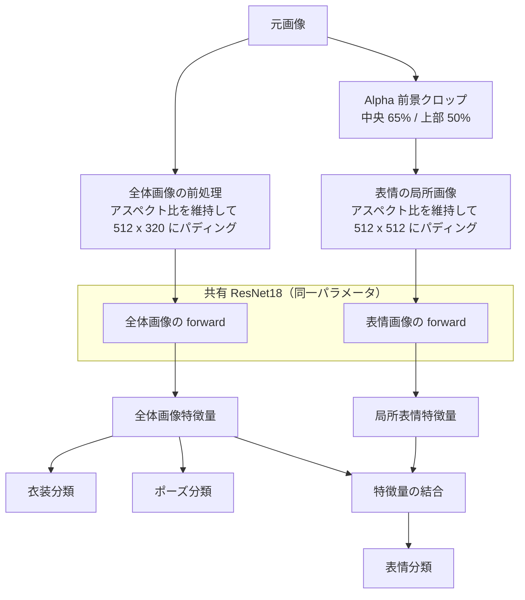

# ATRI Multi-Attribute Recognition

[English](README.md) | [中文](README_CN.md) | 日本語

PyTorch を用いた、単一キャラクターの複数属性認識プロジェクトです。ATRI の立ち絵から衣装・ポーズ・表情を同時に認識します。

本プロジェクトは深層学習の授業課題をもとに開発を始め、その後、データの重複、画像の引き伸ばし、表情領域の解像度不足、学習・評価の不十分さといった問題を改善するために再構成しました。

<p align="center">
  
</p>

## 機能

- PyTorch と ImageNet 事前学習済みの ResNet18 を使用
- 衣装、ポーズ、表情を同時に認識
- 全体画像と表情の局所画像で同じ ResNet18 の重みを共有
- 元画像のアスペクト比を維持し、細長い立ち絵を正方形に強制的に引き伸ばさない
- Alpha 前景から人物上半部の中央領域を自動抽出し、表情に使える実効解像度を向上
- 全体画像と表情画像に同じランダム拡張パラメータを適用し、2 つのビュー間の整合性を維持
- 学習データを訓練用と検証用に自動分割し、3 タスクそれぞれの精度と全タスク同時正解率を記録
- CUDA、AMP、BatchNorm の固定、Early Stopping、checkpoint からの学習再開、出力の上書き防止に対応
- JSON/CSV 形式で学習履歴を自動保存し、新しい重みに対して温度校正を実施
- 低信頼度時の判定保留、JSON/CSV 形式の一括推論、独立テストセット評価に対応
- 表情クロップのプレビュー、Grad-CAM、データセット監査、ONNX エクスポートを提供

## モデル構成

モデルは 2 種類の入力ビューを使用しますが、両方の計算で同一の ResNet18 パラメータを共有します。



全体画像はアスペクト比を保ったままリサイズ・パディングし、衣装とポーズの分類、および全体的な文脈の抽出に使用します。表情ビューは Alpha チャンネルから人物の前景を特定し、前景幅の中央 `65%`、前景高さの上部 `50%` を切り出します。表情分類ヘッドでは、全体画像の特徴量と局所特徴量を結合します。

## データセット

学習データは単一キャラクターの立ち絵で構成されています。スクリプトは学習ディレクトリ直下にある対応形式の画像だけを読み込み、ファイル名形式を厳密に検証します。

ファイル名形式：

```text
<character_name>_<compatibility_field>_<scale>_<outfit>_<pose>_<expression>.png
```

例：

```text
アトリ_tatr01_w_d1_p1_f1.png
```

各フィールドの用途：

| 位置 | 例 | 用途 |
|------|----|------|
| キャラクター名 | アトリ | メタデータとして保持し、現在の学習には使用しない |
| 互換用フィールド | tatr01 / tatr02 | 既存ファイル名との互換性のために解析するが、認識対象には使用しない |
| 解像度レベル | s / w / m / l / ll | 学習に使用する元画像を選択。デフォルトでは `w` のみを使用 |
| 衣装 | d1 | 衣装分類ラベル |
| ポーズ | p1 | ポーズ分類ラベル |
| 表情 | f1 | 表情分類ラベル |

同じ内容に対して `s`、`w`、`m`、`l`、`ll` の 5 段階の等比サイズ画像があります。デフォルトでは `w` のみを使用し、内容が同じでサイズだけ異なる画像が学習データと検証データに重複して数えられることを防ぎます。ファイル名は 6 フィールドである必要があるため、キャラクター名には追加のアンダースコアを使用しないでください。

対応する認識ラベル：

| 属性 | コード | 出力名 |
|------|--------|--------|
| 衣装 | d1 | school uniform |
| 衣装 | d2 | swimsuit |
| 衣装 | d3 | pajamas |
| 衣装 | d4 | pajamas + pumpkin pants |
| ポーズ | p1 | normal |
| ポーズ | p2 | hands up |
| ポーズ | p3 | arms horizontal + jump |
| 表情 | f1 | staring |
| 表情 | f2 | smile |
| 表情 | f3 | happy |
| 表情 | f4 | angry |
| 表情 | f5 | serious |
| 表情 | f6 | sad |
| 表情 | f7 | distressed |
| 表情 | f8 | surprised |
| 表情 | f9 | confused |
| 表情 | fa | troubled / embarrassed |
| 表情 | fb | confident (eyes open) |
| 表情 | fc | sleepy |
| 表情 | fd | crying |
| 表情 | fe | calm |
| 表情 | ff | shy |
| 表情 | fg | sulky |
| 表情 | fh | shy (blush) |
| 表情 | fi | blank |
| 表情 | fj | disgusted |
| 表情 | fk | shocked |
| 表情 | fl | confident (eyes closed) |

公開リポジトリには学習画像を含めていません。データには著作権で保護された素材が含まれるため、本リポジトリで公開するのはソースコード、モデル構成、推論プログラムのみです。学習済みのベスト重みはバージョン 1.0.0 以降、Releases で公開しています。

学習前に、ファイル名形式、破損画像、Alpha チャンネル、5 段階サイズの欠落、アスペクト比、および学習画像とテスト画像の類似性を検査できます。

```powershell
python check_dataset.py --train_dir atridataset/train --test_dir atridataset/test --report dataset_report.json
```

レポートでは、全体画像と表情クロップ領域のそれぞれについて差分ハッシュを計算します。類似画像は手動確認が必要な候補として報告されるだけで、スクリプトが自動で削除することはありません。

## 動作環境

対応範囲：

- Python 3.10 以降
- PyTorch `2.3` 以降の `2.x` 系、および対応する torchvision
- CUDA 対応 PyTorch 環境（GPU 高速化を使用する場合のみ）

依存パッケージのインストール：

```powershell
pip install -r requirements.txt
```

学習スクリプトは新しい `torch.amp` API を使用します。CUDA を検出できない場合は自動的に CPU を使用し、`--cpu` で CPU 実行を強制することもできます。`requirements.txt` には ONNX エクスポートに必要な依存関係も含まれています。CUDA 版 PyTorch は、環境に合ったものを公式の手順で先にインストールしてから、残りの依存関係をインストールすることを推奨します。

## 学習

推奨コマンド：

```powershell
python train.py --train_dir atridataset/train --out_dir outputs --run_name w512_seed42 --epochs 90 --batch 16
```

主なパラメータ：

| パラメータ | 既定値 | 説明 |
|------------|--------|------|
| `--train_dir` | `atridataset/train` | 学習画像ディレクトリ |
| `--out_dir` | `outputs` | checkpoint、学習曲線、レポートの出力ディレクトリ |
| `--run_name` | なし | 出力ディレクトリ内に今回の学習用サブディレクトリを作成 |
| `--overwrite` | 無効 | 他のファイルは削除せず、既存の学習成果物の上書きを許可 |
| `--epochs` | `90` | 最大 epoch 数 |
| `--batch` | `16` | バッチサイズ |
| `--height` | `512` | 全体画像入力の高さ |
| `--width` | `320` | 全体画像入力の幅 |
| `--expression_size` | `512` | 表情局所画像の正方形の一辺 |
| `--expression_width_fraction` | `0.65` | 前景幅に対する表情クロップ幅の割合 |
| `--expression_height_fraction` | `0.50` | 前景高さに対する表情クロップ高さの割合 |
| `--scale` | `w` | 使用する元画像の解像度レベル |
| `--val_ratio` | `0.25` | 検証データの割合 |
| `--lr_backbone` | `1e-4` | ResNet18 の学習率 |
| `--lr_heads` | `3e-4` | 分類ヘッドの学習率 |
| `--warmup_epochs` | `5` | 分類ヘッドのみを学習する epoch 数 |
| `--patience` | `15` | 表情の検証損失が改善しない場合の Early Stopping の待機 epoch 数 |
| `--threshold_quantile` | `0.05` | 低信頼度判定の推奨しきい値を算出する際に使用する分位点 |
| `--workers` | `2` | DataLoader のワーカ数 |
| `--resume` | なし | `atri_net_last.pth` から学習を再開 |
| `--train_bn` | 無効 | ResNet18 の BatchNorm 統計を更新。デフォルトでは固定 |
| `--cpu` | 無効 | CPU 実行を強制 |
| `--no_pretrained` | 無効 | ImageNet 事前学習済み重みを使用しない |
| `--no_amp` | 無効 | CUDA 自動混合精度を無効化 |

プログラムはポーズと表情を基準に層化して、学習データと検証データを分割します。最初の `5` epoch はバックボーンを固定して分類ヘッドのみを学習し、その後バックボーンの凍結を解除して、AdamW とコサイン学習率減衰で最適化します。学習損失にはラベルスムージングを使用し、検証とモデル選択には通常の交差エントロピーを使用します。ベスト checkpoint の保存と Early Stopping は、どちらも表情の検証損失を基準にします。

小規模データセットで 2 種類の入力分布が混在することによるドリフトを抑えるため、ImageNet 事前学習済み BatchNorm の移動統計はデフォルトで固定します。`--train_bn` で更新を有効にできますが、独立テストセットで比較し、改善を確認してから採用してください。

出力先に checkpoint または `metrics.json` がすでに存在する場合、新しい学習は開始せず、`--run_name` または `--overwrite` の使用を案内します。これにより、既存の結果を誤って上書きすることを防ぎます。

学習出力：

```text
outputs/w512_seed42/
├── atri_net_best.pth
├── atri_net_last.pth
├── split.json
├── run_config.json
├── environment.json
├── metrics.json
├── metrics.csv
├── calibration.json
├── loss_curve.png
├── accuracy_curve.png
├── expression_report.json
└── expression_confusion_matrix.png
```

- `atri_net_best.pth`：推論・配布用。モデルと必要な設定のみを含む
- `atri_net_last.pth`：学習再開用。オプティマイザ、学習率スケジューラ、AMP の状態を含む
- `split.json`：実際のデータ分割とデータセット署名を記録し、学習再開時にデータが変更されていないか確認
- `metrics.json` / `metrics.csv`：epoch ごとの損失、精度、学習率を保存
- `calibration.json`：タスクごとの温度、校正誤差、推奨しきい値を保存
- `expression_report.json`：表情ごとの精度、サンプル数、混同行列を保存

学習を再開する場合は、入力サイズ、クロップ比率、ラベル、解像度レベルを元の checkpoint と一致させる必要があります。

```powershell
python train.py --train_dir atridataset/train --out_dir outputs --run_name w512_seed42 --resume outputs/w512_seed42/atri_net_last.pth
```

## 参考結果

現在の `w + 512` 参考実験では乱数シード `42` を使用し、内容が異なる 252 枚の画像を 189 枚の学習画像と 63 枚の検証画像に分割しました。検証セットでは各表情に 3 枚ずつ画像があります。最大 90 epoch で学習し、ベスト checkpoint は epoch 70 で得られました。その後、表情の検証損失が 15 epoch 連続で改善しなかったため、Early Stopping により epoch 85 で学習を正常に終了しました。

| 指標 | 結果 |
|------|------|
| 衣装精度 | 100% |
| ポーズ精度 | 100% |
| 表情精度 | 100% |
| 3 項目すべて正解 | 100% |
| 最良の表情検証損失 | 0.0664 |

21 種類すべての表情について検証画像が各 3 枚あり、表情ごとの精度はすべて 100% でした。混同行列には非対角要素がありません。最終 epoch の学習総損失は約 `0.7268`、検証総損失は約 `0.1376` でした。学習損失のほうが高いのは異常ではありません。学習側ではランダム拡張とラベルスムージングを使用し、検証側ではラベルスムージングなしの通常の交差エントロピーを使用しているためです。

ベスト checkpoint に対して、検証セットを使ってタスクごとに Temperature Scaling を行います。

| タスク | 温度 | 校正前 ECE | 校正後 ECE | 推奨しきい値 |
|--------|------|------------|------------|--------------|
| 衣装 | 0.2596 | 3.11% | 約 0% | 95% |
| ポーズ | 0.2500 | 2.89% | 約 0% | 95% |
| 表情 | 0.2500 | 6.39% | 約 0% | 95% |

Grad-CAM を目視確認したところ、表情分類は主に顔、ポーズ分類は腕と手、衣装分類は胴体と衣服の領域に注目していました。いずれも各タスクで利用すべき意味的な領域と一致しています。

参考環境は Python `3.11.9`、PyTorch `2.5.1+cu121`、torchvision `0.20.1+cu121`、CUDA `12.1`、NVIDIA GeForce RTX 3060 Laptop GPU です。

これらの結果は、現在の単一キャラクター・同一出典・クローズドセットの検証データにおける性能のみを示しています。校正後 ECE がほぼ 0 なのも、検証セットが小規模で、すべての画像を正しく分類できたことの影響を受けています。外部画像、未知のキャラクター、異なる画風に対して同等の汎化性能があることを意味するものではありません。Grad-CAM の結果も少数サンプルに対する定性的な確認にすぎず、独立テストセットによる評価の代わりにはなりません。

## 独立テストセットでの評価

`test1.png` のようにファイル名にラベル情報を含まない画像を評価する場合は、UTF-8 の CSV マニフェストを用意します。

```csv
filename,outfit,pose,expression
image.png,d1,p1,f1
```

リポジトリ内の `test_labels.example.csv` にヘッダー例があります。ラベルを記入したら、次を実行します。

```powershell
python evaluate.py --weight outputs/w512_seed42/atri_net_best.pth --test_dir atridataset/test --labels test_labels.csv --output_dir evaluation
```

評価結果には、タスク別精度、Macro-F1、NLL、ECE、判定保留後のカバレッジ、全タスク同時正解率、画像ごとの CSV、および各タスクの混同行列が含まれます。`--labels` を省略した場合、評価プログラムは標準の 6 フィールド形式のファイル名からラベルを読み取ろうとします。独立テストセットは、学習、Early Stopping、しきい値調整には使用しないでください。

## 推論

GUI：

```powershell
python infer.py --weight outputs/w512_seed42/atri_net_best.pth
```

GUI には、モデルに入力される全体画像と表情クロップ、3 タスクの予測結果、校正後の信頼度を表示します。タスクを選択すると、対応する Grad-CAM を生成できます。衣装とポーズでは全体画像のヒートマップ、表情では局所画像のヒートマップを表示します。

### Grad-CAM の例

<p align="center">
  
  <br />
  <strong>ポーズ認識：</strong>モデルは主に上げた腕と手の領域に注目しています。
</p>

<p align="center">
  
  <br />
  <strong>衣装認識：</strong>モデルは主に胴体と衣服の領域に注目しています。
</p>

ディレクトリ一括推論：

```powershell
python infer.py --weight outputs/w512_seed42/atri_net_best.pth --input atridataset/test --output predictions.csv --top_k 3
```

`--input` には 1 枚の画像またはディレクトリを指定できます。出力先の拡張子が `.csv` の場合は CSV、それ以外の場合は JSON で保存します。`--recursive` を指定するとサブディレクトリも再帰的に走査します。`--min_confidence 0.8` で checkpoint の推奨しきい値を上書きでき、`--accept_all` で判定保留を無効にできます。

新しく学習した checkpoint には、検証セットで求めた温度校正値と推奨しきい値が保存されます。信頼度がしきい値を下回る予測は `uncertain` として扱われます。この仕組みでできるのは低信頼度サンプルの判定を保留することだけで、未知キャラクターや分布外画像を検出する機能ではありません。校正情報を持たない旧 v3 checkpoint では、従来どおりすべての予測を受け入れます。

推論スクリプトは checkpoint から、全体画像の入力サイズ、表情クロップ設定、正規化パラメータ、ラベル順を自動的に読み取ります。GUI と一括推論はいずれも PNG、JPEG、BMP、WebP に対応します。

現在のモデルでは checkpoint 形式バージョン 3 を使用します。靴・靴下認識を含む旧 4 タスクモデルと、初期の単一ビュー 3 タスクモデルは直接読み込めないため、現在のコードで再学習する必要があります。

## ONNX エクスポート

```powershell
python export_onnx.py --weight outputs/w512_seed42/atri_net_best.pth --output outputs/atri_net.onnx
```

エクスポート時には `atri_net.json` も生成され、入力サイズ、前処理パラメータ、ラベル順、校正情報が保存されます。ONNX モデルには `full_image` と `expression_image` の 2 入力と、`outfit`、`pose`、`expression` の 3 つの logits 出力があります。バッチ次元はデフォルトで可変ですが、`--fixed_batch` で固定できます。

## 基本テスト

```powershell
python -m unittest discover -s tests
```

ファイル名解析、層化分割、2 ビュー間で同期したデータ拡張、CSV ラベルマニフェスト、信頼度校正をテストします。

## プロジェクト構成

```text
.
├── calibration.py       # 温度校正と推奨しきい値の算出
├── check_dataset.py     # データセットの完全性と類似画像の監査
├── dataset.py           # ファイル名解析、データ分割、2 ビューの前処理
├── evaluate.py          # 独立テストセット評価
├── export_onnx.py       # ONNX モデルとメタデータのエクスポート
├── infer.py             # GUI、一括推論、低信頼度時の判定保留
├── model.py             # ResNet18 を共有する 2 ビューモデル
├── train.py             # 学習、校正、Early Stopping、レポート生成
├── visualization.py     # Grad-CAM の生成とオーバーレイ
├── labels.py            # 衣装、ポーズ、表情ラベル
├── tests/               # 標準ライブラリ unittest による基本テスト
├── test_labels.example.csv
├── requirements.txt
├── LICENSE
├── README.md             # English（デフォルト）
├── README_CN.md          # 簡体字中国語
└── README_JP.md          # 日本語
```

`atridataset/` と `outputs/` はローカルデータと実行時の出力を保存するためのディレクトリで、プログラム本体には含まれません。

## 既知の制限

- データセットには ATRI のみが含まれており、モデルはキャラクター認識を行わない
- 靴・靴下フィールドはポーズと固定的に対応するため、バージョン 2.0.0 以降は互換用メタデータとしてのみ保持し、認識対象には使用しない
- 表情クロップは、顔が人物前景の上部中央にあることを前提とする
- 検証セットが小さく、各表情の検証画像は 3 枚のみ
- データの出典と構図が非常に似通っているため、クローズドセットで過学習している可能性がある
- 信頼度しきい値だけでは、任意の未知キャラクターや分布外画像を確実に検出できない
- JPEG など透明な前景情報を持たない画像では、画像全体の上部中央領域をクロップする

## 今後の予定

- より完全な独立テストセットにラベルを付与し、評価結果を公開
- 十分な負例を用意できた段階で、softmax しきい値だけに依存しない対応入力の検出機能を追加
- Web UI
- 動画推論

## ライセンス

本プロジェクトは MIT License で公開しています。詳細は [LICENSE](LICENSE) を参照してください。

本プロジェクトに含まれるのはソースコード、モデル構成、推論プログラムのみで、学習画像は含まれません。
