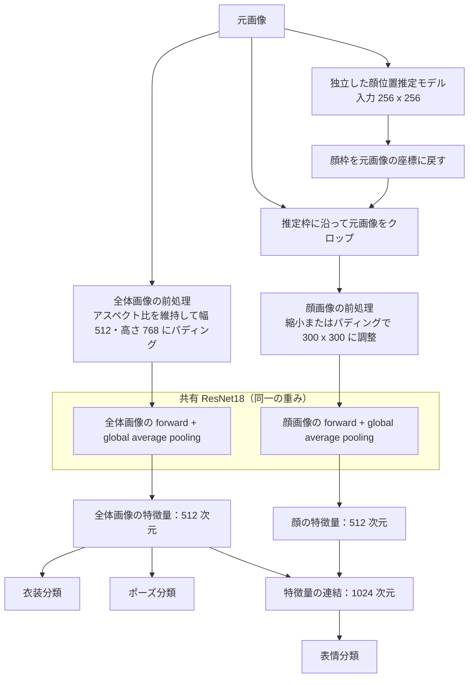

# ATRI Multi-Attribute Recognition

[English](README.md) | [中文](README_CN.md) | 日本語

PyTorch を使って、画像内のアトリの衣装・ポーズ・表情を同時に認識するツールです。深層学習の授業課題から始まり、現在は独立したオープンソースプロジェクトとして開発を続けています。

v4.0.0 では、立ち絵で学習したモデルを、背景のある CG や異なる解像度・角度の画像にも使えるようにするための基盤を整えました。まず顔の位置を推定し、画像全体と顔の両方を使って属性を認識します。以下では、学習データとは異なる出典の CG を中心に、うまく認識できた例と、まだ誤判定が起きる例を紹介します。

- 衣装 4 種類、ポーズ 3 種類、表情 21 種類を認識
- GUI、一括推論、信頼度の表示、Grad-CAM に対応
- 顔アノテーション、クロップ確認、学習、評価、ONNX エクスポート用のツールを用意
- 5 段階の解像度を均等にサンプリングし、6 方向の回転と顔枠の位置ずれを含めて学習

**v4.0.0 は v3.0.0 と比べて、学習に必要な計算資源と時間が大幅に増えています。** ハードウェアや時間に制約がある場合は、GitHub の **branches/tags** から **v3.0.0** に切り替え、そのバージョンの説明に従ってください。推論だけなら、公開済みのモデルをダウンロードすれば利用でき、再学習は不要です。

<p align="center">
  
  <br />
  <em>学習データとは異なる出典の CG に対する認識結果と表情の Grad-CAM</em>
</p>

## 目次

- [クイックスタート](#クイックスタート)：環境構築、モデルのダウンロード、推論
- [認識結果と利用範囲](#認識結果と利用範囲)：CG の例と立ち絵での検証結果
- [モデルの仕組み](#モデルの仕組み)：顔位置推定と 2 つのビューによる分類
- [学習データの準備](#学習データの準備)：ファイル名、ラベル、顔アノテーション
- [学習と再開](#学習と再開)：学習コマンド、出力ファイル、checkpoint
- [学習パラメータの詳細](#学習パラメータの詳細)：各スクリプトのオプションと既定値
- [評価とエクスポート](#評価とエクスポート)：独立テストセット、ONNX、公開用の重み
- [開発とプロジェクト構成](#開発とプロジェクト構成)：テストとファイルの役割

## クイックスタート

以下のコマンドは、プロジェクトのルートディレクトリで実行してください。

### 1. 環境構築

Python 3.10 以降、PyTorch `2.3` 以降の `2.x` 系、および対応する torchvision が必要です。CPU でも動作し、CUDA 対応の PyTorch が利用できる場合は自動的に GPU を優先します。

```powershell
python -m pip install -r requirements.txt
```

GPU を使う場合は、環境に合った CUDA 版 PyTorch を公式の手順でインストールしてから、残りの依存パッケージを入れてください。GUI には Tcl/Tk が必要です。Windows では Python のインストール時に含めてください。Ubuntu のシステム Python を使う場合は `python3-tk` を利用できます。

学習では `torch.amp` を使用し、ImageNet 事前学習済み ResNet18 を初めて読み込む際に重みをダウンロードします。公開モデルで推論するだけなら、このダウンロードは不要です。付属の回転アノテーションを再利用する場合は Pillow のバージョンも合わせる必要があります。[顔アノテーション](#顔アノテーション)を参照してください。

### 2. モデルのダウンロード

**モデルは [GitHub Releases](https://github.com/hoshino924/atri-multitask-cnn/releases) で別途配布しており、ソースリポジトリには含まれません。**

Releases のモデル入りソース一式には、`models/` ディレクトリも含まれています。ソースリポジトリだけをダウンロードまたは clone した場合は、ルートに `models/classifier/` と `models/locator/` を作成し、プログラムのバージョンに対応する分類器・顔位置推定モデル・付属ファイルを次のように配置してください。

```text
models/
├── classifier/
│   ├── atri_net_best.pth
│   └── split.json
├── locator/
│   ├── face_locator_best.pth
│   └── split.json
└── manifest.json
```

2 つの `split.json` には学習・検証データの分割が記録されており、学習の再現や一部の診断で使います。`manifest.json` はモデルファイルの情報を記録したものです。分類器には、学習時に使った顔位置推定モデルを組み合わせる必要があり、プログラム側でも組み合わせを確認します。

### 3. GUI を起動する

```powershell
python infer.py
```

**現在の GUI は日本語に対応していません。** 推論画面は英語でご利用ください。アノテーションとクロップ確認のツールは英語・簡体字中国語に対応しているので、いずれかを選んで使用してください。既定の表示言語は英語です。

**Select Image** で画像を選ぶと、全体画像の入力、実際の顔クロップ、3 タスクの認識結果が表示されます。タスクを選び、**Show Grad-CAM** を押すとヒートマップを確認できます。衣装とポーズでは全体画像、表情では顔画像を表示します。

### 4. 単一画像と一括推論

```powershell
python infer.py --input path/to/image.png
python infer.py --input atridataset/test --output predictions.csv --top_k 3
```

`--input` には画像またはディレクトリを指定でき、PNG、JPEG、BMP、WebP に対応しています。出力ファイル名が `.csv` で終わる場合は CSV、それ以外は JSON で保存します。

| オプション | 用途 |
|------------|------|
| `--recursive` | サブディレクトリも検索する。 |
| `--cpu` | CPU で実行する。 |
| `--top_k 3` | 各タスクの上位 3 候補を返す。 |
| `--min_confidence 0.8` | 分類の信頼度しきい値を 80% に変更する。 |
| `--accept_all` | 信頼度による判定保留を行わず、分類結果を返す。 |
| `--weight` / `--locator_weight` | 自分で学習した分類器と、それに対応する顔位置推定モデルを指定する。 |

### uncertain の意味

公開モデルの分類タスクでは、いずれも推奨しきい値に `95%` を使用しています。信頼度がこれを下回ると、GUI には `uncertain (best: ...)` と表示されます。括弧内は最有力候補ですが、採用するには信頼度が足りないという意味です。

最有力候補が正解の場合も、誤りの場合もあります。そのため、第一候補の正解率と、判定を保留しなかった結果の正解率は別の指標です。`uncertain` は画像自体に問題があることを示すものではありません。しきい値を下げると保留は減りますが、候補の順位や誤判定そのものは変わりません。

顔を検出できなかった場合は、別のエラーとして扱います。分類のしきい値変更や `--accept_all` では、このエラーを回避できません。

### 顔クロップを確認する

```powershell
python inspect_faces.py --input atridataset/test
```

元画像と推定枠、リサイズ前のクロップ、正規化前の顔入力を並べて確認できます。解像度やファイル名で絞り込み、1 枚ずつ切り替えたり、100% 表示で細部を確認したりできます。画像やアノテーションは変更しません。

<p align="center">
  
  <br />
  <em>推定枠、元のクロップ領域、実際のモデル入力を見比べられます</em>
</p>

## 認識結果と利用範囲

### 学習データとは異なる出典の CG

背景のある CG を使い、標準的な立ち絵とは異なる構図でも認識できるかを確認しました。今回の手動確認では、多くの画像で第一候補が目視による判断と一致しました。一方、正解でも `uncertain` になる例はあります。v4.0.0 の改善を確認できる例ですが、試した画像はまだ少なく、独立テストセットの正解率として集計したものではありません。

<p align="center">
  
  <br />
  <em>背景のある CG の例。3 タスクとも第一候補が目視による判断と一致しています</em>
</p>

#### 差分によって予測が変わる例

下の図 1 と図 2 は、同じ CG の別差分です。目視で確認した衣装・ポーズ・表情は同じですが、モデルの第一候補には違いが出ました。

| 画像 | 衣装の第一候補 | ポーズの第一候補 | 表情の第一候補 |
|------|----------------|------------------|----------------|
| 図 1 | `d4` パジャマ＋かぼちゃパンツ、51.4%、誤り | `p1` normal、81.0%、正解 | `fa` troubled / embarrassed、100.0%、正解 |
| 図 2 | `d1` セーラーワンピース、72.9%、正解 | `p1` normal、66.4%、正解 | `f4` angry、94.8%、誤り |

図 1 の表情を除き、表中の結果はすべて `uncertain` でした。2 つの誤判定はいずれもしきい値によって保留されましたが、差分による画面の変化に対して、予測がまだ安定していないことも分かります。髪、水滴、背景の細部、実際のクロップ範囲などが影響し得るものの、このスクリーンショットだけでは各要因の影響を切り分けられません。

<p align="center">
  
  <br />
  <em>図 1：衣装の予測と Grad-CAM</em>
</p>

<p align="center">
  
  <br />
  <em>図 2：表情の予測と Grad-CAM</em>
</p>

### 公開モデルと立ち絵での検証

以下は [Releases](https://github.com/hoshino924/atri-multitask-cnn/releases) で配布する最終モデルの結果です。表情分類には `fusion` head を使い、対応する顔位置推定モデルと組み合わせています。

| モデル | 学習 epoch 数 | ベスト epoch | 入力サイズ |
|--------|---------------|--------------|------------|
| 複数属性分類器 | 500 | 401 | 全体画像は幅 512・高さ 768、顔画像は 300×300 |
| 顔位置推定モデル | 240 | 231 | 256×256 |

開発時の検証に使った 63 組の画像を、それぞれ 5 段階の解像度で評価した結果です。数値は**信頼度による判定保留を適用する前の、第一候補の正解率**を示しています。

| 入力角度 | ビュー数 | 衣装の正解率 | ポーズの正解率 | 表情の正解率 |
|----------|----------|--------------|----------------|--------------|
| 0° | 315 | 100% | 100% | 100% |
| 学習した 6 角度 | 1,890 | 100% | 100% | 100% |
| 未学習の 15° / 30° / 330° / 345° | 1,260 | 100% | 100% | 100% |
| 未学習の 135° / 225° | 630 | 100% | 100% | 80% |

学習した 6 角度では、正しい表情候補が 5 件、正立に近い未学習の 4 角度では 1 件、低信頼度のため保留されました。この 2 組で誤った候補が採用された例はありません。一方、135° / 225° では誤った表情候補 95 件がしきい値を上回っており、任意の角度での認識にはまだ限界があります。

0° の結果は 6 角度の集計にも含まれています。サイズや角度を変えても元の画像は同じなので、独立したサンプルが増えるわけではありません。また、これらの検証データはモデル選択と信頼度校正にも使用しています。立ち絵や回転への対応を確認する指標であり、外部画像での評価に代わるものではありません。

参考学習環境：Python `3.11.9`、PyTorch `2.5.1+cu121`、torchvision `0.20.1+cu121`、CUDA `12.1`、NVIDIA GeForce RTX 3060 Laptop GPU。

#### 検証セットから選んだ例

上記の検証データから、0° の正立画像と 45° の回転画像を選びました。全体画像、顔クロップ、認識結果を確認できます。検証結果を補足する表示例であり、新たな独立テストサンプルには数えていません。

<p align="center">
  
  <br />
  <em>検証セットの例：0° の正立入力</em>
</p>

<p align="center">
  
  <br />
  <em>検証セットの例：45° の回転入力</em>
</p>

### 想定する使い方と制限

現在のモデルは、アトリが 1 人で写っている画像、特に正立または正立に近い入力を主な対象としています。

- キャラクターの識別は行いません。複数人の顔を検出し、それぞれを分類する用途にも対応していません。
- 学習データは同じ出典の立ち絵が中心です。複雑な背景、遮蔽、光の当たり方、画風の違いによって予測が変わることがあります。
- `f1` と `fe` など、差がごく小さい表情があります。低解像度やリサイズによって違いが失われる場合もありますが、ラベルは分けたままです。
- 信頼度のしきい値だけで、未知のキャラクターや学習分布と異なる画像を確実に見分けることはできません。高信頼度の予測でも誤る場合があります。
- Grad-CAM はモデルが注目する領域を確認する手掛かりになりますが、それだけで誤判定の原因を特定することはできません。

## モデルの仕組み

顔の位置を推定するモデルと、属性を判定する分類器を組み合わせています。顔位置推定モデル（locator）は本プロジェクトの手動アノテーションで学習しており、外部の顔検出プロジェクトには依存しません。分類器には ImageNet 事前学習済み ResNet18 を使い、全体画像と顔画像で同じ重みを共有します。



顔位置推定モデルは `256×256` の入力から、顔が存在する確率と枠の位置を予測します。その枠を元画像の座標に戻し、正方形の領域を切り出します。顔の存在確率のしきい値は、既定で `0.5` です。

分類器に入れる 2 つの画像は、どちらも元のアスペクト比を保ちます。

- **全体画像：** 透明背景がある場合は Alpha 前景の範囲を余白付きで切り出し、リサイズとパディングで幅 512・高さ 768 のキャンバスに収めます。透明度から前景を分離できない場合は、画像全体を使います。
- **顔画像：** 元画像から推定枠に沿って切り出します。`300×300` より大きければ縮小し、小さければ元のピクセルサイズを保ったまま中央に配置して余白を埋めます。透明部分と余白は黒にします。

衣装とポーズには全体画像の特徴量を使い、表情には全体画像と顔画像の特徴量を連結して使います。回転角度そのものを予測したり、入力を自動的に正立へ戻したりする処理はありません。

アノテーションの **626×626** は、解像度 `l` の元画像から切り出す手動枠のサイズです。顔位置推定モデルの入力 `256×256` や、分類器に渡す顔キャンバス `300×300` とは別の値です。

## 学習データの準備

公開モデルで推論するだけなら、この節と学習の説明は読み飛ばして構いません。

ソースリポジトリには手動アノテーションと必要な設定を含めていますが、**元の学習画像は含めていません**。再学習には画像を各自で用意してください。顔位置推定モデルのサンプル生成には、背景が透明な PNG が必要です。自動枠キャッシュ、学習ログ、その他の実験結果もリポジトリには含まれません。

### ファイル名とデータのグループ分け

学習スクリプトは、次の形式のファイル名からラベルを読み取ります。

```text
<character_name>_<compatibility_field>_<scale>_<outfit>_<pose>_<expression>.png
```

例：`アトリ_tatr01_w_d1_p1_f1.png`

| フィールド | 例 | 意味 |
|------------|----|------|
| キャラクター名 | アトリ | メタデータとして保持し、認識対象にはしない。 |
| 互換用フィールド | tatr01 / tatr02 | 既存ファイル名の情報を保持し、認識対象にはしない。 |
| 解像度 | s / w / m / l / ll | 同じ内容を等比縮小・拡大した 5 段階の画像。 |
| 衣装 | d1 | 衣装ラベル。 |
| ポーズ | p1 | ポーズラベル。 |
| 表情 | f1 | 表情ラベル。 |

現在のデータは、内容の異なる 252 組、計 1,260 枚の元画像から成ります。seed `42` で、189 組を学習用、63 組を検証用に分けています。同じ内容のサイズ違い・回転違いは必ず同じ集合にまとめ、同一画像の別バージョンが学習と検証の両方に入るのを防ぎます。

ファイル名は 6 フィールドで解析するため、キャラクター名に追加のアンダースコアを入れないでください。学習前には次のコマンドでデータを確認できます。

```powershell
python check_dataset.py --train_dir atridataset/train --test_dir atridataset/test --report dataset_report.json
```

ファイル名、破損画像、Alpha チャンネル、5 段階の解像度の欠落、アスペクト比、学習画像とテスト画像の類似性をレポートにまとめます。類似画像は手動確認の候補として報告するだけで、自動削除はしません。

### ラベル定義

モデルが使うコードと出力名は次のとおりです。

| 属性 | コード | 出力名 |
|------|--------|--------|
| 衣装 | d1 | school uniform |
| 衣装 | d2 | swimsuit |
| 衣装 | d3 | pajamas |
| 衣装 | d4 | pajamas + pumpkin pants |
| ポーズ | p1 | normal |
| ポーズ | p2 | hands up |
| ポーズ | p3 | arms horizontal + jump |
| 表情 | f1 | staring |
| 表情 | f2 | smile |
| 表情 | f3 | happy |
| 表情 | f4 | angry |
| 表情 | f5 | serious |
| 表情 | f6 | sad |
| 表情 | f7 | distressed |
| 表情 | f8 | surprised |
| 表情 | f9 | confused |
| 表情 | fa | troubled / embarrassed |
| 表情 | fb | confident (eyes open) |
| 表情 | fc | sleepy |
| 表情 | fd | crying |
| 表情 | fe | calm |
| 表情 | ff | shy |
| 表情 | fg | sulky |
| 表情 | fh | shy (blush) |
| 表情 | fi | blank |
| 表情 | fj | disgusted |
| 表情 | fk | shocked |
| 表情 | fl | confident (eyes closed) |

### 顔アノテーション

付属のアノテーションは Pillow `12.0.0` で作成しています。回転学習に再利用する場合は、同じバージョンをインストールしてください。

```powershell
python -m pip install "pillow==12.0.0"
```

ツール上で回転後のキャンバスを表示し、顔を囲む正方形の枠を手動で確認します。必要に応じて髪も含められます。保存するのは CSV と付属の `.meta.json` だけで、元画像を切り抜いたり上書きしたりすることはありません。

```powershell
python annotate_faces.py --train_dir atridataset/train --scale l --angles 0 45 90 180 270 315 --output annotations/face_boxes_l_rotated.csv
```

GUI は英語で起動します。**Language / 语言** で表示言語を切り替えられ、`--language zh` を指定すると簡体字中国語で起動できます。このツールに必要なのは Pillow、Tkinter、本プロジェクトの補助モジュールで、PyTorch の重みは読み込みません。

<p align="center">
  
  <br />
  <em>回転後の画像で正方形の枠を調整し、右側のプレビューで切り出す範囲を確認できます</em>
</p>

- `--scale` の既定値は `l` です。他の 4 段階も選べますが、解像度ごとに別のアノテーション表を使ってください。
- まず全画像の `0°` を終え、次に `45°`、最後は `315°` という順で、角度ごとに作業します。正の角度は反時計回りです。
- 左ドラッグで正方形を描き、枠の内側をドラッグすると移動、右下のハンドルでサイズ変更できます。`Shift` + ドラッグで描き直します。
- 矢印キーで画像上の 1 ピクセルずつ移動し、`+` / `-` またはマウスホイールでサイズを調整します。`Shift` を押すと 10 ピクセル刻みになります。座標の直接入力も可能です。
- **Confirm & next**、またはキャンバス上の `Enter` / Space で保存して次へ進みます。`Ctrl+S` は現在の枠を保存するだけです。
- 角度・キャラクター・解像度・ポーズが同じ場合は、直前に確定した枠を引き継げます。引き継いだ枠や、別角度のアノテーションから作られた候補枠も、画像ごとに確認してください。

現在の 6 角度の表には 1,512 件のアノテーションがあり、解像度 `l` の枠はすべて一辺 `626` です。主なフィールドは次のとおりです。

| フィールド | 意味 |
|------------|------|
| `filename` | 元画像のファイル名。 |
| `angle` | 反時計回りの回転角度。 |
| `image_width` / `image_height` | 回転前の元画像のサイズ。 |
| `canvas_width` / `canvas_height` | 回転後のキャンバスのサイズ。 |
| `x_left` / `y_bottom` | 回転後のキャンバスの左下を基準にした、枠の左辺・下辺のピクセル座標。 |
| `side` | 正方形の一辺。単位はキャンバス上のピクセル。 |

原点は**回転後のキャンバスの左下**です。座標は実際のキャンバスのピクセル数で表し、GUI の表示倍率には影響されません。Pillow の左上基準に変換する場合は、`top = canvas_height - y_bottom - side` を使います。

CSV と同名の `.meta.json` は一緒に保管してください。メタデータには元画像のハッシュ、サイズ、回転ルール、Pillow のバージョンが記録され、プログラムが整合性を確認します。画像やサイズを変更した場合は、再度アノテーションして別ファイルに保存してください。

## 学習と再開

以下の 3 段階では、最終公開モデルと同じ学習設定を使います。顔位置推定モデルは解像度 `l` の手動枠で、分類器は 5 段階の元画像と自動推定枠で学習します。分類器のクロップは推論時と同じ方法で取得します。各オプションの定義は[学習パラメータの詳細](#学習パラメータの詳細)を参照してください。

コマンド中の `models/classifier/split.json` は Releases の付属ファイルで、公開モデルと同じ内容分割になっているかを確認するために使います。自分のデータで最初から学習する場合は `--reference_split` を省略でき、公開モデルを先にダウンロードする必要はありません。

### 1. 顔位置推定モデルを学習する

```powershell
python train_locator.py --train_dir atridataset/train --annotations annotations/face_boxes_l_rotated.csv --rotated_annotations --scale l --angles 0 45 90 180 270 315 --angle_weights 1 1 1 1 1 1 --reference_split models/classifier/split.json --epochs 240 --batch 16 --workers 6 --seed 42 --out_dir outputs/face_locator
```

顔位置推定モデルでは 6 角度を均等にサンプリングし、`256×256` の入力を使います。透明背景の立ち絵から、顔があるサンプルと顔がないサンプルを生成します。

### 2. 自動枠キャッシュを作成する

```powershell
python face_box_cache.py --train_dir atridataset/train --locator_weight outputs/face_locator/face_locator_best.pth --scale all --angles 0 45 90 180 270 315 --seed 42 --val_ratio 0.25 --output_dir annotations/face_cache
```

元画像を回転させてから顔位置を推定し、枠の座標、データ署名、モデルのハッシュを保存します。現在のデータでは 7,560 ビュー分の記録ができます。学習時はこの座標を使って元画像から切り出すため、クロップ済み画像を別途保存する必要はありません。

公開済みの顔位置推定モデルを使う場合は、手順 1 を省略し、`--locator_weight` を `models/locator/face_locator_best.pth` に変更してください。キャッシュの出力先には、まだ存在しないディレクトリを指定します。

### 3. 分類器を学習する

```powershell
python train.py --train_dir atridataset/train --face_cache annotations/face_cache --scale all --angles 0 45 90 180 270 315 --angle_weights 45 20 5 5 5 20 --expression_head fusion --face_jitter mixed --face_shrink_probability 0 --height 768 --width 512 --expression_size 300 --epochs 500 --warmup_epochs 5 --patience 500 --batch 16 --workers 6 --seed 42 --out_dir outputs/classifier
```

### 公開モデルで使用した設定

上記のコマンドで使う設定をまとめています。後述のプログラムの既定値とは異なる項目があります。

| 項目 | 設定 |
|------|------|
| 元画像の解像度 | `s / w / m / l / ll` を各 20% で均等にサンプリング |
| 分類器の角度比率 | `0°: 45%`、`45°: 20%`、`90°: 5%`、`180°: 5%`、`270°: 5%`、`315°: 20%` |
| 全体画像 / 顔のキャンバス | 幅 512・高さ 768 / 300×300 |
| 表情分類ヘッド | 全体画像と顔の特徴量を結合 |
| 顔枠の位置ずれ | 位置を維持 25%、小さな移動 50%、大きな移動 25% |
| 移動範囲 | 小さい場合は各軸 ±10 px、大きい場合は各軸 ±25 px。顔入力上のピクセルに相当する量を元画像の座標に換算 |
| 枠サイズの変動 | 一辺 ±8%。顔クロップの追加ランダム縮小は無効 |
| epoch 数 / batch | 500 / 16 |
| DataLoader workers | 6。CPU とメモリに合わせて調整可能 |
| バックボーン / 分類ヘッドの初期学習率 | `1e-4` / `3e-4` |
| オプティマイザ / weight decay | AdamW / `1e-4` |
| ラベルスムージング / Dropout | `0.05` / `0.2` |
| 学習 / 検証の分割 | 内容ごとに 75% / 25%、seed 42 |

各 epoch では、内容のグループごとに解像度と角度を 1 組選び、サンプリング周期全体で指定した比率に揃えます。全体画像と顔画像は同じ回転後の元画像から作るため、回転は衣装・ポーズ・表情のすべての学習に適用されます。左右反転、小さな affine 変換、色調の拡張は 2 つのビューで共有し、自動枠付近の位置ずれは顔クロップにだけ加えます。

最初の 5 epoch は分類ヘッドのみを学習し、その後バックボーンの凍結を解除します。AdamW を使い、学習率はコサインスケジュールで減衰させます。BatchNorm の移動統計は固定し、CUDA では既定で AMP を有効にします。学習損失にはラベルスムージングを使い、検証には通常の交差エントロピーを使います。

ベスト分類器は、3 タスクの検証交差エントロピーの平均で選びます。解像度は等しく重み付けし、角度は指定した比率で重み付けします。学習終了後、ベストモデルを使って検証セット上でタスクごとの温度校正を行います。

公開モデルでは `batch 16`、`workers 6` を使用しました。GPU メモリに余裕があっても、画像の読み込み、回転、クロップには CPU の処理時間がかかります。GPU メモリやシステムメモリが不足する場合は、環境に合わせて設定を調整してください。

### 学習出力と checkpoint からの再開

#### 出力ディレクトリの構成

上記のコマンドによる主な出力は次のとおりです。

```text
outputs/
├── face_locator/
│   ├── face_locator_best.pth
│   ├── face_locator_last.pth
│   └── split.json
└── classifier/
    ├── atri_net_best.pth
    ├── atri_net_last.pth
    ├── split.json
    ├── run_config.json
    ├── environment.json
    ├── metrics.json
    ├── metrics.csv
    ├── calibration.json
    ├── loss_curve.png
    ├── accuracy_curve.png
    ├── expression_report.json
    └── expression_confusion_matrix.png
```

| ファイル | 用途 |
|----------|------|
| `*_best.pth` | 検証指標で選んだベストモデル。ローカルの学習出力には設定や学習記録も含まれる。 |
| `*_last.pth` | 学習再開に必要な状態を保存する。 |
| `split.json` | 内容の分割とデータ署名を記録する。 |
| `run_config.json` / `environment.json` | 分類器の実際の設定と実行環境。 |
| `metrics.json` / `metrics.csv` | epoch ごとの損失、正解率など。 |
| `calibration.json` | 温度校正の結果と、判定保留の推奨しきい値。 |
| 学習曲線・レポート・混同行列 | 学習の推移と表情ごとの結果を確認する。 |

#### 学習を再開する

最初に使った学習コマンドの末尾に、次のオプションを追加します。

- 分類器：`--resume outputs/classifier/atri_net_last.pth`
- 顔位置推定モデル：`--resume outputs/face_locator/face_locator_last.pth`

データ、分割、キャッシュ、モデル構成、入力サイズ、角度、データ拡張の設定は元の実行と揃えてください。分類器では総 epoch 数、batch、学習率、Early Stopping の設定も照合します。`--epochs` は元の値を維持する必要があり、値を増やして追加学習することはできません。顔位置推定モデルでは累計の目標 epoch 数を増やせますが、その他の照合対象の設定は一致させる必要があります。

新しく学習を始める場合は、別の出力ディレクトリを使ってください。Releases の軽量化済み重みは推論・評価用であり、学習再開用の `*_last.pth` の代わりには使えません。

## 学習パラメータの詳細

**以下はプログラムの既定値です。公開モデルを再現する場合は、上記の完全なコマンドを使ってください。** boolean のスイッチはオプション名だけを指定し、`true` は付けません。角度と重みのリストはスペースで区切ります。顔位置推定モデルの学習、キャッシュ生成、分類器の学習では、同じ `--seed`、`--val_ratio`、内容分割を使ってください。

英語の説明は [Training Parameter Reference](README.md#training-parameter-reference)、中国語の説明は[训练参数参考](README_CN.md#训练参数参考)で確認できます。コマンドのヘルプも利用できます。

```powershell
python train_locator.py --help
python face_box_cache.py --help
python train.py --help
```

### 顔位置推定モデル（train_locator.py）

| オプション | 既定値 | 説明 |
|------------|--------|------|
| `--train_dir` | `atridataset/train` | 学習に使う元画像のディレクトリ。 |
| `--annotations` | モードに応じて選択 | 通常モードは `annotations/face_boxes_l.csv`、回転モードは `annotations/face_boxes_l_rotated.csv`。回転版には同名の `.meta.json` も必要。 |
| `--scale` | `l` | 元画像の解像度。`s / w / m / l / ll` に対応し、1 回の学習では 1 段階を使う。 |
| `--out_dir` | モードに応じて選択 | 通常モードは `outputs/face_locator_l`、回転モードは `outputs/face_locator_rotated_l`。`--scale` に合わせた自動改名は行わない。 |
| `--rotated_annotations` | 無効 | 手動確認済みの回転アノテーションを読み込み、内容と角度によるサンプリングを有効にする。 |
| `--angles` | 回転モードでは 6 角度 | 反時計回りの角度リスト。既定は `0 45 90 180 270 315`。`--rotated_annotations` が必要で、すべての指定角度に手動アノテーションが必要。 |
| `--angle_weights` | 6 角度では `45 20 5 5 5 20` | 角度と同じ順に正の重みを指定する。自動的に正規化される。公開モデルでは `1 1 1 1 1 1` を明示的に指定。 |
| `--reference_split` | なし | 生成した学習・検証の内容集合が、指定した `split.json` と完全に一致するか確認する。任意の分割をそのまま読み込む機能ではない。 |
| `--input_size` | `256` | 正方形の入力の一辺。32 ピクセル以上。 |
| `--epochs` | `60` | 総学習 epoch 数。公開モデルでは 240。再開時も累計の目標値を指定する。 |
| `--batch` | `16` | 1 batch のサンプル数。 |
| `--samples_per_image` | `8` | 各内容グループから 1 epoch に生成するサンプル数。元画像、負例、合成サンプルを含み、4 以上が必要。回転モードでは先にグループの角度を 1 つ選ぶ。 |
| `--val_ratio` | `0.25` | 内容ごとに検証用へ割り当てる割合。 |
| `--seed` | `42` | データ分割、サンプリング、学習中の乱数に使う seed。 |
| `--threshold` | `0.5` | 顔の存在確率のしきい値。範囲は `(0, 1]`。評価指標に使い、重みにも保存する。 |
| `--lr` | `0.001` | AdamW の学習率。0 より大きい値。 |
| `--workers` | `0` | DataLoader の子プロセス数。0 はメインプロセスで読み込む。上記の例では 6。 |
| `--resume` | なし | 完全な学習状態を含む `face_locator_last.pth` から再開する。 |
| `--preview_only` | 無効 | データを確認し、入力画像と正解枠のプレビューを出力する。モデルの作成や学習は行わない。新しい出力先を使い、`--resume` とは併用しない。 |
| `--cpu` | 無効 | CPU で実行する。指定しなければ、CUDA が利用できる環境では CUDA と AMP を使う。 |

### 自動枠キャッシュ（face_box_cache.py）

| オプション | 既定値 | 説明 |
|------------|--------|------|
| `--train_dir` | `atridataset/train` | 自動枠を生成する元画像のディレクトリ。 |
| `--locator_weight` | `models/locator/face_locator_best.pth` | 顔位置推定モデルの重み。既定パスはスクリプトのディレクトリを基準に解決する。先にモデルをダウンロードする必要がある。 |
| `--locator_split` | 重みと同じディレクトリの `split.json` | 顔位置推定モデルの内容分割。分類器の検証用画像が顔位置推定モデルの学習に使われていないか確認する。 |
| `--scale` | `w` | 1 段階または `all`。`all` では全グループに 5 段階すべての画像が必要。公開分類器の学習では `all` を使う。 |
| `--angles` | 回転なし | 指定すると元画像を回転させてから推定し、回転情報付きのキャッシュを生成する。公開モデルの手順では 6 角度を明示的に指定。 |
| `--seed` | `42` | 分類器の内容分割に使う seed。 |
| `--val_ratio` | `0.25` | 分類器の検証用に割り当てる割合。後の学習設定と一致させる。 |
| `--output_dir` | 自動命名 | 通常は `annotations/locator_<scale>_seed<seed>`、角度を指定した場合は `annotations/locator_<scale>_rotated_seed<seed>`。既存のディレクトリは指定できない。 |
| `--cpu` | 無効 | 顔位置推定モデルを CPU で実行する。 |

### 分類器（train.py）

#### データと入出力

公開モデルでは、自動枠キャッシュ、6 角度のサンプリング、`fusion` 表情ヘッドを使用しています。自分のデータに合わせて調整できるよう、その他の対応オプションも記載しています。

| オプション | 既定値 | 説明 |
|------------|--------|------|
| `--train_dir` | `atridataset/train` | 学習に使う元画像のディレクトリ。 |
| `--out_dir` | `outputs` | 出力先。`--run_name` を指定した場合は、その親ディレクトリになる。 |
| `--run_name` | なし | 出力サブディレクトリ名。例：`--out_dir outputs --run_name classifier`。単一のディレクトリ名のみ指定できる。 |
| `--overwrite` | 無効 | 既存の出力先にある同名の学習結果を上書きできるようにする。ディレクトリ全体は削除しない。元の結果を残す場合は別の出力先を使う。 |
| `--face_cache` | なし | 自動枠キャッシュのディレクトリ。公開モデルの手順ではこちらを使う。 |
| `--face_annotations` | なし | 正立画像の手動枠 CSV を直接使う。`--face_cache` とは排他。6 角度の分類器学習には回転キャッシュを使う。 |
| `--scale` | 手動枠では `l`、それ以外は `w` | 5 段階のいずれか、または `all`。`all` は内容ごとに 5 段階を均等に選び、各グループに全解像度が揃っている必要がある。 |
| `--angles` | 回転サンプリングなし | 反時計回りの角度リスト。`--face_cache` と併用し、キャッシュに指定した全角度が含まれている必要がある。 |
| `--angle_weights` | 6 角度では `45 20 5 5 5 20` | `--angles` に対応する正の重み。角度サンプリング、回転検証によるモデル選択、校正に反映する。 |
| `--height` | `768` | 全体画像の入力キャンバスの高さ。単位はピクセル。 |
| `--width` | `512` | 全体画像の入力キャンバスの幅。単位はピクセル。 |
| `--expression_size` | クロップ元に応じて選択 | 正方形の顔キャンバスの一辺。自動枠キャッシュでは 300、手動枠では 626、枠を渡さない場合は 512。公開モデルでは 300。 |
| `--expression_head` | `fusion` | `fusion` は全体画像と顔の特徴量を連結し、`face_only` は顔の特徴量だけで表情を分類する。どちらもバックボーンは共有する。 |
| `--margin` | `0.04` | 全体画像の前景クロップに加える余白の割合。範囲は `[0, 0.5)`。自動顔枠に余白を追加する設定ではない。 |
| `--expression_width_fraction` | `0.65` | 顔枠を渡さない場合に、前景の中央から切り出す幅の割合。範囲は `(0, 1]`。自動枠の手順では使わない。 |
| `--expression_height_fraction` | `0.50` | 顔枠を渡さない場合に、前景の上部から切り出す高さの割合。範囲は `(0, 1]`。自動枠の手順では使わない。 |

どちらの学習スクリプトも、指定した角度の順に重みを対応させて正規化します。角度が 1 つだけなら重みは省略できます。既定の 6 角度以外の組み合わせで複数角度を使う場合は、重みも明示してください。角度は 360° を周期として正規化した後に重複してはいけません。`0` と `360` は同じ方向です。重みには単純な比率を使ってください。角度のサンプリング周期は 1,000 epoch 以下に制限され、分類器の解像度と角度を組み合わせた全周期は、その長さに解像度の数を掛けたものになります。

#### 最適化・実行・校正

| オプション | 既定値 | 説明 |
|------------|--------|------|
| `--epochs` | `90` | 総学習 epoch 数。公開モデルでは 500。再開時も追加回数ではなく、累計の目標値。 |
| `--batch` | `16` | 1 batch のサンプル数。各サンプルに全体画像と顔の 2 ビューを含む。 |
| `--val_ratio` | `0.25` | 内容グループ単位で検証用に割り当てる割合。 |
| `--seed` | `42` | データ分割と乱数処理に使う seed。 |
| `--lr_backbone` | `1e-4` | 凍結解除後のバックボーンの初期学習率。 |
| `--lr_heads` | `3e-4` | 分類ヘッドの初期学習率。 |
| `--min_lr` | `1e-6` | コサイン学習率減衰の下限。 |
| `--weight_decay` | `1e-4` | AdamW の weight decay 係数。 |
| `--label_smoothing` | `0.05` | 学習時の交差エントロピーに使うラベルスムージング係数。範囲は `[0, 1)`。検証には適用しない。 |
| `--dropout` | `0.2` | 分類ヘッドの Dropout 確率。範囲は `[0, 1)`。 |
| `--gradient_clip` | `5.0` | 勾配ノルムの上限。0 でクリッピングを無効にする。 |
| `--warmup_epochs` | `5` | 最初にバックボーンを固定し、分類ヘッドだけを学習する epoch 数。範囲は `[0, epochs)`。 |
| `--patience` | `15` | モデル選択指標が改善しない場合に、Early Stopping まで待つ epoch 数。6 角度の手順では 3 タスクの重み付き検証損失、回転なしでは表情の検証損失を監視する。公開設定では 500。 |
| `--threshold_quantile` | `0.05` | 検証で正解した予測の校正済み信頼度から、推奨しきい値を求める分位点。範囲は `[0, 0.5]`。推論の信頼度しきい値を直接指定する設定ではない。 |
| `--workers` | `2` | DataLoader の子プロセス数。0 はメインプロセスで読み込む。公開設定では 6。 |
| `--resume` | なし | `atri_net_last.pth` から学習状態を復元する。設定は元の実行と揃える。 |
| `--train_bn` | 無効 | バックボーンの BatchNorm の移動統計を更新する。既定では固定。 |
| `--cpu` | 無効 | CPU で実行する。指定しなければ CUDA が利用可能な場合は CUDA を使う。 |
| `--no_pretrained` | 無効 | 新規学習で ImageNet 事前学習済み重みを使わない。既定では読み込む。再開時には checkpoint の重みを使う。 |
| `--no_amp` | 無効 | CUDA の自動混合精度を無効にする。CPU 学習では、もともと CUDA AMP は使わない。 |

#### 顔枠とデータ拡張

以下は、**顔枠を使って新しく学習を始める場合**の既定値です。再開時に明示しなかった顔のデータ拡張オプションは、checkpoint の設定を引き継ぎます。実際の設定は `run_config.json` で確認できます。枠の位置とサイズは元画像上で調整し、affine 変換や色調の拡張は入力キャンバスを作ってから適用します。

| オプション | 既定値 | 説明 |
|------------|--------|------|
| `--face_jitter` | `mixed` | `mixed` は位置維持・小さな移動・大きな移動の 3 通りを使う。`none` は位置ずれを無効にし、`legacy` は従来の枠の変動方式を使う。顔枠を渡さない場合の既定は `legacy`。 |
| `--face_size_jitter` | `0.08` | 正方形の一辺を変動させる割合。0.08 は ±8% を意味し、範囲は `[0, 1)`。 |
| `--face_keep_probability` | `0.25` | mixed モードでクロップ位置を維持する確率。 |
| `--face_small_probability` | `0.50` | mixed モードで小さな移動を選ぶ確率。大きな移動は `1 - keep - small`。keep と small の合計は 1 以下にする。 |
| `--face_small_pixels` | `10` | 小さな移動の各軸での最大絶対値。顔入力上のピクセルに換算した単位。 |
| `--face_wide_pixels` | `25` | 大きな移動の最大絶対値。単位は同じで、`face_small_pixels` 以上にする。 |
| `--face_jitter_attempts` | `16` | 枠が画像の外にはみ出した場合に、移動量を再サンプリングする最大試行回数。成功しなければ、移動前の有効な枠に戻す。 |
| `--face_shrink_probability` | `0.35` | クロップ済みの顔画像を、さらにランダムに縮小する確率。顔枠を狭める設定ではない。公開モデルでは明示的に 0 を指定。 |
| `--face_min_scale` | `0.30` | 追加縮小時の一辺の最小倍率。範囲は `(0, 1]` で、この値から 1 の間をサンプリングする。縮小確率が 0 の場合は影響しない。 |
| `--face_translate` | `0` | 顔キャンバスの affine 平行移動の上限を、幅・高さに対する割合で指定する。mixed / none では移動が重ならないよう 0 が必須。legacy の既定は 0.02。 |
| `--full_translate` | `0.02` | 全体画像キャンバスの affine 平行移動の上限を、幅・高さに対する割合で指定する。範囲は `[0, 1]`。 |
| `--flip_probability` | `0.50` | 全体画像と顔画像を同時に左右反転する確率。 |
| `--affine_degrees` | `3` | 両ビューに共通で適用する小さな affine 回転の最大絶対角度。元画像の 6 角度サンプリングとは別の設定。 |
| `--affine_scale_min` | `0.95` | 共通の affine 拡大縮小の最小倍率。0 より大きい値。 |
| `--affine_scale_max` | `1.02` | 共通の affine 拡大縮小の最大倍率。最小倍率以上にする。 |
| `--color_jitter` | `0.08` | 明るさ・コントラスト・彩度の係数を、それぞれ `1 ± 指定値` の範囲でサンプリングする。両ビューには同じ係数を使う。指定範囲は `[0, 1]`。 |

`--face_jitter none` で無効になるのは、クロップ位置の変動だけです。枠のサイズ変更、追加縮小、左右反転、色調の拡張は、それぞれのオプションで制御します。

#### プレビューモード

| オプション | 既定値 | 説明 |
|------------|--------|------|
| `--sampling_preview_only` | 無効 | データとキャッシュを確認し、分割とサンプリング計画を保存して終了する。モデルやオプティマイザは作成しない。 |
| `--augmentation_preview_only` | 無効 | 実際の学習入力と枠の変動情報を出力して終了し、学習は行わない。顔枠が必要で、`--resume` とは併用できない。 |
| `--augmentation_preview_count` | `21` | 解像度と角度の組み合わせごとに選ぶ、プレビュー用の学習画像数の上限。1 以上。 |
| `--augmentation_preview_repeats` | `4` | 各プレビュー画像にランダム拡張を繰り返す回数。1 以上。 |

2 つのプレビュースイッチは併用できません。出力先には、プレビュー専用の新しいディレクトリを使ってください。データやサンプリング設定の確認には使えますが、モデルの精度を測るものではありません。

## 評価とエクスポート

### 自分のテストセットで評価する

独立テストセットには、学習、モデル選択、しきい値調整に使っていない画像を用意してください。`image.png` のようにファイル名にラベルを含まない画像では、UTF-8 の CSV を作成します。

```csv
filename,outfit,pose,expression
image.png,d1,p1,f1
```

`test_labels.example.csv` をひな形にしてラベルを記入し、次のコマンドを実行します。

```powershell
python evaluate.py --test_dir atridataset/test --labels test_labels.csv --output_dir evaluation/test
```

既定では `models/` にダウンロードした分類器と顔位置推定モデルを使います。結果には、タスク別の正解率、Macro-F1、NLL、ECE、判定保留を適用した後の coverage、全タスク同時正解率、画像ごとの CSV、混同行列が含まれます。`--labels` を省略すると、標準の 6 フィールド形式のファイル名からラベルを読み取ります。

### ONNX エクスポート

```powershell
python export_onnx.py --output outputs/atri_net.onnx
```

分類器の ONNX と、前処理・ラベル順・校正設定を記録した `atri_net.json` を出力します。

| 名前 | 種類と shape |
|------|--------------|
| `full_image` | 全体画像の入力、`[batch, 3, 768, 512]` |
| `expression_image` | 顔画像の入力、`[batch, 3, 300, 300]` |
| `outfit` / `pose` / `expression` | 3 タスクの logits 出力 |

batch 次元は既定で可変です。`--fixed_batch` で固定できます。ONNX に含まれるのは分類器のみで、顔位置推定、元画像からのクロップ、温度スケーリング、softmax、判定保留の処理は、メタデータに従って利用側で実装する必要があります。

### 公開用の重みをエクスポートする

自分で学習したモデルも、Releases で配布しやすい軽量なファイルに変換できます。

```powershell
python export_release_weights.py --classifier outputs/classifier/atri_net_best.pth --locator outputs/face_locator/face_locator_best.pth --output_dir release_models
```

分類器と顔位置推定モデルは、学習時と同じ組み合わせを指定し、それぞれのディレクトリに `split.json` を残してください。ダウンロードした顔位置推定モデルでキャッシュを作った場合は、`--locator` にもそのモデルを指定します。

エクスポート時に学習履歴やオプティマイザの状態などを取り除き、推論と評価に必要な情報を残します。モデルのテンソルや、出力した重みを読み込めることも確認します。出力先は新しいディレクトリに限り、既存ファイルは上書きしません。

## 開発とプロジェクト構成

### 回帰テスト

```powershell
python -m unittest discover -s tests -v
```

ラベル解析、内容のグループ分け、均等サンプリング、回転アノテーション、顔枠キャッシュ、同期したデータ拡張、モデル構成、信頼度校正、公開用重みのエクスポートをテストします。GUI の表示と操作は、別途手動で確認する必要があります。

### ファイルの役割

```text
.
├── annotate_faces.py         # 顔枠・回転アノテーション GUI
├── annotation_i18n.py        # アノテーションツールの英語・中国語テキスト
├── app_assets.py             # モデルの既定パス、GUI アイコン、タスクバー識別子
├── calibration.py            # 温度校正と推奨しきい値
├── check_dataset.py          # データの整合性と類似画像のチェック
├── dataset.py                # ファイル名、内容分割、2 ビューの前処理
├── model.py                  # 共有 ResNet18 と fusion 分類ヘッド
├── face_locator.py           # 単一の顔の位置推定モデルと予測
├── locator_data.py           # 顔位置推定の学習サンプル生成
├── face_regions.py           # 正方形の枠と顔クロップ
├── face_box_cache.py         # 自動枠キャッシュの生成と検証
├── face_augmentation.py      # 顔枠の変動方式
├── image_rotation.py         # 共通の回転ルール
├── rotation_annotations.py   # 回転アノテーションとメタデータの検証
├── rotation_data.py          # 解像度と角度のサンプリング
├── classifier_rotation.py    # 分類器の回転データの整合性確認
├── train_locator.py          # 顔位置推定モデルの学習
├── train.py                  # 分類器の学習、校正、レポート
├── preview_augmentation.py   # データ拡張のプレビュー
├── infer.py                  # GUI と一括推論
├── inspect_faces.py          # 自動顔クロップの確認 GUI
├── evaluate.py               # 独立テストセットでの評価
├── diagnose_*.py             # 解像度、回転、クロップ位置ずれの診断
├── visualization.py          # Grad-CAM
├── export_onnx.py            # 分類器の ONNX エクスポート
├── export_release_weights.py # 公開用重みのエクスポート
├── models/                   # 自分で作成して Releases のファイルを配置。モデル入り一式には付属
├── annotations/              # 手動アノテーション CSV とメタデータ
├── icons/                    # 各サイズの元 PNG と複数解像度の ICO
├── tools/build_icon.ps1      # 各サイズの PNG をリサイズせずに ICO にまとめる
├── tests/                    # 回帰テスト
├── test_labels.example.csv
├── requirements.txt
├── LICENSE
├── README.md                 # English（デフォルト）
├── README_CN.md              # 簡体字中国語
└── README_JP.md              # 日本語
```

上記の `models/` はモデルを配置した後の構成です。ディレクトリと付属ファイルはソースリポジトリには含まれません。作成方法と配置先は[モデルのダウンロード](#2-モデルのダウンロード)を参照してください。`atridataset/` は各自で用意した画像、`outputs/` と `evaluation/` はローカルの実行結果を置くディレクトリで、これらもソースには含まれません。README のスクリーンショットは外部リンクで表示しています。

## 今後の予定

- 異なる出典の画像を増やし、手動ラベルを付けて定量評価を行う
- 負例を増やし、モデルに適さない入力を見分ける仕組みを改善する
- Web UI
- 動画推論

## License

本プロジェクトのコードと、作者が制作したプロジェクトアイコン（`icons/` 内の PNG・ICO）は MIT License で公開しています。詳細は [LICENSE](LICENSE) を参照してください。

モデルは Releases から個別にダウンロードできるほか、モデル入りのソース一式でも配布します。元の学習画像は含まれません。学習や動作例に使用したキャラクター・画像素材の権利は、それぞれの権利者に帰属します。
