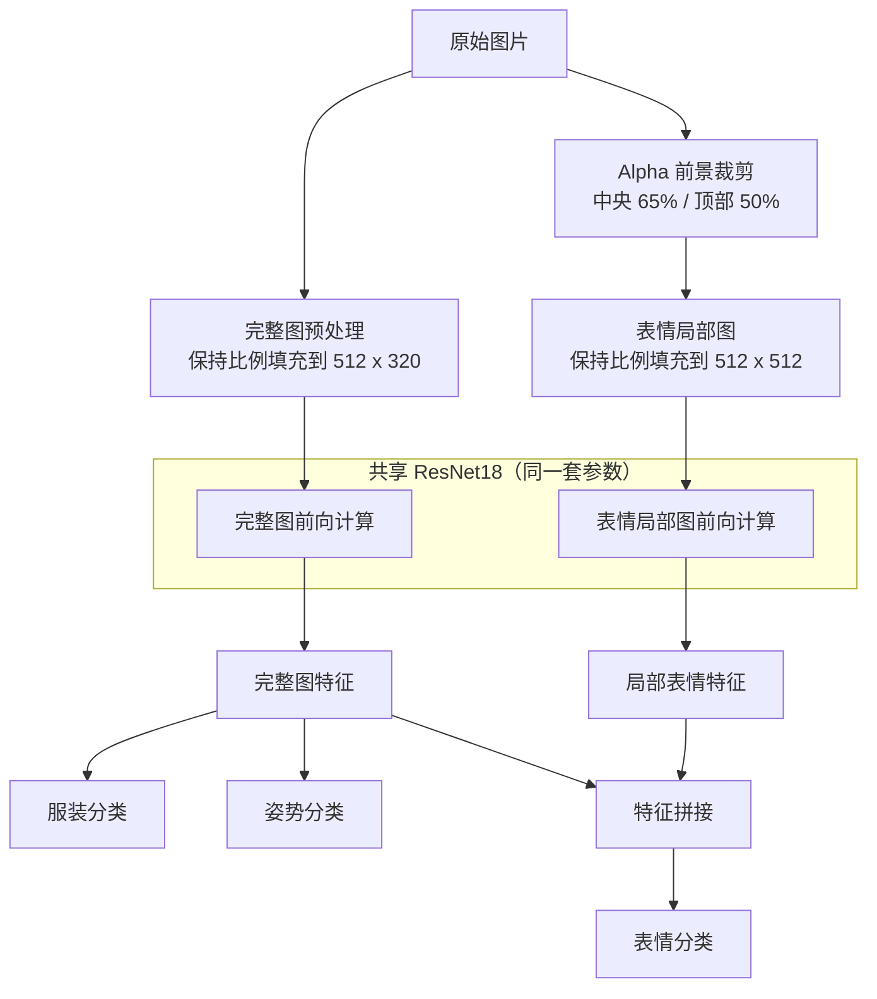

# ATRI Multi-Attribute Recognition

[English](readme_en.md) | 中文

基于 PyTorch 的单角色多属性识别项目，用于从 ATRI 角色立绘中同时识别服装、姿势和表情。

项目最初来源于深度学习课程课题，之后针对数据重复、图像拉伸、表情区域过小和训练评估不足等问题进行了重构。

<p align="center">
  
</p>

## 功能特点

- 基于 PyTorch 和预训练 ResNet18
- 同时识别服装、姿势和表情
- 完整图与表情局部图共享同一个 ResNet18
- 保持原图宽高比，避免将细长立绘强制拉伸为正方形
- 根据 Alpha 前景自动提取角色上半部中央区域，提高表情有效分辨率
- 完整图与表情图共享同一组随机增强参数，保持双视图一致
- 自动划分训练集和验证集，记录三个任务及联合准确率
- 支持 CUDA、AMP、冻结 BatchNorm、早停、断点续训和输出防覆盖
- 自动保存 JSON/CSV 训练记录，并对新权重进行温度校准
- 支持低置信度拒答、批量 JSON/CSV 推理和独立测试集评估
- 提供表情裁剪预览、Grad-CAM、数据集审计和 ONNX 导出

## 模型结构

模型使用两种输入视图，但两路计算共享同一套 ResNet18 参数：



完整图经过保持比例缩放和填充后用于服装、姿势及全局上下文提取。表情视图根据透明通道确定人物前景，再截取前景中央 `65%`、顶部 `50%` 的区域。表情头融合完整图特征和局部特征。

## 数据集说明

训练数据使用单角色立绘构建。脚本只读取训练目录下受支持的图片文件，并严格验证文件名格式。

文件名格式：

```text
<角色名>_<兼容字段>_<分辨率档位>_<服装标签>_<姿势标签>_<表情标签>.png
```

例如：

```text
アトリ_tatr01_w_d1_p1_f1.png
```

各字段用途如下：

| 位置 | 示例 | 用途 |
|------|------|------|
| 角色名 | アトリ | 作为元数据保留，不参与当前训练 |
| 兼容字段 | tatr01 / tatr02 | 为兼容现有文件名而解析，不作为识别目标 |
| 分辨率档位 | s / w / m / l / ll | 选择训练源图，默认只使用 `w` |
| 服装 | d1 | 服装分类标签 |
| 姿势 | p1 | 姿势分类标签 |
| 表情 | f1 | 表情分类标签 |

同一内容存在 `s`、`w`、`m`、`l`、`ll` 五个等比例尺寸版本。程序默认只使用 `w`，避免把尺寸不同但内容相同的图片重复计入训练和验证。请勿在角色名中额外使用下划线，否则文件名将无法通过六字段校验。

支持的识别标签如下：

| 属性 | 标签 | 输出名称 |
|------|------|----------|
| 服装 | d1 | school uniform |
| 服装 | d2 | swimsuit |
| 服装 | d3 | pajamas |
| 服装 | d4 | pajamas + pumpkin pants |
| 姿势 | p1 | normal |
| 姿势 | p2 | hands up |
| 姿势 | p3 | arms horizontal + jump |
| 表情 | f1 | staring |
| 表情 | f2 | smile |
| 表情 | f3 | happy |
| 表情 | f4 | angry |
| 表情 | f5 | serious |
| 表情 | f6 | sad |
| 表情 | f7 | distressed |
| 表情 | f8 | surprised |
| 表情 | f9 | confused |
| 表情 | fa | troubled / embarrassed |
| 表情 | fb | confident (eyes open) |
| 表情 | fc | sleepy |
| 表情 | fd | crying |
| 表情 | fe | calm |
| 表情 | ff | shy |
| 表情 | fg | sulky |
| 表情 | fh | shy (blush) |
| 表情 | fi | blank |
| 表情 | fj | disgusted |
| 表情 | fk | shocked |
| 表情 | fl | confident (eyes closed) |

公开仓库不提供训练图片。数据涉及版权内容，本仓库仅公开代码、模型结构和推理程序；训练好的最佳权重已从 1.0.0 版本起通过 Release 发布。

训练前可以检查文件名、损坏图片、Alpha 通道、五档尺寸完整性、宽高比以及训练/测试间的相似图片：

```powershell
python check_dataset.py --train_dir atridataset/train --test_dir atridataset/test --report dataset_report.json
```

报告分别计算完整图和表情裁剪区域的差异哈希。相似图片只表示需要人工复核，不会被脚本自动删除。

## 环境要求

支持范围：

- Python 3.10+
- PyTorch `2.3` 至 `2.x` 和对应版本 torchvision
- CUDA 兼容的 PyTorch 环境（可选，用于 GPU 加速）

安装依赖：

```powershell
pip install -r requirements.txt
```

训练脚本使用新版 `torch.amp` 接口。未检测到 CUDA 时会自动使用 CPU；也可以通过 `--cpu` 强制使用 CPU。`requirements.txt` 同时包含 ONNX 导出所需依赖；CUDA 版 PyTorch 仍建议按照 PyTorch 官方方式安装后再安装其余依赖。

## 训练

推荐命令：

```powershell
python train.py --train_dir atridataset/train --out_dir outputs --run_name w512_seed42 --epochs 90 --batch 16
```

主要参数：

| 参数 | 默认值 | 说明 |
|------|--------|------|
| `--train_dir` | `atridataset/train` | 训练图片目录 |
| `--out_dir` | `outputs` | checkpoint、曲线和报告输出目录 |
| `--run_name` | 无 | 在输出目录内为本次训练建立子目录 |
| `--overwrite` | 关闭 | 允许覆盖已有训练产物，不会删除其他文件 |
| `--epochs` | `90` | 最大训练轮数 |
| `--batch` | `16` | batch size |
| `--height` | `512` | 完整图输入高度 |
| `--width` | `320` | 完整图输入宽度 |
| `--expression_size` | `512` | 表情局部图的正方形边长 |
| `--expression_width_fraction` | `0.65` | 表情区域占前景宽度的比例 |
| `--expression_height_fraction` | `0.50` | 表情区域占前景高度的比例 |
| `--scale` | `w` | 使用的源图分辨率档位 |
| `--val_ratio` | `0.25` | 验证集比例 |
| `--lr_backbone` | `1e-4` | ResNet18 学习率 |
| `--lr_heads` | `3e-4` | 分类头学习率 |
| `--warmup_epochs` | `5` | 只训练分类头的轮数 |
| `--patience` | `15` | 表情验证损失无改善后的早停等待轮数 |
| `--threshold_quantile` | `0.05` | 生成低置信度建议阈值所用分位数 |
| `--workers` | `2` | DataLoader worker 数量 |
| `--resume` | 无 | 从 `atri_net_last.pth` 继续训练 |
| `--train_bn` | 关闭 | 更新 ResNet18 的 BatchNorm 统计量；默认保持冻结 |
| `--cpu` | 关闭 | 强制使用 CPU |
| `--no_pretrained` | 关闭 | 不使用 ImageNet 预训练权重 |
| `--no_amp` | 关闭 | 禁用 CUDA 自动混合精度 |

程序会按姿势和表情分层划分训练集与验证集。前 `5` 轮冻结骨干，只训练分类头；之后解冻骨干并使用 AdamW 和余弦学习率衰减。训练损失使用标签平滑，验证和模型选择使用普通交叉熵。最佳 checkpoint 根据表情验证损失保存，早停也监控该指标。

默认固定 ImageNet 预训练 BatchNorm 的运行统计量，以减少小数据集和双视图分布混合造成的漂移。可通过 `--train_bn` 恢复更新，用独立测试集比较后再决定是否采用。

如果目标目录已经存在 checkpoint 或 `metrics.json`，新训练会停止并提示使用 `--run_name` 或 `--overwrite`，避免意外覆盖。

训练输出：

```text
outputs/w512_seed42/
├── atri_net_best.pth
├── atri_net_last.pth
├── split.json
├── run_config.json
├── environment.json
├── metrics.json
├── metrics.csv
├── calibration.json
├── loss_curve.png
├── accuracy_curve.png
├── expression_report.json
└── expression_confusion_matrix.png
```

- `atri_net_best.pth`：用于推理和发布，仅包含模型及必要配置
- `atri_net_last.pth`：包含优化器、学习率调度器和 AMP 状态，用于断点续训
- `split.json`：记录实际划分及数据签名；恢复训练时会检查数据是否改变
- `metrics.json` / `metrics.csv`：保存逐轮损失、准确率和学习率
- `calibration.json`：保存各任务温度、校准误差和建议拒答阈值
- `expression_report.json`：记录逐表情准确率、支持样本数和混淆矩阵

断点续训时必须保持输入尺寸、裁剪比例、标签和分辨率档位与原 checkpoint 一致：

```powershell
python train.py --train_dir atridataset/train --out_dir outputs --run_name w512_seed42 --resume outputs/w512_seed42/atri_net_last.pth
```

## 参考结果

当前实现的 `w + 512` 参考实验使用随机种子 `42`，从 252 张不同内容中划分 189 张训练图片和 63 张验证图片。验证集中每个表情包含 3 张图片。训练最多运行 90 轮，最佳 checkpoint 出现在第 70 轮，并在第 85 轮因连续 15 轮表情验证损失没有改善而正常早停。

| 指标 | 结果 |
|------|------|
| 服装准确率 | 100% |
| 姿势准确率 | 100% |
| 表情准确率 | 100% |
| 三项全部正确 | 100% |
| 最佳表情验证损失 | 0.0664 |

21 个表情在验证集中均有 3 张图片，逐表情准确率全部为 100%，混淆矩阵中没有出现非对角元素。最终一轮的训练总损失约为 `0.7268`，验证总损失约为 `0.1376`。训练损失较高并非异常：训练侧包含随机增强和标签平滑，而验证侧使用不带标签平滑的普通交叉熵。

最佳 checkpoint 使用验证集进行逐任务温度校准：

| 任务 | 温度 | 校准前 ECE | 校准后 ECE | 建议阈值 |
|------|------|------------|------------|----------|
| 服装 | 0.2596 | 3.11% | 约 0% | 95% |
| 姿势 | 0.2500 | 2.89% | 约 0% | 95% |
| 表情 | 0.2500 | 6.39% | 约 0% | 95% |

Grad-CAM 手动检查显示，表情分类主要关注面部，姿势分类会关注手臂和手部，服装分类主要关注躯干与衣物区域，和三个任务需要利用的语义区域一致。

参考训练环境为 Python `3.11.9`、PyTorch `2.5.1+cu121`、torchvision `0.20.1+cu121`、CUDA `12.1` 和 NVIDIA GeForce RTX 3060 Laptop GPU。

这些结果只反映当前单角色、同来源、闭集验证数据上的表现。校准后 ECE 接近 0 也受到验证集较小且全部分类正确的影响，不代表模型对外部图片、未知角色或不同画风具有同等泛化能力。Grad-CAM 结果属于少量样本的定性检查，不能替代独立测试集评估。

## 独立测试集评估

对于 `test1.png` 这类不在文件名中携带标签的图片，需要提供 UTF-8 CSV：

```csv
filename,outfit,pose,expression
image.png,d1,p1,f1
```

仓库中的 `test_labels.example.csv` 提供了表头。填写标签后运行：

```powershell
python evaluate.py --weight outputs/w512_seed42/atri_net_best.pth --test_dir atridataset/test --labels test_labels.csv --output_dir evaluation
```

评估结果包含三任务准确率、Macro-F1、NLL、ECE、拒答覆盖率、联合准确率、逐图片 CSV 和每任务混淆矩阵。没有 `--labels` 时，评估程序会尝试从标准六字段文件名读取标签。独立测试集不应参与训练、早停或阈值调节。

## 推理

GUI：

```powershell
python infer.py --weight outputs/w512_seed42/atri_net_best.pth
```

GUI 会同时显示完整模型视图、表情裁剪视图、三任务结果和校准后的置信度。选择任务后可生成对应 Grad-CAM；服装和姿势显示完整图热力图，表情显示局部图热力图。

### Grad-CAM 示例

<p align="center">
  
  <br />
  <strong>姿势识别：</strong>模型主要关注抬起的手臂和手部区域。
</p>

<p align="center">
  
  <br />
  <strong>服装识别：</strong>模型主要关注躯干和衣物区域。
</p>

目录批量推理：

```powershell
python infer.py --weight outputs/w512_seed42/atri_net_best.pth --input atridataset/test --output predictions.csv --top_k 3
```

`--input` 可以是单张图片或目录，输出扩展名为 `.csv` 时写入表格，其余情况写入 JSON。`--recursive` 会递归扫描子目录，`--min_confidence 0.8` 可以覆盖 checkpoint 建议阈值，`--accept_all` 会关闭拒答。

新训练权重会保存验证集温度校准和建议阈值；置信度低于阈值时结果标记为 `uncertain`。该机制只能拒绝低置信度样本，不是未知角色或分布外图片检测器。旧 v3 权重没有校准字段，会保持原先的全部接受行为。

推理脚本会从 checkpoint 自动读取完整图尺寸、表情裁剪参数、归一化参数和标签顺序。GUI 和批量模式均支持 PNG、JPEG、BMP 和 WebP。

当前模型使用 checkpoint 格式版本 3。旧的鞋袜四任务模型和早期单视图三任务模型不能直接加载，需要使用当前代码重新训练。

## ONNX 导出

```powershell
python export_onnx.py --weight outputs/w512_seed42/atri_net_best.pth --output outputs/atri_net.onnx
```

程序会同时生成 `atri_net.json`，保存输入尺寸、预处理参数、标签顺序和校准信息。ONNX 包含 `full_image`、`expression_image` 两个输入，以及 `outfit`、`pose`、`expression` 三个 logits 输出；默认 batch 维度可变，可通过 `--fixed_batch` 固定。

## 基础测试

```powershell
python -m unittest discover -s tests
```

测试覆盖文件名解析、分层划分、双视图同步增强、CSV 标签清单和置信度校准。

## 项目结构

```text
.
├── calibration.py       # 温度校准和建议阈值
├── check_dataset.py     # 数据完整性与相似图片审计
├── dataset.py           # 文件名解析、数据划分和双视图预处理
├── evaluate.py          # 独立测试集评估
├── export_onnx.py       # ONNX 与元数据导出
├── infer.py             # GUI、批量推理与低置信度拒答
├── model.py             # 共享 ResNet18 双视图模型
├── train.py             # 训练、校准、早停与报告生成
├── visualization.py     # Grad-CAM 生成与叠加
├── labels.py            # 服装、姿势和表情标签
├── tests/               # 标准库 unittest 基础测试
├── test_labels.example.csv
├── requirements.txt
├── LICENSE
├── readme_en.md
└── readme.md
```

`atridataset/` 和 `outputs/` 为本地数据与运行输出目录，不属于程序本体。

## 已知限制

- 数据只包含 ATRI，模型不进行角色识别
- 鞋袜字段与姿势存在固定关系，因此从 2.0.0 版本开始只作为兼容元数据，不进行鞋袜识别
- 表情裁剪假设面部位于角色前景的上半部中央区域
- 验证集规模较小，每个表情只有 3 张验证图片
- 数据来源和构图高度一致，仍可能存在闭集过拟合
- 低置信度阈值不能可靠识别任意未知角色或分布外图片
- JPEG 等没有透明前景的图片会按整张图片的上半部中央区域裁剪

## 后续计划

- 标注并发布更完整的独立测试集结果
- 在具备足够负样本后增加受支持输入检测，而不是仅依赖 softmax 阈值
- Web UI
- 视频推理

## License

本项目使用 MIT License，详见 [LICENSE](LICENSE)。

本项目仅包含源代码、模型结构和推理程序，不包含任何训练图片资源。
