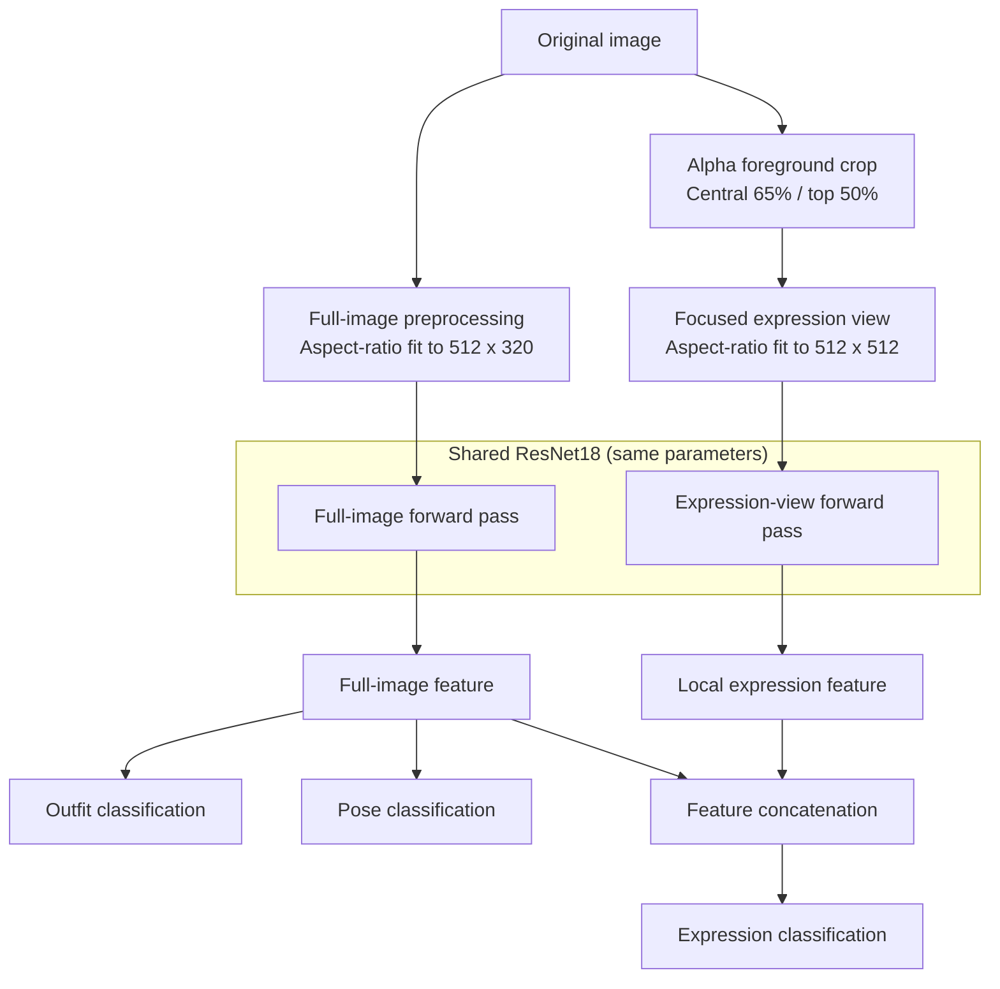

# ATRI Multi-Attribute Recognition

English | [中文](readme.md)

A PyTorch-based single-character multi-attribute recognition project for jointly classifying outfit, pose, and expression from ATRI character illustrations.

The project originated as a deep learning course assignment and was later refactored to address duplicate training images, aspect-ratio distortion, insufficient expression resolution, and limited training evaluation.

<p align="center">
  
</p>

## Features

- Built with PyTorch and a pretrained ResNet18
- Joint outfit, pose, and expression recognition
- Full-image and focused-expression views share the same ResNet18
- Aspect-ratio-preserving resize and padding instead of square distortion
- Automatic upper-center foreground extraction from the Alpha channel for higher effective expression resolution
- Automatic train/validation split with per-task and joint accuracy tracking
- CUDA, AMP, early stopping, resume training, and best-checkpoint support
- Per-expression accuracy, confusion matrix, and a Tkinter GUI for inference

## Model Structure

The model uses two input views while sharing one set of ResNet18 parameters:



The full image is resized with its aspect ratio preserved and padded before being used for outfit, pose, and global-context features. The expression view locates the foreground through transparency and crops the central `65%` of its width and the top `50%` of its height. The expression head fuses the full-image and local features.

## Dataset

The training data consists of single-character illustrations. The script only reads supported image files in the training directory and strictly validates their filenames.

Filename format:

```text
<character_name>_<compatibility_field>_<scale>_<outfit>_<pose>_<expression>.png
```

Example:

```text
アトリ_tatr01_w_d1_p1_f1.png
```

Field usage:

| Position | Example | Purpose |
|----------|---------|---------|
| Character name | アトリ | Preserved as metadata; not a current target |
| Compatibility field | tatr01 / tatr02 | Parsed for filename compatibility; not a recognition target |
| Resolution level | s / w / m / l / ll | Selects source images; only `w` is used by default |
| Outfit | d1 | Outfit class label |
| Pose | p1 | Pose class label |
| Expression | f1 | Expression class label |

Each source image has five proportional size copies: `s`, `w`, `m`, `l`, and `ll`. The program uses only `w` by default so that size variants of the same content are not counted repeatedly in training or validation. Do not add extra underscores to the character name, because filenames must contain exactly six fields.

Supported recognition labels:

| Attribute | Code | Output name |
|-----------|------|-------------|
| Outfit | d1 | school uniform |
| Outfit | d2 | swimsuit |
| Outfit | d3 | pajamas |
| Outfit | d4 | pajamas + pumpkin pants |
| Pose | p1 | normal |
| Pose | p2 | hands up |
| Pose | p3 | arms horizontal + jump |
| Expression | f1 | staring |
| Expression | f2 | smile |
| Expression | f3 | happy |
| Expression | f4 | angry |
| Expression | f5 | serious |
| Expression | f6 | sad |
| Expression | f7 | distressed |
| Expression | f8 | surprised |
| Expression | f9 | confused |
| Expression | fa | troubled / embarrassed |
| Expression | fb | confident (eyes open) |
| Expression | fc | sleepy |
| Expression | fd | crying |
| Expression | fe | calm |
| Expression | ff | shy |
| Expression | fg | sulky |
| Expression | fh | shy (blush) |
| Expression | fi | blank |
| Expression | fj | disgusted |
| Expression | fk | shocked |
| Expression | fl | confident (eyes closed) |

The public repository does not provide training images. The data involves copyrighted material, so the repository only publishes source code, the model structure, and the inference program. The trained best checkpoint has been available through Releases since version 1.0.0.

## Environment

Recommended environment:

- Python 3.10+
- A recent PyTorch 2.x release with a matching torchvision version
- A CUDA-compatible PyTorch environment (optional, for GPU acceleration)

Install dependencies:

```powershell
pip install -r requirements.txt
```

The training script uses the current `torch.amp` API. It automatically falls back to CPU when CUDA is unavailable; use `--cpu` to force CPU execution.

## Training

Recommended command:

```powershell
python train.py --train_dir atridataset/train --out_dir outputs --epochs 90 --batch 16
```

Main parameters:

| Parameter | Default | Description |
|-----------|---------|-------------|
| `--train_dir` | `atridataset/train` | Training image directory |
| `--out_dir` | `outputs` | Output directory for checkpoints, curves, and reports |
| `--epochs` | `90` | Maximum number of epochs |
| `--batch` | `16` | Batch size |
| `--height` | `512` | Full-image input height |
| `--width` | `320` | Full-image input width |
| `--expression_size` | `512` | Square expression-view side length |
| `--expression_width_fraction` | `0.65` | Expression crop fraction of foreground width |
| `--expression_height_fraction` | `0.50` | Expression crop fraction of foreground height |
| `--scale` | `w` | Source-image resolution level |
| `--val_ratio` | `0.25` | Validation split ratio |
| `--lr_backbone` | `1e-4` | ResNet18 learning rate |
| `--lr_heads` | `3e-4` | Classification-head learning rate |
| `--warmup_epochs` | `5` | Epochs that train only the heads |
| `--patience` | `15` | Early-stopping patience for expression validation loss |
| `--workers` | `2` | Number of DataLoader workers |
| `--resume` | none | Resume from `atri_net_last.pth` |
| `--cpu` | disabled | Force CPU execution |
| `--no_pretrained` | disabled | Do not use ImageNet pretrained weights |
| `--no_amp` | disabled | Disable CUDA automatic mixed precision |

The program creates a pose- and expression-stratified train/validation split. The backbone is frozen for the first `5` epochs while only the heads are trained. It is then unfrozen and optimized with AdamW and cosine learning-rate decay. The best checkpoint and early stopping are both based on expression validation loss.

Training outputs:

```text
outputs/
├── atri_net_best.pth
├── atri_net_last.pth
├── split.json
├── loss_curve.png
├── accuracy_curve.png
├── expression_report.json
└── expression_confusion_matrix.png
```

- `atri_net_best.pth`: intended for inference and distribution; contains the model and required configuration
- `atri_net_last.pth`: contains optimizer, scheduler, and AMP state for resume training
- `split.json`: records the exact train and validation files used by the run
- `expression_report.json`: contains per-expression accuracy, support counts, and the confusion matrix

Resume training requires the input dimensions, crop fractions, labels, and resolution level to match the checkpoint:

```powershell
python train.py --train_dir atridataset/train --out_dir outputs --resume outputs/atri_net_last.pth
```

## Reference Result

The current `w + 512` configuration uses random seed `42` and splits 252 unique-content images into 189 training images and 63 validation images. Each expression has 3 validation samples. The best checkpoint from the local reference run achieved:

| Metric | Result |
|--------|--------|
| Outfit accuracy | 100% |
| Pose accuracy | 100% |
| Expression accuracy | 100% |
| All three correct | 100% |

These results only describe the current single-character, same-source, closed-set validation data. They do not imply equivalent generalization to external images or different art styles.

## Inference (GUI)

```powershell
python infer.py --weight outputs/atri_net_best.pth
```

The GUI accepts PNG, JPEG, BMP, and WebP images and displays outfit, pose, expression, and their softmax confidence values. The inference script automatically reads full-image dimensions, expression-crop settings, normalization parameters, and label order from the checkpoint.

The current model uses checkpoint format version 3. Old four-task checkpoints with shoe recognition and earlier single-view three-task checkpoints cannot be loaded directly and must be retrained with the current code.

## Project Structure

```text
.
├── dataset.py       # Filename parsing, data splitting, and dual-view preprocessing
├── train.py         # Training, validation, early stopping, and report generation
├── infer.py         # Tkinter GUI inference
├── model.py         # Shared-ResNet18 dual-view model
├── labels.py        # Outfit, pose, and expression labels
├── requirements.txt
├── LICENSE
├── readme_en.md
└── readme.md
```

`atridataset/` and `outputs/` are local data and runtime-output directories rather than part of the program itself.

## Known Limitations

- The dataset only contains ATRI, and the model does not perform character recognition
- The shoe field is deterministically tied to pose, so starting with version 2.0.0 it is retained only as compatibility metadata and is not recognized
- The expression crop assumes that the face is in the upper-center region of the character foreground
- The validation set is small, with only 3 validation images per expression
- The data source and composition are highly consistent, so closed-set overfitting remains possible

## Future Plans

- ONNX export
- Grad-CAM visualization
- Web UI
- Video inference
- Evaluation on a more complete independent test set

## License

This project uses the MIT License. See [LICENSE](LICENSE) for details.

The project only contains source code, the model structure, and the inference program. It does not include any training image resources.
